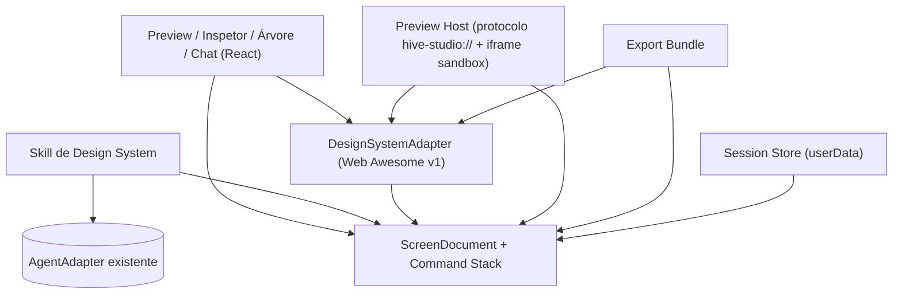
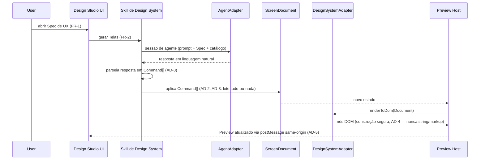

# Architecture Spine — Design Studio

## Design Paradigm

**Command-sourced document model, behind a Ports-and-Adapters boundary for the Design System.**

Every Tela is one canonical `ScreenDocument` tree. Every change to it — a manual Inspector edit, a Árvore de Componentes edit, or a Skill de Design System chat response — is expressed as a `Command` from one closed vocabulary (`AddComponent` / `RemoveComponent` / `MoveComponent` / `SetProp`) and applied through a single reducer. Nothing mutates the tree any other way. This is what makes "generation and every edit surface never diverge from the DS catalog" (§7 NFR) and "chat and manual edits share one undo stack" (FR-9) true by construction instead of by convention.

The Design System itself sits behind one port, `DesignSystemAdapter` — the only code allowed to know a specific DS package's API. Preview, Inspector, Tree, the Skill's prompt construction, and Export all read the catalog and render through this adapter; none of them import a DS package directly. Swapping the adapter (FR-12, and eventually the company's internal DS) never touches the other five namespaces.

Layer → namespace map:

| Layer | Namespace | Knows about |
| --- | --- | --- |
| Document | `main/designStudio/screenDocument.ts` | Command types, reducer, undo stack. Zero Electron/agent/DOM knowledge. |
| DS port | `main/designStudio/dsAdapter/` | `DesignSystemAdapter` interface + catalog; `webAwesomeAdapter.ts` the v1 concrete adapter. |
| Skill | `main/designStudio/skillDesignSystem.ts` | Translates Spec de UX / chat NL into Commands, via the existing `AgentAdapter`. |
| Preview host | `main/designStudio/previewProtocol.ts` | Serves Document + DS Adapter output same-origin to the sandboxed iframe. |
| Session | `main/designStudio/sessionStore.ts` | Persists Document + command history + chat transcript per session. |
| Export | `main/designStudio/exportBundle.ts` | Document + DS Adapter → self-contained HTML. |
| UI | `renderer/src/designStudio/` | Dispatches Commands; never mutates the tree directly. |



## Invariants & Rules

### AD-1 — Design Studio mounts as an editor tab, not a sidebar view or dialog `[ADOPTED]`

- **Binds:** FR-1, FR-4
- **Prevents:** building Design Studio into the `SidebarView` union (`'explorer' | 'scm' | 'review' | 'brain'`), where it would have to fit inside the narrow `rail` pane body shared with the file explorer — too little room for Preview + Inspetor + Árvore + Chat at once. Also prevents the dialog pattern (MCP/Skill Studio), whose open/closed boolean state doesn't survive reload and carries no session identity.
- **Rule:** Design Studio registers a new `EditorTabKind` (`'design-studio'`) opened in the existing `viewer` pane's tab system, following the precedent already set by `diff`/`commit`/`conflict`/`review` kinds. One tab per Spec de UX; its Telas are switched *inside* that tab (FR-4's seletor), not as separate tabs. **Confirmed with the user 2026-08-09, overriding the PRD §9 assumption of a sidebar-view pattern; the PRD has been updated to match.**

### AD-2 — All mutation goes through Commands against the ScreenDocument; validation happens before dispatch, not inside the reducer

- **Binds:** FR-2, FR-6, FR-7, FR-8, FR-9, FR-11
- **Prevents:** a manual-edit code path and a Skill-applied-edit code path independently mutating tree state in incompatible ways, breaking undo (FR-9) or letting one path bypass DS-catalog validation the other enforces. Also prevents two builders picking incompatible `Command` wire shapes for the same union member (e.g. Inspector's single-field edit vs. a chat-batched multi-field edit).
- **Rule:** The only way any surface changes a Tela is by dispatching a `Command` through the one reducer in `screenDocument.ts`, and every `Command` carries exactly one atomic field change — `SetProp = { componentId, key, value }` — never a multi-key props bag; a multi-field change is multiple `Command`s. The reducer itself is pure and always applies its input; it does **not** validate. Validation happens once, at construction time, via `DesignSystemAdapter.validate(command): CapabilityViolation | null` (AD-4, AD-10) — both the Inspector/Tree (manual) and `skillDesignSystem.ts` (chat) call this same function before a `Command` is ever dispatched. No direct tree mutation from UI event handlers, the Skill, or Export.

### AD-3 — The Skill de Design System's only output vocabulary is Commands, applied as an all-or-nothing batch per turn

- **Binds:** FR-2, FR-9, FR-11
- **Prevents:** the agent emitting raw markup/HTML that bypasses catalog validation (§7 NFR: "geração e edição manual nunca divergem") or that can't be undone through the same stack as manual edits. Also prevents a chat turn that produces several `Command`s from partially applying when one of them is invalid — which would leave the Tela in a state FR-11 explicitly forbids ("nunca aplicar uma mudança parcial ou incorreta").
- **Rule:** `skillDesignSystem.ts` parses agent output into `Command[]`; every `Command` in that batch is validated (AD-2) *before any of them is dispatched*. If all pass, the whole batch dispatches and pushes as the single grouped undo step (AD-8). If any fails, none dispatch, and one `CapabilityViolation` is returned to the chat. Markup is never accepted as a Skill response.

### AD-4 — `DesignSystemAdapter` is the only seam to a design system package; it builds DOM safely, never by string-interpolated markup

- **Binds:** FR-6, FR-7, FR-12, FR-13
- **Prevents:** Preview, Inspector, Tree, Skill-prompt construction, or Export importing `@awesome.me/webawesome` (or any future DS package) directly — which would make swapping the DS (FR-12) require touching five places instead of one. Also prevents a `Command`'s prop values (attacker-influenceable, since they can originate from agent output derived from a Spec de UX the user didn't author) reaching the DOM through unsafe string composition — e.g. an `href`/`src`-shaped prop carrying a `javascript:` URL.
- **Rule:** Every read of "what components/props exist" goes through `DesignSystemAdapter.catalog()`. `renderToDom()` (used by the Preview Host, AD-5) builds DOM exclusively via safe APIs — `createElement` plus property/attribute assignment — **never** `innerHTML` or string-interpolated markup; any prop whose catalog type is URL-shaped (`href`, `src`, …) is checked against an allowlist of schemes (`https:`, `http:`, `data:image/*`) before assignment, rejected as a `CapabilityViolation` otherwise. `renderToStaticHtml()` (string output) is reserved for Export (AD-6) — its output is never re-executed inside the app, only handed to the external Figma Agent. No other module imports a DS package.

### AD-5 — Preview isolation is a sandboxed iframe against a same-origin custom protocol with its own CSP, not `srcDoc`

- **Binds:** FR-8, §7 NFR (isolamento do Preview), §8 Guardrails
- **Prevents:** repeating `HtmlPreview.tsx`'s known limitation (no base URL in `srcDoc` → relative assets 404) — unacceptable here because the DS ships its own icons/fonts/CSS that must resolve. Also prevents relaxing the sandbox to fix asset loading (`allow-same-origin` would defeat the isolation §8 requires for agent-generated content), and prevents assuming the iframe `sandbox` attribute alone limits *network* egress from scripts that do execute inside it — it doesn't; that gap needs its own control.
- **Rule:** Register a new privileged protocol (`hive-studio://`, mirroring `whisperProtocol.ts`'s registration: `standard/secure/corsEnabled: true`, `bypassCSP: false`) that serves the DS Adapter's packaged web-component bundle plus a per-session generated HTML shell. The bundle itself ships in `hive-desktop/resources/` (the existing `asarUnpack: [resources/**]` convention in `electron-builder.yml`), read from `process.resourcesPath` by `previewProtocol.ts` at request time — it's a build-time dependency, unlike `whisperProtocol`'s runtime-downloaded models, so it doesn't need that download path. Every `hive-studio://` response carries its own `Content-Security-Policy` header (set directly on the `protocol.handle` `Response`, independent of the renderer's `<meta>` CSP) with **`connect-src 'none'`** at minimum — closing the network-egress gap the sandbox attribute leaves open — plus `script-src 'self'`, `style-src 'self' 'unsafe-inline'`, `img-src 'self' data:`. The preview `<iframe>` keeps `sandbox="allow-scripts"` with **no** `allow-same-origin`, loaded via `src="hive-studio://…"` for the initial load, never `srcDoc`. Updates after that initial load (FR-8's instant reflection) go through `postMessage` from the Preview Host into an in-frame receiver script — itself served same-origin and built to AD-4's safe-DOM rule — not through re-navigation. The renderer's own CSP `<meta>` tag must additionally allow the new scheme where the parent references it (`frame-src`/`default-src` at minimum), following the existing one-directive-at-a-time convention used for `hive-model:`.

### AD-6 — Export reuses the DS Adapter's static renderer; no second HTML generator

- **Binds:** FR-14, FR-15
- **Prevents:** the Preview and the exported Bundle rendering a Tela differently because two independent code paths encode DS knowledge.
- **Rule:** `exportBundle.ts` calls `DesignSystemAdapter.renderToStaticHtml(document)` — the same adapter method family the Preview Host uses for `renderToDom` — never a parallel markup generator.

### AD-7 — Session state is main-process userData storage, keyed differently from the Preview's session URL; the Spec de UX file is read-only to Design Studio

- **Binds:** FR-4, FR-9, FR-10, AD-5, §6.2 (fora do MVP: histórico persistente)
- **Prevents:** Design Studio writing generated Telas or command history back into the workspace as new files (which would conflate agent-generated, disposable-per-session state with the user's actual project files), and prevents assuming Tela state survives anywhere but the local session store. Also prevents the disk-storage key doubling as the network-facing Preview URL — `hive-studio://` is `corsEnabled: true` (AD-5), so any document in the app could construct another session's URL if it were derivable from a predictable hash.
- **Rule:** One JSON file per Design Studio session under `<userData>`, keyed by `(specPathHash, workspaceHash)`, following `chatHistoryStore.ts`'s disk-is-source-of-truth / write-temp-then-rename pattern. The Spec de UX markdown is only ever read, never written, by Design Studio. The `hive-studio://` Preview URL for that session uses a **separate, unguessable random token** generated at session start — never the `(specPathHash, workspaceHash)` disk key or any other deterministic derivation.

### AD-8 — Undo/redo is one linear per-Tela command log, replayed from origin; the undo unit is one user-visible action

- **Binds:** FR-9
- **Prevents:** undoing a chat-applied change reverting only part of what that chat turn did (or bleeding into a later manual edit), and prevents two independent undo stacks (one for manual edits, one for chat) that could desync. Also prevents introducing a second, snapshot-shaped persisted format that would contradict the "`Command[]` is the only persisted representation" convention.
- **Rule:** Each Tela owns one append-only `Command` log. A manual edit appends one `Command`; all `Command`s emitted by one chat turn (AD-3) append as a single grouped step. Undo/redo is implemented by replaying the log from an empty document up to a given step — not by storing separate snapshots — so `Command[]` stays the only persisted document shape. Undo moves the replay cursor back exactly one grouped step regardless of source. No prior undo/redo implementation exists in this codebase to inherit — this is a fresh design, not a reused pattern.

### AD-9 — The Skill de Design System is a routed workflow over the existing `AgentAdapter`; no backend-specific branching

- **Binds:** FR-2, FR-10, FR-11
- **Prevents:** Design Studio code assuming Claude-specific capabilities (e.g. artifacts) and breaking when the session's configured agent is the Devin or GitHub Copilot CLI adapter — both already implemented behind the same contract.
- **Rule:** `skillDesignSystem.ts` talks only to `AgentSession`/`AgentEvent` (the common contract in `main/agentAdapter.ts`), routed through `AgentService`/`window.hive.agent` exactly like the main chat. No `if (agentId === 'claude')` branches inside Design Studio.

### AD-10 — Manual rejection and chat incapability share one `CapabilityViolation` shape — scoped to catalog mismatches only

- **Binds:** FR-6, FR-11, FR-13
- **Prevents:** the Inspector's "invalid prop, rejected with feedback" (FR-6) and the Chat's "explains the limitation instead of applying a partial change" (FR-11) evolving into two different error shapes/UX for what is the same underlying fact: the requested change isn't in the active DS Adapter's catalog. Also prevents `CapabilityViolation` being stretched to cover unrelated failure kinds (agent unreachable, disk/export I/O) it wasn't shaped for — see AD-11.
- **Rule:** Both paths construct the same `CapabilityViolation { componentId, reason, attemptedValue? }` when — and only when — `DesignSystemAdapter.validate()` (AD-2) rejects a `Command` for not matching the active catalog. Both surfaces render it the same way. Anything that isn't a catalog mismatch is an `OperationError` (AD-11), not this.

### AD-11 — Operational failures are a distinct `OperationError`, isolated per unit of work

- **Binds:** FR-2, FR-10, FR-14, FR-15
- **Prevents:** agent-unreachable, Preview-asset-load, and per-Tela export I/O failures being silently unhandled (left as neither a decision nor a Deferred item) or conflated with `CapabilityViolation` (AD-10) — which would blur "your request isn't supported" with "something broke."
- **Rule:** Failures that aren't a catalog mismatch — the Skill's agent session failing or timing out (FR-2, FR-10), the Preview Host failing to load the DS bundle, or an individual Tela's export failing (FR-14) — surface as `OperationError { scope, message, retryable }`. Export explicitly isolates these per Tela: one Tela's `OperationError` is collected and reported without stopping the batch (FR-15's "uma falha ao exportar uma Tela não impede a exportação das demais").

## Consistency Conventions

| Concern | Convention |
| --- | --- |
| Naming | `ScreenDocument` node ids are stable per-Tela identifiers assigned on creation; `Command` is a PascalCase discriminated union (`AddComponent`, `RemoveComponent`, `MoveComponent`, `SetProp`, …); IPC namespace is `designStudio:*`, mirrored as `window.hive.designStudio.*` — the existing flat `<namespace>:<action>` convention, kept in lockstep between `preload/index.ts` and `preload/index.d.ts` per current codebase practice. |
| Data & formats | `Command[]` is the only wire/persisted representation of an edit — never partial DOM diffs or raw markup; each `Command` is one atomic field change (AD-2). Failures are one of exactly two shapes: `CapabilityViolation` for catalog mismatches (AD-10), `OperationError` for everything else (AD-11) — never a third ad hoc shape. Session JSON mirrors `chatHistoryStore`'s one-file-per-session shape (document command-log + chat transcript), keyed separately from the Preview's session token (AD-7). |
| State & cross-cutting | Mutation only via the Command reducer (AD-2). Errors surface only as `CapabilityViolation` (AD-10). The active Design System is a single config pointer resolved once at startup by the `dsAdapter` registry (FR-12) — not re-resolved per Tela. Viewport preset (FR-3) and current selection (FR-5) are transient UI state, not part of `ScreenDocument` — they don't participate in undo/redo (AD-8) or persistence (AD-7). |

## Stack

| Name | Version |
| --- | --- |
| `@awesome.me/webawesome` | ^3.11.0 (MIT license, `lit ^3.2.1` dependency). **Note:** Shoelace is archived as of 2026 (`shoelace-style/shoelace` repo: `archived: true`) — do not install `@shoelace-style/shoelace`; the successor package is `@awesome.me/webawesome`. A paid Pro tier gates a documented set of components (Combobox, Date Picker, File Input, Data Grid, chart types, "Patterns") plus extra icon/theme packs — **not** just icons/themes as this spine first assumed. The components the addendum names as v1-needed (card, tabs, badge, dialog, dropdown, tooltip, basic form inputs) are confirmed free, but re-check any new component against the Pro list before FR-13 catalog work leans on it. Verified against the npm registry and GitHub 2026-08-09. |

Everything else (Electron main/preload/renderer, React shell, TypeScript) is the existing Hive Desktop stack — unchanged by this spine.

## Structural Seed

`src/main/` today is entirely flat (~60 files, no subdirectories) — `main/designStudio/` is a **deliberate exception**, not an oversight: the module has enough internal files (document model, DS adapter(s), skill, protocol, session, export, service facade) that flattening them with a prefix would hurt more than a scoped subdirectory hurts consistency, and `dsAdapter/` needs room to grow a second concrete adapter later (the company's internal DS) without renaming files.

`hive-desktop/resources/` (already `asarUnpack`'d per `electron-builder.yml`) gains the Web Awesome bundle at build time — the same mechanism the app already uses for build-time static assets read directly off disk by the main process, distinct from `whisperProtocol.ts`'s runtime-downloaded Whisper models (AD-5).

```text
hive-desktop/
  resources/
    design-system-web-awesome/  # DS bundle (JS+CSS+assets), asarUnpack'd (AD-5)
  src/
    main/
      designStudio/
        screenDocument.ts        # ScreenDocument type, Command union, reducer, undo-via-replay (AD-2, AD-8)
        dsAdapter/
          types.ts                # DesignSystemAdapter port + catalog shape
          webAwesomeAdapter.ts     # v1 concrete adapter (safe DOM construction, AD-4)
        skillDesignSystem.ts      # Spec de UX / chat NL -> Command[], via AgentAdapter (AD-3, AD-9)
        previewProtocol.ts        # protocol.handle('hive-studio://…') + per-response CSP (AD-5)
        sessionStore.ts           # userData persistence — mirrors chatHistoryStore.ts (AD-7)
        exportBundle.ts           # Document + DS Adapter -> self-contained HTML (AD-6)
        designStudioService.ts    # facade exposed over IPC as designStudio:*
    renderer/src/
      designStudio/
        DesignStudioViewer.tsx    # registered as EditorTabKind 'design-studio' (AD-1)
        PreviewPane.tsx           # sandboxed iframe pointed at hive-studio://
        Inspector.tsx
        ComponentTree.tsx
        IterationChat.tsx
```



## Capability → Architecture Map

| Capability / Area | Lives in | Governed by |
| --- | --- | --- |
| FR-1 Abrir Spec de UX no Design Studio | `DesignStudioViewer.tsx` as `EditorTabKind` | AD-1 |
| FR-2 Geração automática do Preview | `skillDesignSystem.ts` → `AgentAdapter` → `Command[]` → `screenDocument.ts`; falha do agente → `OperationError` | AD-2, AD-3, AD-9, AD-11 |
| FR-3 Alternar tamanho de dispositivo | `PreviewPane.tsx` local UI state (não persistido, não participa do undo — Consistency Conventions) | — |
| FR-4 Navegar entre Telas | One `ScreenDocument` + command log per Tela, within one tab; "editada vs. auto-gerada" é derivado de `log.length > 0` por Tela | AD-1, AD-7, AD-8 |
| FR-5 Selecionar Componente | `PreviewPane.tsx` + `ComponentTree.tsx` selection state (transiente, fora do `ScreenDocument` — Consistency Conventions) | — |
| FR-6 Editar propriedades visuais | `Inspector.tsx` → `SetProp` Command → `DesignSystemAdapter.validate()` antes do dispatch | AD-2, AD-4, AD-10 |
| FR-7 Editar Árvore de Componentes | `ComponentTree.tsx` → `Add/Remove/MoveComponent` Commands | AD-2, AD-4 |
| FR-8 Refletir edições no Preview | `screenDocument.ts` → `previewProtocol.ts` → `DesignSystemAdapter.renderToDom` → `postMessage` | Design Paradigm, AD-4, AD-5 |
| FR-9 Desfazer/refazer | Per-Tela command log, replay-from-origin | AD-8 |
| FR-10 Chat de Iteração Visual | `IterationChat.tsx` → `skillDesignSystem.ts`; um Componente selecionado é passado como contexto adicional ao prompt da Skill | AD-9, AD-11 |
| FR-11 Aplicar mudanças da Skill | `Command[]` → `screenDocument.ts` como lote tudo-ou-nada; falha → `CapabilityViolation` | AD-3, AD-10 |
| FR-12 Configurar Design System ativo | `dsAdapter` registry, config central | AD-4 |
| FR-13 Catálogo de Componentes | `DesignSystemAdapter.catalog()` | AD-4, AD-10 |
| FR-14 Gerar Bundle de uma Tela | `exportBundle.ts` → `DesignSystemAdapter.renderToStaticHtml` | AD-6, AD-7, AD-11 |
| FR-15 Exportar múltiplas Telas | `exportBundle.ts` iterado por Tela; falha vira `OperationError` isolado, não bloqueia as demais | AD-6, AD-11 |

## Deferred

- **Formato exato do Bundle de Exportação** (PRD §11 Q1) — o seam (`renderToStaticHtml`, AD-6) é agnóstico de formato de saída de propósito; o shape concreto (HTML único vs. múltiplos arquivos, achatar shadow DOM ou não, metadados de camadas) fica para quando o contrato do Figma Agent for confirmado.
- **Profundidade da revisão de segurança do isolamento do Preview** (PRD §11 Q2) — a lente de segurança deste Reviewer Gate fechou três lacunas concretas nesta própria spine (CSP própria do `hive-studio://` com `connect-src 'none'`, construção segura de DOM em vez de markup interpolado, token de sessão inadivinhável — todas dobradas para dentro da AD-5/AD-4/AD-7). O que permanece genuinamente em aberto é um julgamento de profundidade que esta altitude não decide sozinha: se `sandbox="allow-scripts"` + CSP própria + postMessage é suficiente frente a conteúdo *regenerado repetidamente por um agente* (vs. um arquivo estático), ou se o caso pede isolamento mais forte (ex.: worker dedicado, processo separado). A revisão de segurança dedicada que o próprio PRD pede continua valendo para essa pergunta específica.
- **Migração automática de Telas entre Design Systems diferentes** — fora do MVP (PRD §6.2); nenhum AD cobre conversão entre adapters.
- **Colaboração multi-usuário / edição simultânea da mesma Tela** — fora do MVP (PRD §5); o command stack (AD-8) assume um único editor local.
- **Histórico de versões de longo prazo entre sessões** (reaproveitar o padrão do Second Brain / M12) — explicitamente fora do MVP (PRD §6.2); a v1 só tem o command stack por sessão (AD-8), sem versionamento persistente entre sessões.
- **Meta de custo por chamada de agente** (PRD §8) — sem meta definida nesta v1; Design Studio herda o mesmo adaptador de agente do resto do app (AD-9) sem introduzir um novo provedor.
- **Reconciliação do AD-1 com o PRD §9** — o PRD assumiu o padrão de sidebar view; este spine decide, com base no código real, que é editor-tab. Precisa voltar ao PRD como atualização, não só ficar registrado aqui.
