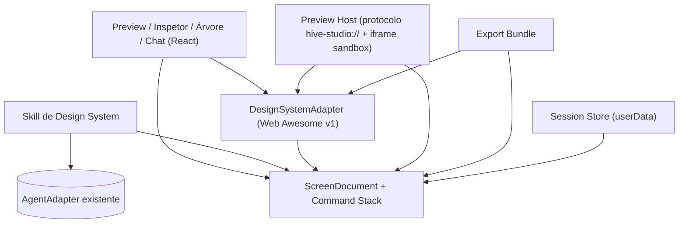
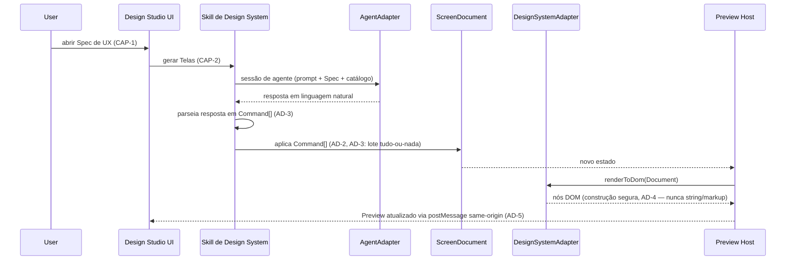

# Architecture Diagrams — Design Studio

## Component graph



## Generation / edit sequence



## Directory layout

```text
hive-desktop/
  resources/
    design-system-web-awesome/  # DS bundle (JS+CSS+assets), asarUnpack'd (AD-5)
  src/
    main/
      designStudio/
        screenDocument.ts        # ScreenDocument type, Command union, reducer, undo-via-replay (AD-2, AD-8)
        dsAdapter/
          types.ts                # DesignSystemAdapter port + catalog shape
          webAwesomeAdapter.ts     # v1 concrete adapter (safe DOM construction, AD-4)
        skillDesignSystem.ts      # Spec de UX / chat NL -> Command[], via AgentAdapter (AD-3, AD-9)
        previewProtocol.ts        # protocol.handle('hive-studio://…') + per-response CSP (AD-5)
        sessionStore.ts           # userData persistence — mirrors chatHistoryStore.ts (AD-7)
        exportBundle.ts           # Document + DS Adapter -> self-contained HTML (AD-6)
        designStudioService.ts    # facade exposed over IPC as designStudio:*
    renderer/src/
      designStudio/
        DesignStudioViewer.tsx    # registered as EditorTabKind 'design-studio' (AD-1)
        PreviewPane.tsx           # sandboxed iframe pointed at hive-studio://
        Inspector.tsx
        ComponentTree.tsx
        IterationChat.tsx
```

Rationale para a exceção de subdiretório (`main/designStudio/` vs. o resto de `src/main/` flat): ver `architecture-decisions.md`, seção "Naming & Structure".
