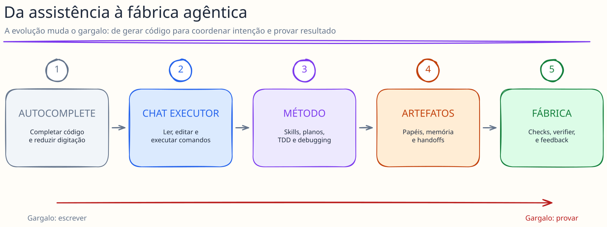
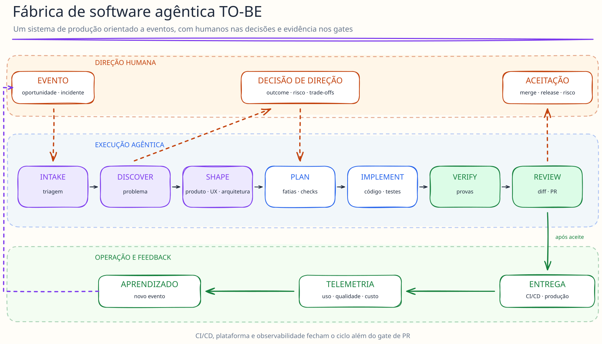
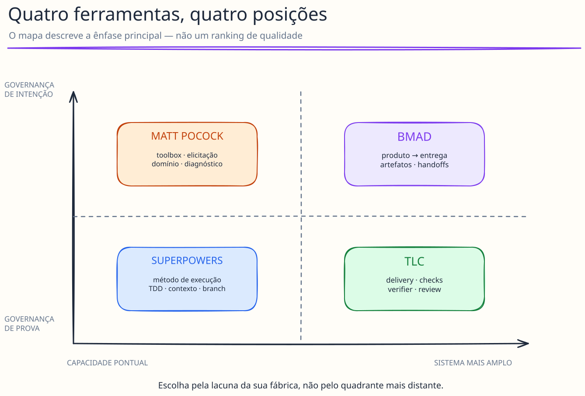
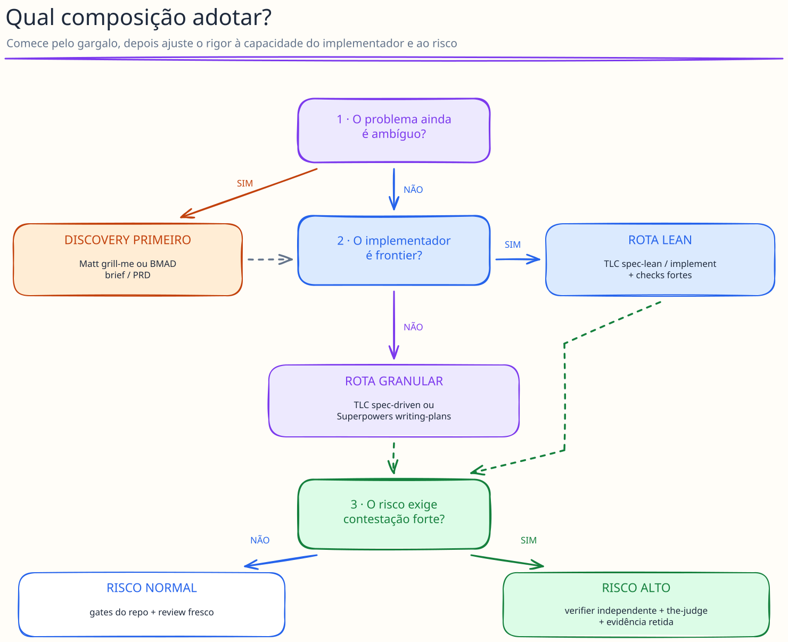
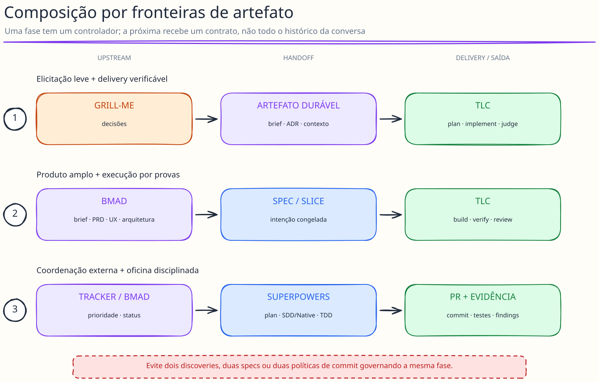

# Da conversa à fábrica: um mapa prático dos frameworks de desenvolvimento de software com agentes

## A pergunta não é “qual é o melhor?”, mas “qual problema cada um resolve?”

Em pouco tempo, o desenvolvimento com IA saiu do autocomplete para agentes capazes de investigar repositórios, discutir requisitos, escrever planos, implementar, testar e revisar código. Junto com essa evolução surgiu uma nova categoria de ferramentas: métodos e bibliotecas de skills que tentam transformar a capacidade bruta dos modelos em trabalho de engenharia repetível.

Quatro nomes ajudam a enxergar as diferentes escolas desse movimento:

- [Superpowers](https://github.com/obra/superpowers), uma metodologia portátil e opinionada para disciplinar o coding agent;
- [Matt Pocock Skills](https://github.com/mattpocock/skills), uma caixa de ferramentas pequena, humana e combinável;
- [BMAD Method](https://github.com/bmad-code-org/BMAD-METHOD), um sistema artifact-first que cobre produto, UX, arquitetura e entrega;
- [TLC Agent Skills](https://github.com/tech-leads-club/agent-skills), uma família modular orientada a obrigações verificáveis, provas e separação entre autor e verificador.

Eles não são quatro versões do mesmo produto. Compará-los em um ranking único seria como perguntar se uma oficina, uma caixa de ferramentas, um sistema operacional de produto e uma linha de inspeção competem pela mesma função. Há sobreposição, mas a unidade de valor é diferente.

A tese deste artigo é: **a fábrica de software agêntica não nasce da adoção integral de um framework. Ela nasce de uma arquitetura de trabalho na qual intenção, estado, execução e evidência têm donos e contratos claros.** Os quatro projetos podem participar dessa arquitetura, isoladamente ou combinados.

> Nota de método: a análise foi feita em 23 de setembro de 2026 a partir de clones locais dos quatro repositórios, leitura de skills, scripts, testes, documentação e páginas oficiais. Os snapshots e limitações da pesquisa estão registrados no fim do artigo. Afirmações de capacidade descrevem o corpus observado; não são promessas sobre todo o ecossistema em torno de cada projeto.

## Como chegamos até aqui

### Primeiro ato: IA como autocomplete

Na primeira fase, o valor estava em completar linhas, gerar boilerplate e explicar trechos de código. O humano mantinha quase todo o estado do trabalho na cabeça: problema, arquitetura, sequência de mudanças e critério de pronto. A IA reduzia o custo de digitar, não o custo de coordenar.

### Segundo ato: o chat que “faz a feature”

Modelos melhores e acesso a ferramentas criaram o coding agent. Ele passou a ler o repositório, editar arquivos e executar comandos. O salto de produtividade foi real, mas revelou um conjunto previsível de falhas:

- começar a implementar antes de entender o problema;
- confundir uma resposta plausível com uma resposta comprovada;
- esquecer decisões antigas conforme a conversa cresce;
- declarar sucesso depois de um teste estreito;
- revisar o próprio trabalho com as mesmas premissas que produziram o erro;
- criar planos grandes demais para caberem com qualidade em uma janela de contexto.

A pesquisa sobre contexto longo ajuda a explicar parte do fenômeno: modelos podem perder informação relevante quando ela fica “no meio” do contexto, mesmo quando a janela nominal comporta o conteúdo ([Lost in the Middle](https://arxiv.org/abs/2307.03172)). Mais contexto disponível não equivale automaticamente a um uso melhor do contexto.

### Terceiro ato: o processo vira código comportamental

As primeiras metodologias de agentes reagiram com instruções fortes: faça discovery antes de construir, escreva um plano, use TDD, investigue a causa raiz, verifique antes de declarar conclusão. O prompt deixou de ser um pedido e virou procedimento operacional.

Superpowers é uma expressão madura dessa fase. Seu núcleo encadeia brainstorming, planejamento, worktree, implementação TDD, revisão e integração. Matt Pocock Skills segue uma filosofia ainda mais granular: skills pequenas para grilling, modelagem de domínio, specs, tickets, TDD, diagnóstico e review, sem tentar “possuir” todo o processo.

### Quarto ato: artefatos, papéis e handoffs

Quando o trabalho atravessa várias sessões e pessoas, apenas “seguir uma boa skill” deixa de bastar. É preciso preservar intenção, decisões, estado, evidências e pontos de aprovação fora da conversa. BMAD expande a superfície para product brief, PRFAQ, PRD, UX, arquitetura, SPEC, épicos, stories, sprint status, implementação, review e retrospectiva. A conversa passa a produzir artefatos que outra pessoa ou sessão agêntica consegue retomar.

### Quinto ato: da disciplina para a fábrica verificável

O passo seguinte é converter regras importantes em mecanismos que falham de modo observável. Em vez de somente dizer “verifique bem”, a linha TLC associa checks a provas, usa validadores com exit code, separa autor e verificador e, nas variantes mais rigorosas, testa se a suíte distingue a implementação correta de uma mutação errada.

É aqui que muda a pergunta central. Se gerar código ficou relativamente barato, o gargalo passa a ser **saber se o que foi produzido corresponde à intenção e continua correto sob condições adversas**. A fábrica agêntica não é uma sequência de prompts; é um sistema de produção com feedback.

*Figura 1 — O gargalo migra de escrever código para provar resultado. [Abrir fonte editável no Excalidraw](assets/diagrams/01-evolucao-fabrica-agentica.excalidraw).*

## A fábrica TO-BE

Uma visão útil da fábrica não começa no código. Ela começa em um evento e termina em aprendizado operacional:

*Figura 2 — A fábrica fecha o ciclo quando produção e telemetria voltam a gerar eventos. [Abrir fonte editável no Excalidraw](assets/diagrams/02-fabrica-tobe.excalidraw).*

O humano não desaparece. Ele se concentra onde julgamento e responsabilidade têm maior valor: definir intenção, aceitar trade-offs, aprovar decisões irreversíveis e decidir sobre riscos. Agentes assumem legwork, exploração, decomposição, execução e inspeção — desde que existam contratos de entrada e saída.

Sob a lente de desenvolvimento avançado com IA, quatro perguntas governam o desenho:

1. **Qual é a fase?** Discovery, planejamento, implementação, verificação e review exigem contextos e critérios diferentes.
2. **Qual é a capacidade do modelo que implementa?** Um modelo barato ou instável precisa de passos menores e mais gates; um modelo frontier pode trabalhar com uma spec mais enxuta sem ser microgerenciado.
3. **Quanto contexto a unidade consome?** O objetivo não é preencher a janela, mas preservar espaço para raciocínio, ferramentas e correção.
4. **Quem verifica?** A mesma instância que escreveu traz as mesmas hipóteses e pontos cegos. Sempre que o risco justificar, autor e verificador devem operar em contextos separados e, idealmente, usar identidades ou modelos distintos. A conclusão deve depender de evidência.

Essa lente produz duas rotas legítimas:

- **spec-driven granular:** melhor para modelos mais baratos, tarefas de alto risco, equipes começando ou ambientes que exigem auditabilidade. Há mais tarefas, checkpoints e verificações intermediárias;
- **spec-lean com checks fortes:** melhor para modelos frontier e trabalho coeso. A intenção e as provas são congeladas, mas o modelo escolhe a microestratégia de construção.

Mais processo não é automaticamente mais segurança. Se o agente é capaz, microtarefas podem fragmentar o raciocínio e criar babysitting. Se o agente é fraco, liberdade excessiva vira variação e retrabalho.

## Onde cada ferramenta entra

Legenda: **● nativo/forte**, **◐ presente ou parcial**, **○ depende de composição externa**, **— fora do foco observado**.

| Estação da fábrica | Superpowers | Matt Pocock Skills | BMAD Method | TLC |
| --- | --- | --- | --- | --- |
| Intake e triagem | ○ | ◐ `triage` e tracker | ◐ ticketing/sprint | ○; estação futura no fluxo publicado |
| Discovery do problema | ● brainstorming adaptativo | ● `grill-me`, research, prototype | ● brainstorming, recon, brief, PRFAQ, PRD | ● `tlc-discover` |
| Produto e requisitos | ◐ design/spec | ◐ `to-spec` | ● PRD/spec e escala por stakes | ◐ design document/spec |
| UX e experiência | ○ | ◐ prototype/visual artefacts | ● DESIGN.md e EXPERIENCE.md | ◐ catálogo complementar de design/browser |
| Arquitetura | ◐ design arquitetural | ● domain modeling, ADRs, architecture improvement | ● architecture spine e reviewer gate | ◐ skills complementares + decisões no plano |
| Planejamento executável | ● planos detalhados | ● spec → tickets/wayfinder | ● SPEC, épicos/stories ou tickets | ● `tlc-plan`, driven e lean |
| Implementação | ● SDD ou Native | ● `implement` + TDD | ● Build por unidade | ● `tlc-implement`, driven ou lean |
| Verificação durante build | ● TDD + prova fresca | ● TDD, typecheck, suíte e repro de bug | ● test matrix + gates do repo | ● checks, provas, verifier e mutação |
| Review de código/PR | ● task/branch review | ◐ Standards + Spec | ● múltiplas lentes e triagem causal | ● `the-judge` |
| Estado durável entre sessões | ◐ arquivos/Git; parte é apagada | ◐ tracker/Markdown/ADRs distribuídos | ● memlog, SPEC, status, tickets e logs | ● `.specs`, STATE, LESSONS e relatórios |
| Gates mecânicos do método | ◐ helpers locais | ◐ depende sobretudo do repo | ● ilhas determinísticas | ● validators e selftests explícitos |
| Operação orientada a eventos | ○ | ○ | ○; integrações sem barramento de eventos | ○; direção publicada, ainda não entregue no v1 |
| Produção e feedback operacional | ○ | ○ | ○; retrospectiva pós-épico, sem feedback de produção | ○; estação futura no fluxo publicado |

A matriz mostra cobertura, não qualidade absoluta. Uma classificação `○` ou `—` não é defeito quando a ferramenta deliberadamente ocupa uma camada menor.

Há ainda um limite comum: o corpus comparado cobre principalmente o caminho entre intenção e gate de PR. Nenhum dos quatro projetos entrega sozinho um control plane com deploy, operação, observabilidade e feedback de produção. Para fechar a fábrica TO-BE, essa camada precisa vir de CI/CD, plataforma, telemetria, tracker e políticas organizacionais externas — e devolver seus eventos ao intake.

*Figura 3 — As posições representam ênfases complementares, não um ranking. [Abrir fonte editável no Excalidraw](assets/diagrams/03-posicionamento-frameworks.excalidraw).*

### Superpowers: método de execução portátil

Superpowers v6.4.1 se apresenta como uma metodologia completa de desenvolvimento sobre skills componíveis. No snapshot analisado, o fluxo classifica o trabalho em spike, bounded ou architectural, escreve planos detalhados quando necessário e oferece duas rotas de execução:

- **Subagent-Driven Development (SDD):** implementador e reviewer frescos por tarefa, mais review final da branch;
- **Native/inline:** execução mais barata, sem reviewer por tarefa e com review concentrado no fim.

Seus melhores atributos são disciplina, contexto e portabilidade. Nos fluxos baseados em plano — sobretudo no SDD — briefs, reports, diffs e ledger ficam em arquivos; a execução usa worktree. TDD e evidência fresca são tratados como regras centrais. Há também helpers reais: um comando falho não registra a tarefa como concluída, e ranges inválidos de review são rejeitados. Testes locais selecionados desses mecanismos passaram na pesquisa.

O limite é a escala do sistema: o orquestrador continua sendo o modelo seguindo Markdown. Não há, no core observado, fila organizacional, board, scheduler multi-equipe, observabilidade de frota ou política central. No modo Native, a independência entre autor e verificador pode desaparecer. E parte da trilha de evidência é apagada ao final, reduzindo auditabilidade histórica.

**Melhor encaixe:** transformar um coding agent em executor disciplinado dentro de uma sessão, plano e branch; equipes que valorizam TDD, debugging sistemático e portabilidade entre harnesses.

### Matt Pocock Skills: peças pequenas para pensar e entregar

Matt Pocock Skills v1.2.3 rejeita deliberadamente um framework que possua todo o processo. A cadeia promovida pode ser lida como `grill-with-docs → to-spec → to-tickets → implement → code-review`, mas as capacidades também podem ser adotadas seletivamente. Algumas skills, porém, são wrappers com dependências textuais que o instalador não declara.

O destaque é a interface humano–agente. `grill-me` percorre o frontier de uma árvore de decisões e mantém decisões com a pessoa; `domain-modeling` cria linguagem compartilhada e ADRs apenas para decisões realmente duráveis; `to-tickets` procura tracer bullets verticais; `diagnosing-bugs` exige um comando red-capable antes de permitir hipóteses. É uma gramática de engenharia forte com baixo custo de adoção.

Essa leveza também cria as lacunas. `grill-me` é stateless: sem `grill-with-docs`, spec ou outro ledger, respostas importantes podem morrer na conversa. As dependências entre skills são composição em prosa, não contratos executáveis. O fluxo promovido de implementação é serial, e o review separa Standards de Spec. No entanto, não impõe `autor != verificador`, não fecha automaticamente tickets e tem uma inconsistência documentada: mudanças ainda não commitadas podem ficar fora de um review baseado em `fixed-point...HEAD`. A orquestração mais ambiciosa, `implement-spec`, ainda estava em `in-progress` e fora do plugin promovido no snapshot.

**Melhor encaixe:** times que querem adotar capacidades específicas sem trocar todo o processo; discovery conversacional, domain modeling, decomposição em tickets, TDD e diagnóstico reprodutível.

### BMAD Method: governança artifact-first do produto à entrega

BMAD tem a maior superfície de produto e coordenação dos quatro. O método oferece brainstorming, pesquisa, product brief, PRFAQ, PRD, UX, arquitetura, SPEC, épicos/stories, sprint planning, Build, review e retrospectiva. Personas de analista, PM, UX, arquiteto e desenvolvedor tornam essa superfície acessível aos papéis de uma squad.

Seu melhor princípio é o **smallest safe path**: mudança trivial pode não precisar de cerimônia; uma feature coesa pode usar Build; uma iniciativa complexa recebe os artefatos exigidos por risco e coordenação. O sistema preserva estado em memlogs append-only, frontmatter, SPEC, test matrix, status, tickets e Git. Build revisa findings por causa: lacuna de intenção volta ao humano, problema da spec volta ao planejamento, defeito de código vira patch e melhoria fora de escopo pode ser adiada.

Há mais engenharia mecânica do que a aparência documental sugere: parsers, escrita atômica, renderização content-addressed, linters, validações e CI. Ainda assim, decidir se algo está “pronto”, “coerente” ou “alinhado à intenção” continua exigindo julgamento semântico. Reviewers são separados por contexto, mas não existe uma garantia rígida de identidade ou provedor diferente.

BMAD também não é, sozinho, um control plane autônomo. Build opera uma unidade. A seleção do próximo trabalho, o controle das dependências e a coordenação entre unidades ficam com o humano ou o orquestrador; o `bmad-loop` documentado é linear e limitado. No snapshot de `main`, a migração v6→v7 e recursos preview exigem cuidado para não misturar superfícies de maturidade diferentes.

**Melhor encaixe:** problemas com ambiguidade de produto, muitos papéis, necessidade de handoffs e memória durável; iniciativas em que PRD, UX e arquitetura precisam chegar à implementação sem depender da lembrança de um chat.

### TLC: núcleo de delivery guiado por provas

A família TLC oferece uma linha modular — `tlc-discover → tlc-plan → tlc-implement → the-judge` — e dois fluxos integrados:

- **`tlc-spec-driven`:** quatro fases, tasks atômicas, validadores, estado persistente, verifier e sensores de discriminação; é a opção mais segura quando o modelo implementador precisa de trilhos;
- **`tlc-spec-lean`:** congela plano, checks e provas, mas elimina a decomposição em microtarefas; é apropriado para um modelo forte que não precisa ser babysat.

O diferencial é tornar a verificação uma arquitetura, não uma recomendação. Checks descrevem afirmações observáveis e suas provas; author e verifier são separados; validators interrompem o fluxo com exit code; mutação/fault injection pergunta se um teste falharia sob uma implementação errada. `the-judge` executa checks determinísticos primeiro, aplica seis lentes, exige evidência e limita ruído.

O núcleo publicado é muito forte entre discovery e gate de PR, mas o próprio TLC AI Dev Flow marca Entry, Triage e Production como estações futuras do v1. A escolha entre driven, lean e perfil `light`/`standard`/`ui` ainda precisa de uma política da equipe. E benchmarks publicados pelo fabricante devem ser tratados como sinais reproduzíveis, não como validação independente.

**Melhor encaixe:** squads que querem transformar critérios em provas, separar construção de julgamento e reduzir “pronto por afirmação”; bom complemento para um upstream de produto mais amplo.

## Comparativo crítico

| Dimensão | Superpowers | Matt Pocock Skills | BMAD Method | TLC |
| --- | --- | --- | --- | --- |
| Forma principal | método portátil de execução | biblioteca composável | sistema operacional artifact-first | núcleo modular de delivery/verificação |
| Unidade natural | plano, tarefa, branch | skill, ticket, sessão | artefato e unidade de Build | slice, check, implementação e prova |
| Maior força | disciplina + contexto + TDD | clareza humana e modularidade | cobertura produto→entrega e memória | verificação independente e determinística |
| Maior fraqueza | pouco control plane organizacional | ciclo não fecha sozinho | peso/estado distribuído e coordenação externa | a fábrica v1 ainda não fecha o ciclo até a produção |
| Discovery | bom e adaptativo | excelente para elicitação | mais amplo e estruturado | focado em problema/veredito/shape |
| Planejamento | muito detalhado | vertical e tracker-friendly | adaptativo e rico em artefatos | orientado a superfícies e checks |
| Implementação | SDD ou Native | enxuta, serial por ticket | Build por unidade | granular ou lean |
| Verificação | forte na disciplina; independência parcial | bons loops locais; pouca garantia sistêmica | matriz + múltiplas lentes | ponto mais forte do conjunto |
| Contexto | briefs, reports, diff e ledger | fresh session, pointers e tracker | memlog, SPEC, status e logs | budgets, loading progressivo e handoffs |
| Customização | skills/adaptadores por harness | copiar e combinar peças | overlays, TOML, hooks, módulos e stores | skills independentes e perfis |
| Custo/cerimônia | Native vs SDD | baixo e incremental | varia do trivial à iniciativa | driven vs lean + perfis |
| Portabilidade documentada/estrutural | 16 hosts documentados + adaptadores | arquivos/skills; distribuição varia por host | vários hosts; capacidades variam por runtime | catálogo/skills portáveis |
| Validação observada no corpus | seis conjuntos determinísticos; sem eval comportamental importado | sem suíte comportamental encontrada | testes determinísticos não executados; sem benchmark comportamental | selftest isolado 46/46; benchmark do fabricante, sem comparação independente |

Nenhuma coluna vence a tabela. Os destaques apontam usos diferentes:

- quer um agente local muito disciplinado? Superpowers;
- quer acrescentar uma capacidade sem adotar um sistema inteiro? Matt Pocock Skills;
- precisa alinhar produto, UX, arquitetura e várias sessões? BMAD;
- quer elevar o padrão de prova, verifier e review? TLC.

## Um guia de decisão por dor

| Dor dominante | Comece por | Complete com |
| --- | --- | --- |
| “O agente começa a codar cedo demais” | Superpowers brainstorming ou TLC discover | checkpoint humano antes do build |
| “Ainda não entendemos o que construir” | Matt `grill-me` ou BMAD brief/PRD | ledger/spec durável |
| “Perdemos decisões entre sessões” | BMAD spec/memlog/status | ADRs e IDs nos checks |
| “O plano fica genérico” | Superpowers writing-plans ou TLC plan | comandos, valores e provas concretas |
| “Modelo barato se perde” | TLC spec-driven | tarefas atômicas + verifier forte |
| “Modelo forte está sendo microgerenciado” | TLC spec-lean | checks rigorosos e review fresco |
| “Os testes passam, mas não provam nada” | TLC checks + discriminação/mutação | QA adversarial |
| “O review produz muito ruído” | the-judge | evidence-or-silence + noise budget |
| “Precisamos de TDD e debugging consistentes” | Superpowers ou Matt | gates do repositório |
| “Cada papel trabalha num chat desconectado” | BMAD artifact-first | contratos de handoff e tracker |

*Figura 4 — A escolha começa pela ambiguidade, passa pela capacidade do implementador e termina no risco. [Abrir fonte editável no Excalidraw](assets/diagrams/05-arvore-decisao.excalidraw).*

## Compor é legítimo — desde que cada fase tenha um dono

Misturar frameworks funciona bem quando a composição acontece nas bordas dos artefatos. Funciona mal quando duas metodologias tentam governar a mesma fase ao mesmo tempo.

Uma regra simples evita a maior parte da confusão:

> Para cada fase, escolha um método controlador, defina seu artefato de saída e entregue apenas esse contrato à fase seguinte.

Não rode dois discoveries completos e depois tente reconciliar narrativas. Não mantenha simultaneamente duas specs como fontes de verdade. Não execute duas políticas de commit incompatíveis. Use capacidades auxiliares como lentes, não como segundos donos do fluxo.

*Figura 5 — A composição funciona melhor quando o handoff é um artefato explícito. [Abrir fonte editável no Excalidraw](assets/diagrams/04-composicoes-praticas.excalidraw).*

### Receita 1: `grill-me` + TLC para desenvolvimento

É uma combinação natural:

1. Use `grill-me` para expor decisões e ambiguidades.
2. Antes de encerrar, persista as respostas relevantes em um brief, `CONTEXT.md`, ADR ou design document. `grill-me` sozinho é stateless.
3. Para um modelo frontier, entregue esse artefato a `tlc-spec-lean` ou a `tlc-plan → tlc-implement`.
4. Para um modelo menos capaz, entregue a `tlc-spec-driven`, com tarefas menores e validadores.
5. Feche com `the-judge` em contexto fresco.

O ganho vem da divisão de trabalho: Matt melhora a qualidade das perguntas; TLC melhora a qualidade da prova.

### Receita 2: BMAD no discovery, TLC no delivery

Para um produto novo ou uma iniciativa ambígua:

1. BMAD brainstorming/product brief para direção.
2. PRD quando a coordenação realmente exige requisitos explícitos.
3. UX e architecture spine apenas na profundidade proporcional ao risco.
4. Converta a unidade aprovada em design document ou spec consumível pela TLC.
5. Use `tlc-plan`, `tlc-implement` e `the-judge`.

BMAD governa intenção e handoffs; TLC governa construção e evidência. O cuidado é manter uma só fonte de verdade por camada e registrar o mapeamento requisito → slice → check.

### Receita 3: Superpowers como política do coding agent

Uma squad pode manter BMAD ou seu tracker atual no nível organizacional e usar Superpowers dentro de cada branch:

1. A story aprovada vira a entrada do brainstorming bounded/architectural.
2. `writing-plans` transforma a intenção em passos executáveis.
3. SDD é usado em mudanças complexas; Native em tarefas menores e de baixo risco.
4. A saída retorna ao tracker com commit, testes e findings.

Nesse desenho, o tracker organiza a fábrica; Superpowers disciplina a oficina.

### Receita 4: modelo barato na execução

Quando Composer ou outro modelo intermediário/barato implementa, não basta usar um modelo frontier no planejamento. Quem precisa dos trilhos é o **modelo que editará o código**.

Use uma destas rotas:

- BMAD ou Matt para esclarecer → TLC `spec-driven` para tarefas e gates → verifier forte;
- design aprovado → Superpowers `writing-plans` detalhado → Native/SDD com comandos e saídas esperadas;
- tickets verticais pequenos → sessão fresca por ticket → review independente no fim.

O erro comum é produzir uma spec excelente e depois entregar ao implementador barato uma tarefa grande, aberta e sem prova definida.

### Receita 5: modelo frontier

Para um modelo forte, reduza a microcoreografia e aumente a qualidade dos checks:

1. Discovery proporcional: `grill-me`, BMAD brief/PRD ou `tlc-discover`.
2. Congele objetivo, restrições, decisões irreversíveis e critérios observáveis.
3. Use TLC `spec-lean` ou `tlc-implement`; deixe detalhes reversíveis aparecerem no diff.
4. Preserve verifier fresco, testes e review de PR. Capacidade do autor não elimina a necessidade de contestação.

## Exemplos práticos do dia a dia

### Bug intermitente em produção

- Matt `diagnosing-bugs` ou Superpowers `systematic-debugging` para obter primeiro um repro red-capable.
- Abra uma unidade pequena; não misture refactor amplo.
- Implemente com TDD.
- Use verifier separado para reproduzir o bug antes e depois da correção.
- Faça review com foco em regressão, observabilidade e hipótese causal.

### Feature simples em um serviço conhecido

- Faça discovery bounded, sem PRD completo.
- Registre três coisas: comportamento, restrições e prova.
- Modelo frontier: TLC lean ou Superpowers Native.
- Modelo intermediário: plano detalhado ou TLC driven.
- Execute a suíte relevante e depois a suíte do repositório; conclua somente com evidência fresca.

### Nova jornada de produto com interface

- BMAD brief/PRD para intenção e público.
- BMAD UX para `DESIGN.md` e `EXPERIENCE.md`, ou uma capacidade de prototipação equivalente.
- Validação visual real com navegador, em desktop e mobile; screenshots e logs do console fazem parte da evidência.
- Planejamento em fatias verticais, evitando separar “frontend” e “backend” quando o valor só existe integrado.
- TLC perfil `ui` ou um harness que exija prova visual, teste comportamental e review de acessibilidade.

### Refactor arquitetural amplo

- Matt domain modeling/ADR ou BMAD architecture spine para decisões difíceis de reverter.
- Use expand–contract e tracer bullets.
- Preserve baseline antes da mudança.
- Defina invariantes e checks arquiteturais mecanizáveis quando possível.
- Implemente por fatias que mantêm o sistema operante; review deve distinguir melhoria estrutural de scope creep.

### PR com alto risco

- Rode build, lint, typecheck e testes antes da análise semântica.
- Use `the-judge` ou reviewers BMAD em contexto fresco.
- Exija arquivo/linha, afirmação verificável e impacto para cada finding.
- Mantenha noise budget: review longo não é sinônimo de review bom.
- Corrija e execute novamente os gates; não trate comentário publicado como fechamento.

## Qual composição para cada tipo de squad?

### Squad comum: PM, Tech Lead, UX, QA e Dev

Esta formação consegue sustentar o fluxo mais completo sem transferir toda a coordenação para uma pessoa.

**Baseline recomendado:** BMAD para discovery/produto/UX/arquitetura; TLC para planejamento, implementação, verificação e PR gate. Matt entra como toolbox de grilling, domain modeling e diagnóstico. Superpowers pode ser a política local do agente de cada dev quando a equipe prefere um ciclo TDD opinionado.

Distribuição de responsabilidades:

- PM governa intenção, outcome, PRD e priorização;
- UX governa comportamento e prova visual;
- Tech Lead define invariantes, rota driven/lean e gates do repositório;
- Dev implementa com contexto limitado e entrega evidência;
- QA desenha checks adversariais, oracle e critérios de discriminação, não apenas casos felizes.

O principal cuidado é evitar duas fontes de verdade: PRD/UX alimentam uma spec executável, e a spec referencia explicitamente os checks.

### Squad enxuta: PM, Tech Lead e UX

Agentes preencherão parte relevante da implementação e da verificação.

**Baseline recomendado:** BMAD de forma proporcional até a arquitetura/UX; TLC `spec-lean` com modelo frontier ou `spec-driven` com modelo intermediário; `the-judge` como gate. O Tech Lead não deve ser simultaneamente o único autor e o único aprovador de tudo. Reserve um contexto separado para a verificação e, quando possível, outro modelo.

Como não há QA dedicado, transforme critérios de experiência em provas executáveis e visuais. Como não há dev dedicado, reduza WIP: uma unidade coesa por vez, com rollback e observabilidade definidos.

### Squad enxuta: PM e Tech Lead

O maior risco é a lacuna de UX e a sobrecarga de decisão técnica.

**Baseline recomendado:** `grill-me` ou BMAD product brief/PRD para clarificar; UX leve mas obrigatória para qualquer interface; BMAD architecture spine apenas para decisões irreversíveis; TLC para delivery. Em trabalhos locais menores, Superpowers pode reduzir a cerimônia.

Adicione dois gates que a composição de pessoas não oferece naturalmente:

- validação visual e com usuários antes de aceitar jornadas;
- review fresco de intenção e edge cases antes do merge.

### Squad enxuta: Tech Lead e Devs

Esta formação costuma ter boa execução e pouco bandwidth de produto.

**Baseline recomendado:** Matt `grill-me`/`grill-with-docs` para não aceitar a demanda literalmente; `to-spec`/`to-tickets` ou TLC discovery/plan; Superpowers ou TLC na implementação; `the-judge` ou review BMAD para fechar.

Use BMAD completo somente quando a iniciativa realmente precisar de alinhamento de produto, UX ou múltiplos stakeholders. Para manutenção e plataforma, artefatos menores e invariantes técnicas claras tendem a render melhor.

### Profissional solo ou dupla com modelo frontier

**Baseline recomendado:** skills pequenas de Matt para pensamento; TLC `spec-lean` para execução; verifier em nova sessão; BMAD apenas para iniciativas que atravessam várias sessões ou exigem memória de produto. O objetivo é evitar tanto o improviso quanto a burocracia de simular uma corporação inteira.

### Ambiente regulado, legado crítico ou muitos handoffs

**Baseline recomendado:** BMAD para memória, rastreabilidade e artefatos; TLC `spec-driven`/`standard` para checks e evidência; gates determinísticos no CI; identidade diferente para autor e verifier quando possível. Superpowers pode disciplinar a execução local, mas não substitui retenção de evidência e controles organizacionais.

## Benchmark — protocolo preparado, resultados em aberto

Esta seção permanece deliberadamente sem resultados. Um benchmark justo não pode atribuir zero a uma ferramenta por deixar de fora uma fase que não faz parte de seu escopo; deve separar **completude da fábrica** de **qualidade dentro de uma estação**.

| Etapa | Capacidade | Superpowers | Matt Pocock Skills | BMAD Method | TLC |
| --- | --- | --- | --- | --- | --- |
| Discovery | qualidade / custo / variância | — | — | — | — |
| Planejamento | qualidade / custo / variância | — | — | — | — |
| Implementação | qualidade / custo / variância | — | — | — | — |
| Verificação | recall / precisão / custo | — | — | — | — |
| Review | recall / precisão / ruído / custo | — | — | — | — |

O protocolo preparado congela, por etapa:

- mesmo fixture, input e commit-base;
- mesmo modelo implementador, esforço, ferramentas e permissões;
- versões/SHAs fixos dos frameworks;
- sessão limpa entre execuções;
- juiz diferente do autor e com contexto limpo;
- baseline binária, com evidência de arquivo/linha;
- pelo menos três repetições para observar variância;
- score calculado por script, nunca inventado pelo LLM;
- custo, tokens, tempo, intervenções e observações qualitativas reportados separadamente do score.

Foi criado um [protocolo de benchmark](benchmark/protocolo.md) e um [Claude Dynamic Workflow](../../.claude/workflows/benchmark-agentic-frameworks.js) com fases de preflight, execução isolada, julgamento, score determinístico e síntese. O workflow executa uma etapa por invocação porque dynamic workflows não aceitam intervenção humana no meio da execução; isso preserva o checkpoint antes de avançar. A configuração de exemplo mantém placeholders de propósito e o preflight se recusa a rodar até que caso, paths, commits e modelos sejam realmente congelados.

## O que eu adotaria como princípio, independentemente da ferramenta

1. **Intenção antes de implementação.** Nem toda mudança precisa de PRD, mas toda mudança precisa de um objetivo e um critério de sucesso compreensíveis.
2. **Processo proporcional à capacidade e ao risco.** Cerimônia é uma variável de engenharia, não uma religião.
3. **Uma fonte de verdade por camada.** Brief/PRD para intenção, spec/ticket para a unidade, Git para código, checks para prova.
4. **Contexto separado por fase.** Carregue o que a tarefa precisa; não arraste toda a história do projeto para todo agente.
5. **Autor não é a última palavra.** Review fresco e evidência são mais valiosos do que confiança na eloquência do modelo.
6. **Regra importante deve tentar virar sensor.** Lint, typecheck, teste, validator, scanner ou policy check superam uma frase esquecível no prompt.
7. **Decisões irreversíveis são persistidas; detalhes reversíveis aparecem no diff.** Isso reduz documentação ornamental.
8. **A fábrica termina em feedback.** Sem produção, observabilidade e aprendizado, temos uma linha de geração de código, não um sistema de entrega.

## Conclusão

Todas as quatro ferramentas analisadas podem elevar muito a qualidade do desenvolvimento com agentes. O valor aparece em lugares diferentes:

- Superpowers torna a execução local disciplinada;
- Matt Pocock Skills melhora a conversa, a modelagem e a adoção incremental;
- BMAD preserva intenção e coordena papéis e artefatos;
- TLC transforma critérios em checks, evidências e julgamento independente.

A melhor escolha raramente será “instalar tudo” ou “eleger um vencedor”. Será desenhar uma linha de produção explícita e selecionar, em cada estação, a capacidade que resolve seu gargalo atual. Comece pequeno: um artefato durável, uma unidade de trabalho limitada, um verificador fresco e uma prova que realmente poderia falhar. Depois automatize as transições que se repetem.

O futuro da fábrica de software agêntica não pertence ao agente que escreve mais código. Pertence ao sistema que consegue explicar **o que decidiu, o que construiu, como sabe que funciona e quem contestou essa conclusão**.

## Apêndice: corpus e transparência da pesquisa

| Projeto | Snapshot analisado | Data do commit | Observações |
| --- | --- | --- | --- |
| Superpowers | `5bf4e78011075bcfc0dc295f0724994cd123ee71` / v6.4.1 | 2026-09-18 | 231 arquivos, 15 skills; seis conjuntos de testes determinísticos selecionados executados com sucesso |
| Matt Pocock Skills | `c55ee46073ed923f86ce59a5eb3b6d895095d1b7` / v1.2.3 | 2026-09-18 | 38 skills no corpus; 25 promovidas no plugin; sem suíte comportamental encontrada |
| BMAD Method | `1b59caa7f96459fda6750c225a9330283e108fd6` / main 6.13.0-next | 2026-09-22 | main em migração v6→v7; último release estável observado: v6.12.0 |
| TLC Agent Skills | `120b67676388241b314699fa8fa9af25ada6d1d4` / catálogo 0.17.9 | 2026-09-20 | selftest de spec-lean matou 46/46 mutantes; suíte total não executada por incompatibilidade Node/lockfile do snapshot |

Fontes primárias principais: [Superpowers no commit analisado](https://github.com/obra/superpowers/tree/5bf4e78011075bcfc0dc295f0724994cd123ee71), [Matt Pocock Skills no commit analisado](https://github.com/mattpocock/skills/tree/c55ee46073ed923f86ce59a5eb3b6d895095d1b7), [BMAD no commit analisado](https://github.com/bmad-code-org/BMAD-METHOD/tree/1b59caa7f96459fda6750c225a9330283e108fd6), [TLC Agent Skills no commit analisado](https://github.com/tech-leads-club/agent-skills/tree/120b67676388241b314699fa8fa9af25ada6d1d4), [TLC AI Dev Flow](https://agent-skills.techleads.club/tlc-ai-dev-flow/) e [Claude Code Dynamic Workflows](https://code.claude.com/docs/en/workflows).

Não foram usados números de produtividade, redução de defeitos ou “vezes mais rápido” sem um benchmark reproduzível comum. Afirmações publicadas pelos próprios projetos foram tratadas como posições dos mantenedores, não como validação independente.
