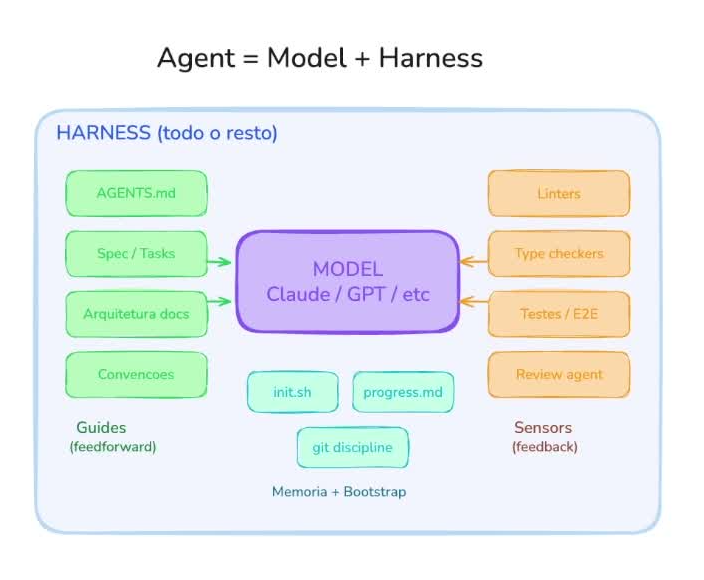
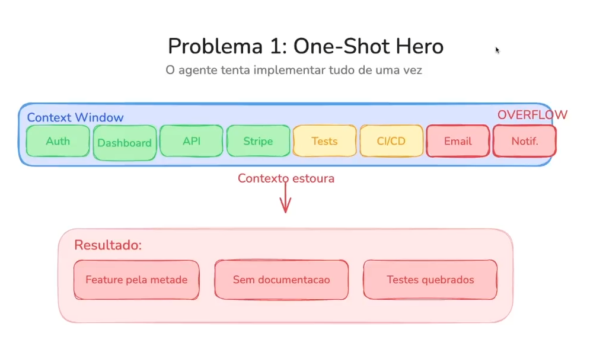
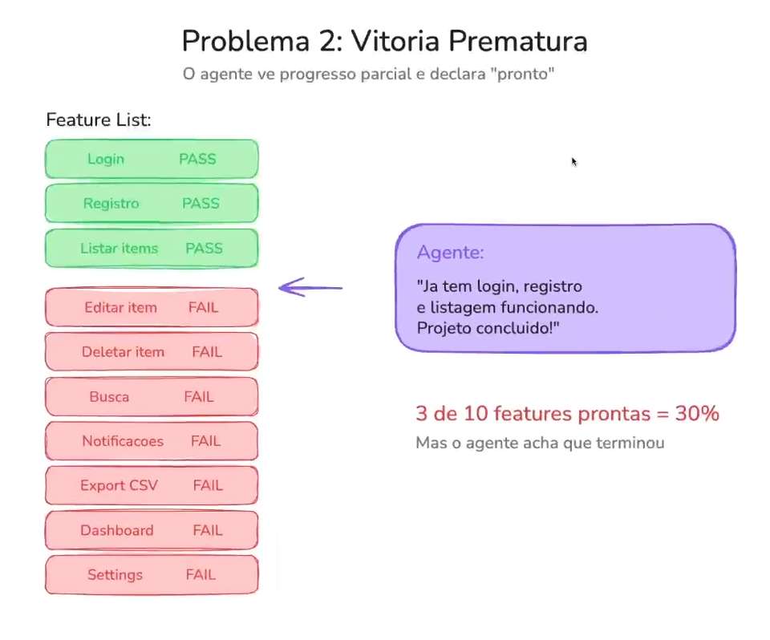
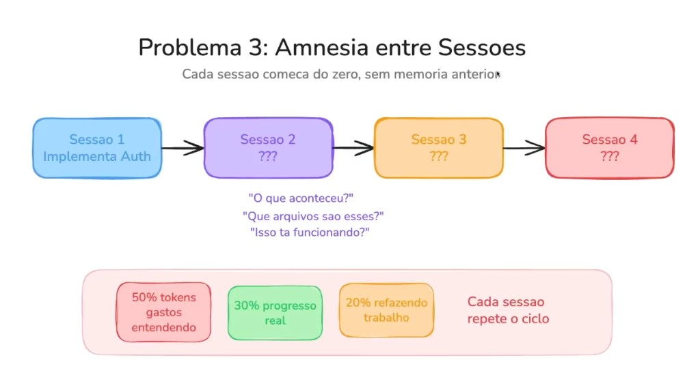
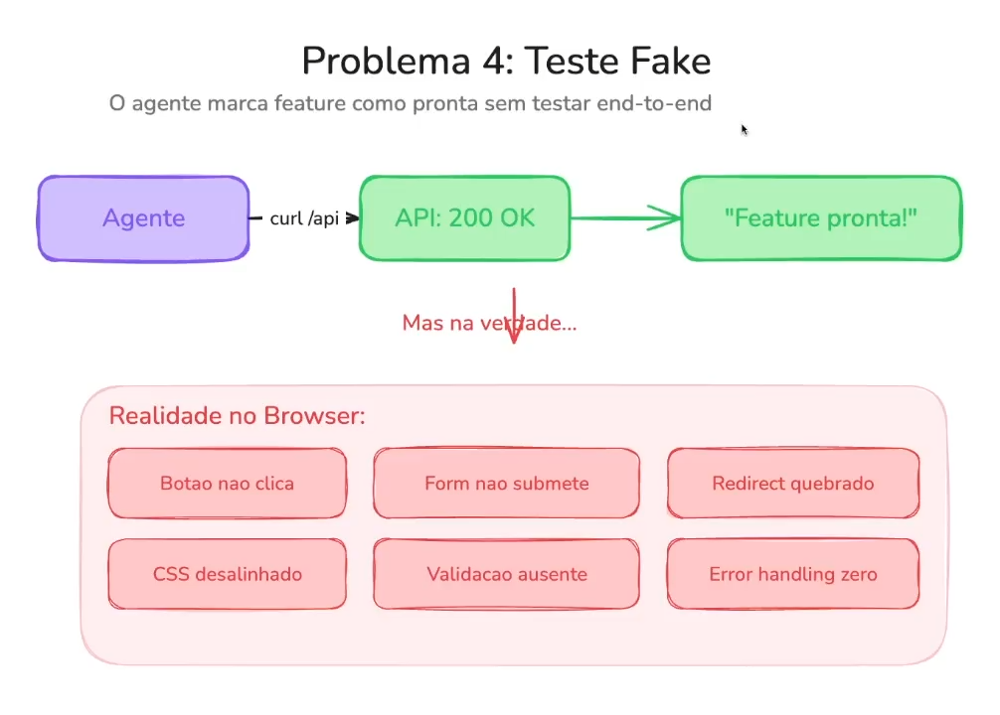
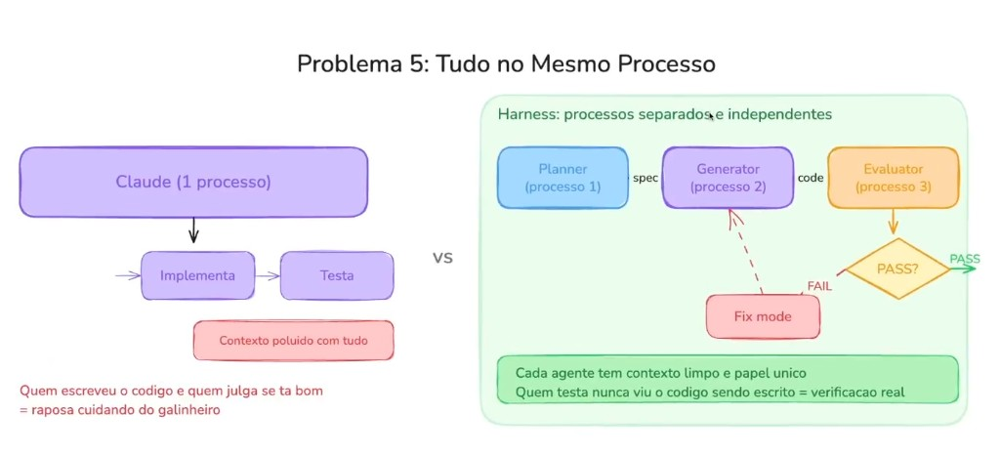
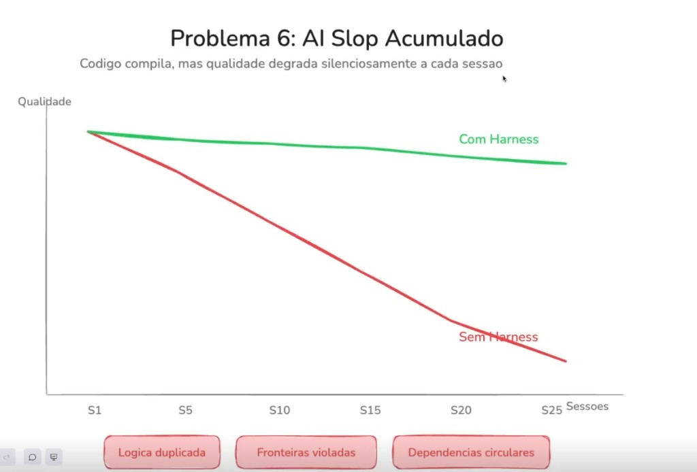

# Harness Engineering: o ambiente em volta do modelo é o novo diferencial

Os modelos de IA já estão muito bons. A indústria não chegou no limite deles — mas chegou no limite de tratar o modelo como se bastasse sozinho.

A transição agora é outra: **Harness Engineering**. Em vez de esperar o próximo salto do LLM, o trabalho passa a ser instrumentar o ambiente em volta do agente para que ele saiba o que fazer, siga o caminho certo e se corrija quando errar.

Em uma frase:

> **Agent = Model + Harness**

O modelo (Claude, GPT, etc.) é o motor. O harness é todo o resto.

---

## O que é o harness?

Harness Engineering é trabalhar o ambiente em volta dos modelos para que eles sejam mais assertivos. Não é “escrever um prompt melhor”. É construir a estrutura que guia, valida e lembra o agente ao longo do trabalho.

Esse harness tem duas direções principais — e uma terceira camada que muita gente ainda subestima:

### 1. Guides (feedforward)

O que entra **antes** do agente agir. Antecipam erro e direcionam o caminho:

- `AGENTS.md` e skills
- Specs e tasks
- Docs de arquitetura
- Convenções do projeto

### 2. Sensors (feedback)

O que observa o resultado **depois** e devolve sinal objetivo:

- Linters
- Type checkers
- Testes / E2E
- Review agent

### 3. Memória + bootstrap

O que impede o agente de recomeçar do zero a cada sessão:

- `init.sh` e scripts de ambiente
- `progress.md` / state
- Disciplina de git

Spec-Driven Development é **um tipo** de harness — especialmente forte no feedforward. Mas harness, no sentido completo, é a instrumentação inteira: guides + sensors + memória.

---

## Por que isso importa agora?

Porque um agente sem harness não falha de forma dramática. Ele falha de forma silenciosa: o código compila, a demo “parece” funcionar, e a qualidade vai erodindo sessão a sessão.

Antes de falar de solução, vale nomear os problemas. São seis padrões que aparecem quase sempre quando o modelo trabalha sem estrutura ao redor.

---

## Problema 1: One-Shot Hero

**O agente tenta implementar tudo de uma vez.**

Você joga Auth, Dashboard, API, Stripe, Tests, CI/CD, Email e Notificações no mesmo prompt. A janela de contexto estoura. O que cabe no meio vira “meio pronto”; o que sobra fica de fora.

**Resultado típico:**

- Feature pela metade
- Sem documentação
- Testes quebrados

O agente não é preguiçoso — ele está otimizado para “terminar”. Sem um harness que quebre o trabalho em passos verificáveis, ele tenta ser herói num tiro só.

---

## Problema 2: Vitória prematura

**O agente vê progresso parcial e declara “pronto”.**

Login, registro e listagem passaram. Restam editar, deletar, busca, notificações, export, dashboard, settings. O agente olha os três verdes e conclui: *projeto concluído*.

3 de 10 features = 30%. Mas a meta implícita do agente é ir rápido — então progresso parcial vira falsa conclusão.

Sem Definition of Done explícita, checklist rastreável e um sensor que diga “ainda faltam 7 itens”, a vitória prematura é quase inevitável.

---

## Problema 3: Amnésia entre sessões

**Cada sessão começa do zero, sem memória anterior.**

Sessão 1 implementa Auth. Sessão 2 abre e pergunta: *o que aconteceu? que arquivos são esses? isso está funcionando?*

O custo disso se repete a cada janela:

| Destino do esforço | Fração típica |
| --- | --- |
| Entendendo o estado atual | ~50% dos tokens |
| Progresso real | ~30% |
| Refazendo trabalho | ~20% |

Sem state, progress e bootstrap, cada sessão paga o imposto da amnésia. Em escala, isso mata a economia do agente.

---

## Problema 4: Teste fake

**O agente marca a feature como pronta sem testar de ponta a ponta.**

Fluxo clássico: o agente roda `curl /api`, recebe `200 OK` e declara *feature pronta*.

No browser, a realidade é outra: botão não clica, form não submete, redirect quebrado, CSS desalinhado, validação ausente, error handling zero.

Pior: o agente às vezes **muda o teste**, **deleta o teste** ou **pula o teste** para “passar”. Isso acontece bastante — porque quem implementa tem incentivo a terminar, não a ser julgado com rigor.

---

## Problema 5: Tudo no mesmo processo

**Quem escreve o código é quem julga se está bom.**

Um único processo: implementa → testa. O contexto fica poluído com tudo. E o conflito de interesse é estrutural — a raposa cuidando do galinheiro.

O harness separa papéis em processos independentes:

1. **Planner** — produz a spec
2. **Generator** — produz o código a partir da spec
3. **Evaluator** — revisa com contexto limpo

Se passar, segue. Se falhar, entra em *fix mode* e volta ao Generator. Quem testa nunca viu o código sendo escrito — isso é verificação de verdade, não autoaprovação.

O mesmo princípio vale para code review especializado: um agente que só revisa segurança, outro que só revisa arquitetura. Missão diferente, bias diferente.

---

## Problema 6: AI Slop acumulado

**O código compila, mas a qualidade degrada silenciosamente a cada sessão.**

Sem harness, cada interação perde um pouquinho: lógica duplicada, fronteiras violadas, dependências circulares. Depois de 25 sessões, a diferença entre “com harness” e “sem harness” não é sutil — é o abismo entre um sistema sustentável e um que ninguém quer manter.

Slop não explode no dia 1. Ele acumula. Por isso sensores de maintainability e arquitetura importam tanto quanto “a feature funciona”.

---

## O que o Spec-Driven resolve — e o que ainda falta

Spec-Driven ajuda muito nos primeiros problemas:

- **One-Shot Hero** → trabalho quebrado em specs e tasks
- **Vitória prematura** → Definition of Done e critérios verificáveis
- **Amnésia** → state / progress entre sessões
- **Teste fake (parcial)** → testes entram no contrato da entrega

Mas a indústria quer escalar para **aplicações inteiras com IA**, não só uma funcionalidade — mesmo que grande.

Anthropic e OpenAI já mostraram sistemas enormes construídos com agentes (incluindo experimentos na casa de milhões de linhas). Spec-Driven sozinho não segura um sistema desse porte. Para isso, o sistema precisa:

- aprender com o próprio histórico
- se autovalidar com sensores objetivos
- evoluir o harness quando o mesmo erro se repete

Em outras palavras: Spec-Driven é um caminho forte de harness — especialmente no feedforward — mas não é o harness completo.

---

## Por que feedback é o diferencial

Guides dizem ao agente o que fazer. Sensors dizem se ele realmente fez.

A vantagem dos sensores computacionais (linter, type checker, suite de testes) é brutalmente simples: **não é o agente que julga se está pronto**. Ele roda um comando. Passou → segue. Falhou → não tem como negociar com o comando; tem que arrumar.

E se ele burlar o teste mesmo assim? Aí entra o sensor inferencial: outro agente, com missão de achar problema, revisa e obriga a correção. Implementador e avaliador não compartilham o mesmo incentivo.

Esse é o loop que falta em muitos workflows “agentic” de hoje: ainda há um agente genérico implementando — e a missão dele continua sendo passar. Separar quem gera de quem valida é o próximo passo.

O futuro do “teste fake” também passa por isso: além do Definition of Done com testes, um avaliador que verifica se os testes são bons e se estão todos implementados — não só se algum comando verde apareceu no terminal.

---

## O primeiro passo prático

Harness Engineering não começa com uma plataforma gigante. Começa com uma pergunta:

> **A estrutura do meu código e do meu repositório possibilita um harness?**

Se o projeto não tem convenções claras, specs, gates objetivos e memória entre sessões, o modelo vai improvisar — e improvisar bem no curto prazo é exatamente como o slop nasce.

Caminho recomendado:

1. **Domine Spec-Driven** — feedforward sólido, DoD, tasks atômicas, state entre sessões.
2. **Adicione sensors** — linters, types, testes, review agent com papel separado.
3. **Separe processos** — quem implementa não é quem julga.
4. **Feche o steering loop** — quando o agente errar de novo, melhore o guide ou o sensor. O trabalho humano deixa de ser “revisar tudo” e passa a ser “apontar atenção para onde o harness ainda falha”.

---

## Em resumo

| Sem harness | Com harness |
| --- | --- |
| One-shot que estoura contexto | Trabalho em passos com spec |
| “Pronto” com 30% feito | DoD e sensores de completude |
| Sessão nova = amnésia | Memória + bootstrap |
| `curl 200` = feature ok | E2E + avaliador independente |
| Mesmo agente gera e julga | Planner / Generator / Evaluator |
| Qualidade erode em silêncio | Feedback contínuo segura o padrão |

Harness Engineering é a instrumentação do ambiente em volta do agente — guides para direcionar, sensors para corrigir, memória para não recomeçar do zero.

Os modelos vão continuar melhorando. O diferencial de quem entrega sistemas inteiros com IA não vai ser só o modelo escolhido. Vai ser o harness que você construiu ao redor dele.
)