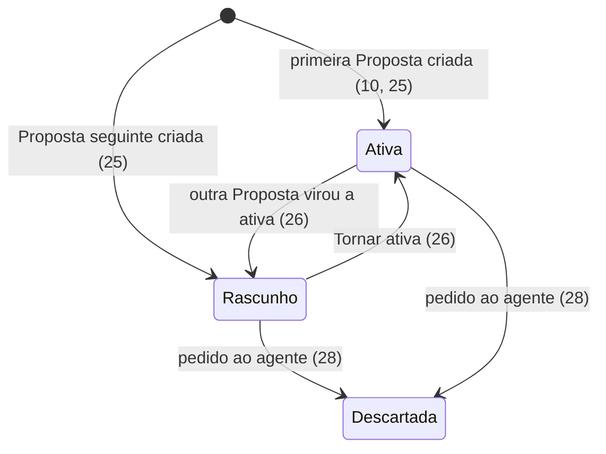
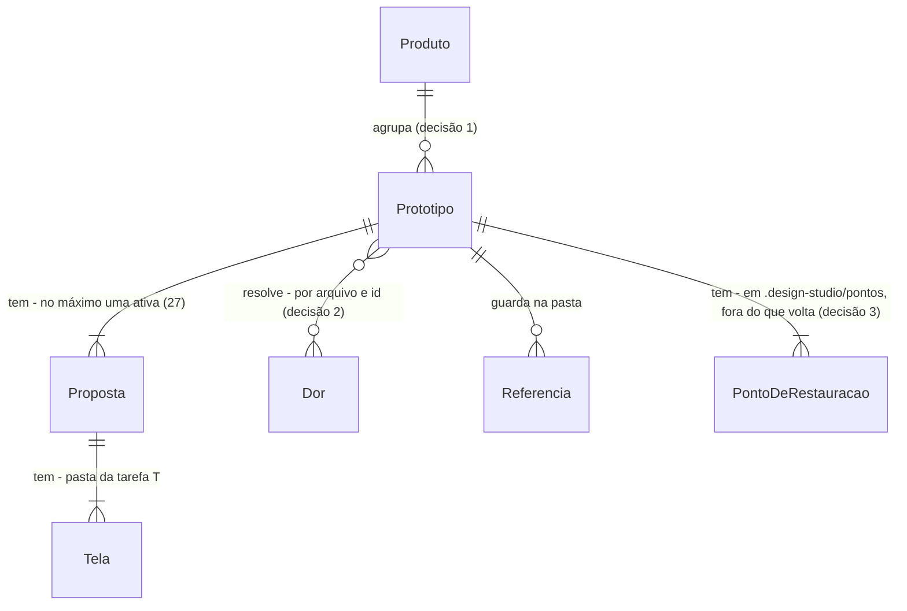

# 2 · Protótipo e sessão de design

> Construa com **tlc-implement** (`.claude/skills/tlc-implement/`). Cada critério abaixo vira uma checagem com prova, referenciada pelo número. Nada em `Unresolved` se decide durante a construção.

Ordem do corte: **T** e **1** em paralelo, depois **2**, depois **2b**, depois **3**. O usuário escolheu quatro tarefas em 2026-10-08. A **2b**, com o modo ao vivo, saiu desta tarefa no mesmo dia, depois da diretriz de que o modo ao vivo é 100% do app.

Esta tarefa usa da **T** o template, a forma de pastas e a conferência. Da **1** e do que já existe no módulo, usa o harness do Hive, os Relatórios (`relatorioFormato.ts`), a `<raiz>` (`dataRoot.ts`), o turno com escopo (`turnScope.ts`) e o perfil de design (decisão 2 de lá).

## Intent

Com a tarefa 1, a pessoa vê as Dores e conversa sobre elas, mas não consegue fazer nada com elas. A pergunta do POC termina em "uma Proposta melhorada, rodando ao vivo", e hoje nada roda: não existe Protótipo, nem quadro, nem Proposta, nem forma de voltar atrás. O caminho que um PM teria para mudar uma tela passa por pedir a alguém técnico, que é exatamente o que o produto quer evitar ("errar rápido"; PRODUCT, princípios 2 e 3). O ROADMAP registra dois riscos que caem aqui: o Node que roda o `ng serve` precisa atender o Angular 22, e um rebuild acima de 750 ms no Windows faz o template cru piscar.

O que muda:

- A pessoa cria um Protótipo a partir de Dores e Referências, ou de um Briefing num Produto novo, e o vê nascer no quadro.
- O agente recria o Atual, e as Dores ficam coladas ao lado das telas onde doem.
- Cada resposta do agente vira um Ponto de restauração.
- A pessoa compara Propostas lado a lado, testa como cliente e apresenta a história, da Dor à Proposta.

Mudar telas no lugar, com o modo ao vivo, é a tarefa 2b. As telas do estúdio são as do protótipo de validação e do DESIGN.md. As telas dentro dos Protótipos são livres no POC: o design system delas é o perfil de design, que no banco passa a ser o do IDS (ADR 0006).

49 critérios em 10 fatias · 6 portas de mão única · 14 em aberto, nenhum bloqueia

## Criteria

### Criar um Protótipo de produto existente

1. O seletor de Protótipo do campo do Início oferece, nesta ordem:
   - "Novo Protótipo em <Produto>" para cada Produto, com "<n> de 3 Fontes";
   - "Produto novo";
   - "Sem Protótipo";
   - os Protótipos existentes com miniatura, sob "Continuar um Protótipo".
2. Dado "Novo Protótipo em Câmbio", uma Dor citada e um print anexado, quando a pessoa envia, então:
   - o app cria `<raiz>\Câmbio\<nome>\` a partir do template (tarefa T);
   - abre a vista de trabalho, com a conversa à esquerda e o quadro à direita;
   - cria o primeiro Ponto de restauração, "Protótipo criado", com o detalhe "1 Dor".
3. O nome de um Protótipo novo é "<Tela> · <título da primeira Dor citada>", com o título cortado em 34 caracteres. Sem Dor citada, o nome é o começo do pedido, cortado em 42 caracteres.
4. Os anexos do envio viram Referências do Protótipo e ficam guardados na pasta dele. O primeiro turno do agente recebe as Referências, as Dores citadas (com resumo e Evidências) e a instrução de recriar o Atual.
5. Enquanto o agente recria o Atual, a linha mostra "Atual · recriando a tela de hoje" e os frames ficam em esqueleto. Ao terminar:
   - a linha vira "Atual · a tela de hoje", com um frame por tela na ordem do `telas.json`;
   - a resposta lista as ações em linguagem de PM, como "Recriou 3 telas do app atual".
6. Dado que nenhum Protótipo foi criado ainda, quando o primeiro é criado, então as dependências do template são instaladas uma única vez em `<raiz>\node_modules`, e os frames ficam em esqueleto até o Protótipo compilar. No segundo Protótipo nada é instalado.
7. Numa máquina Windows sem Node, depois de instalar o Hive, criar e abrir um Protótipo funciona: o `ng serve` roda com o Node ≥22.22.3 ou ≥24.15 que o instalador do Hive pôs na máquina (decisão 4).
8. Cada Dor do Protótipo aparece no quadro como nota grande, na cor da Fonte, ao lado do frame da tela onde dói (mesmo id de tela, tarefa T). A nota fica na linha da Proposta ativa, ou na do Atual enquanto não há Proposta, ligada ao frame por um conector tracejado. Tocar na nota abre a folha da Dor.
9. Sempre, uma Dor ligada a um Protótipo continua abrindo a mesma folha depois que o Relatório da Fonte dela é gerado de novo, porque o Protótipo guarda o arquivo e o id da Dor (decisão 2).

### Criar um Protótipo de Produto novo

10. Dado "Produto novo" e um pedido em texto, com ou sem PRD anexado, quando a pessoa envia, então o Protótipo nasce sem Atual e o Briefing aparece no quadro como nota com "Produto novo". O primeiro turno termina com a linha "Proposta A · sendo criada" virando "Proposta A · <título> · ativa".

### O quadro

11. O quadro mostra uma linha por Proposta (o Atual primeiro, depois A, B, C…). Em cada linha há um frame por tela, na ordem do `telas.json` e a 72px um do outro. Cada frame é a tela rodando de verdade (`/<proposta>/<tela>` do Protótipo) numa MolduraDeAparelho de 390×780, com o nome da tela no rótulo acima.
12. Quando a pessoa troca para desktop, então todos os frames passam a janelas de 1040×680 e o quadro se reenquadra. Trocar de volta devolve os frames a 390×780.
13. Os botões + e − multiplicam e dividem o zoom por 1,25 e mostram o valor em %. "Enquadrar tudo" põe todos os frames na vista. Com Mover, arrastar desloca o quadro. Os rótulos mantêm o tamanho de leitura em qualquer zoom, com piso de 0,42.
14. Enquanto o agente muda uma tela, o cursor laranja com o nome do agente desliza até o frame dela. Quando o turno termina, esse frame pulsa um anel uma vez. Com movimento reduzido, o anel fica fixo.
15. Quando a pessoa toca em "Ver no canvas" numa resposta do agente, então o quadro aproxima e realça o frame da tela que mudou.
16. Com a janela até 820px de largura, a vista de trabalho mostra a conversa ou o quadro, com um alternador entre os dois.

### Conversa do Protótipo e atalhos

17. Abaixo do campo da conversa do Protótipo ficam 8 atalhos: Revisar usabilidade, Checar acessibilidade, Deixar mais claro, Simplificar, Acabamento final, Adaptar para desktop, Melhorar primeiro uso e Nova Proposta. Tocar num deles envia o rótulo como mensagem. O app monta o turno com a referência do comando correspondente, lida da Skill de UX embarcada (decisão 5): `critique`, `audit`, `clarify`, `distill`, `polish`, `adapt` ou `onboard`. O agente recebe o texto da referência dentro do turno, e a skill nunca fica numa pasta que o agente descobre sozinho.
18. A resposta de "Revisar usabilidade" chega como o cartão "Revisão de usabilidade da <Proposta>", com os achados por gravidade (Resolvido, Alto, Médio, Baixo). As sugestões do cartão, quando tocadas, viram o próximo pedido.
19. Toda resposta do agente que mexeu no Protótipo lista as ações em linguagem de PM, tiradas das pastas que ele tocou ("Editou a tela Acompanhar", "Criou a Proposta B", "Criou a tela Período"). A lista termina com "Conferiu o Protótipo: abre sem erros" quando a conferência da tarefa T aprovou o Protótipo.
20. Sempre, nas conversas de Protótipo vale a mesma regra da tarefa 1 (critério 17): nenhuma chamada de ferramenta, comando, caminho de arquivo ou pedido de permissão aparece.
21. Se o agente tenta escrever fora da pasta do Protótipo ou rodar um comando fora da lista fechada (Unresolved 7), então nada acontece fora da pasta e nenhuma janela de permissão aparece. Dentro da pasta, ele escreve sem perguntar.
22. Dado um Protótipo existente escolhido no seletor do Início, quando a pessoa envia, então abre a vista de trabalho dele, com a mensagem nova no fim da conversa e as Dores citadas somadas às do Protótipo.
23. Enquanto o agente responde num Protótipo, enviar uma mensagem ou tocar num atalho mostra o aviso "Espere o agente terminar a resposta" e não manda nada.

### Propostas

24. O topo do quadro mostra as abas das Propostas ("Atual", "A · <título>", "B · <título>"…), com um ponto laranja na ativa e as descartadas esmaecidas. Tocar numa aba seleciona a Proposta.
25. Quando a pessoa toca em "Nova" (ou no atalho Nova Proposta), então o agente cria a próxima Proposta (pasta `b`, `c`…) com título e resumo, e uma linha nova aparece no quadro. A primeira Proposta de um Protótipo nasce ativa, e as seguintes nascem em rascunho.
26. Dada uma Proposta em rascunho selecionada, "Tornar ativa" faz dela a única ativa e devolve a anterior a rascunho. Aparecem o aviso "<Proposta> é a Proposta ativa" e o Ponto "<Proposta> virou a ativa".
27. Sempre, um Protótipo tem no máximo uma Proposta ativa, e o Atual nunca é a ativa.
28. Quando a pessoa pede ao agente para descartar uma Proposta, então a aba e o rótulo da linha ganham "· descartada", e a Proposta continua no quadro.

### Pontos de restauração

29. Toda resposta do agente que mudou o Protótipo cria um Ponto de restauração com título e detalhe, e a mensagem mostra o marcador do Ponto.
30. O botão de histórico abre "Pontos de restauração · voltar não apaga nada", com os Pontos do mais novo para o mais velho e "você está aqui" no atual.
31. Quando a pessoa escolhe "Voltar para este ponto" e confirma em "Voltar para cá", então:
    - os arquivos do Protótipo voltam ao estado daquele Ponto e os frames recarregam;
    - aparece o aviso "Voltou para “<título>”. Os pontos depois dele continuam guardados.";
    - o histórico mantém todos os Pontos.

    "Cancelar" não muda nada.
32. Dado que a pessoa voltou ao Ponto 3 de 9, quando o agente responde de novo, então o Ponto 10 aparece no topo, partindo do estado do Ponto 3. Os Pontos 4 a 9 continuam na lista e podem ser restaurados.
33. Voltar a um Ponto anterior à criação da Proposta B tira a aba e a linha B do quadro. Voltar a um Ponto posterior traz as duas de volta.
34. Sempre, voltar a um Ponto não muda a conversa: todas as mensagens continuam lá.

### Barra do quadro, Testar e Apresentar

35. A barra na base do quadro tem Mover, Testar (o único item laranja), o zoom e Enquadrar. A ferramenta ativa fica invertida em `tinta`, e `Esc` a desliga. As ferramentas do modo ao vivo (Comentar, Editar, Inserir, Texto e Ajustar) entram nessa barra pela tarefa 2b.
36. Quando a pessoa toca em Testar, então a Proposta selecionada (ou o Atual) abre por cima do quadro com "Testando · <Proposta>". Os toques navegam entre as telas como o cliente faria, e "Sair" ou `Esc` voltam ao quadro.
37. "Apresentar" abre em tela cheia os passos A Dor, Evidências, Onde dói, Relatório e Proposta, nesta ordem e quando existirem. O passo Proposta mostra o Atual ao lado da Proposta ativa e o que mudou. Num Produto novo, o passo Pedido entra no lugar dos quatro primeiros. A tela mostra "<i> de <total>", as setas, Home e End navegam, e `Esc` sai.

### Encontrar e retomar Protótipos

38. A navegação do módulo ganha o item Protótipos, entre Início e Dores, e "Recentes" passa a incluir Protótipos junto com as conversas.
39. A página Protótipos mostra o cartão "Novo Protótipo · Comece pelo chat" e um cartão por Protótipo, do mais recente para o mais antigo. Cada cartão traz:
    - as miniaturas do Atual e da Proposta ativa;
    - o Produto e o número de Dores (ou "Produto novo");
    - "<Proposta> ativa" ou "sem Proposta";
    - "Atualizado <quando>" e o agente.

    O filtro por Produto mostra "Nenhum Protótipo de <Produto> ainda" quando o Produto não tem nenhum.
40. A seção "Continuar" do Início mostra os 4 Protótipos mais recentes com miniaturas, e "Ver todos" leva à página Protótipos.
41. Três entradas criam um Protótipo no Produto das Dores, já citando-as: "Resolver esta Dor" na folha, "Resolver as 2 primeiras" no Relatório e "Criar Protótipo" numa resposta do agente na conversa do Produto. O primeiro turno usa o agente e o modelo de onde a pessoa partiu.
42. Na folha da Dor, "Protótipos com esta Dor" lista os Protótipos que a citam, com um link para cada um.
43. Quando a pessoa fecha e reabre o Hive, então um Protótipo abre com as Propostas, a ativa, os Pontos e a conversa como estavam.

### Perfil de design (ADR 0006)

44. Ao criar um Protótipo, o app copia para o arquivo de tokens dele o modelo de tokens do perfil ativo, quando o perfil tem um (tarefa 1, decisão 2). No perfil Livre, o arquivo começa com os tokens neutros do template.
45. Em todo turno de Protótipo, na conversa e nos atalhos, o app põe no turno o arquivo de tokens do Protótipo e os documentos de regras do perfil ativo (no Livre, não há documentos). Num perfil em que o agente não pode editar os tokens, uma escrita no arquivo de tokens é negada, sem janela de permissão.
46. Com um perfil que restringe cores ou fontes, depois de cada resposta que mexeu no Protótipo, a conferência da tarefa T procura cores e fontes fora do perfil (critério 13 de lá). Quando acha alguma, a resposta ganha a linha "Fora do design system: <n> cores e <m> fontes, em <telas>" e a sugestão "Ajustar ao design system", que vira o próximo pedido. No perfil Livre, essa linha nunca aparece.
47. Sempre, os testes de integração e E2E dos critérios 44, 45 e 46 rodam com o perfil Livre e com o perfil de exemplo restrito, e passam nos dois.

### O módulo dentro do Hive (ADR 0007)

48. Sempre, a CSP do renderer do Hive só deixa abrir em frame a origem `http://127.0.0.1` nas portas dos servidores dos Protótipos (decisão 6). Qualquer outra origem num frame continua bloqueada, como hoje (`frame-src 'none'`).
49. Sempre, o código novo desta tarefa continua passando no `dsOnly.test.ts`. As peças de tela que faltam (abas de Proposta, moldura de aparelho, barra do quadro, cursor do agente) entram no `@hive/design-system`, com o comportamento das peças de mesmo nome da lib de referência `design-studio/design-system/`.

## States

A Proposta (o Atual não tem estado):



Como se sai de Descartada é o Unresolved 9.

## Out of scope

- O modo ao vivo (Comentar, Editar, Inserir, Texto, Ajustar, anotações e parâmetros): está na tarefa 2b.
- Publicar (S3 e CloudFront), Testar com clientes, Hipótese e Enviar ao Figma: estão no Futuro do ROADMAP.
- Apagar ou renomear um Protótipo: nenhuma fonte pede.
- Atualizar a Skill de UX e a página de Configurações: ficam na tarefa 3. Aqui a Skill de UX é a versão embarcada, fixa.
- Recriar o Atual com `mirror`: só existe no iu-memorable, dentro do banco (ROADMAP, Riscos).
- O passo "Próximos passos" do Apresentar e o percurso Publicada, Testada e No Figma dos cartões: são do roadmap (tarefa 1, Unresolved 3).
- Recriar o Atual a partir de uma URL navegada pelo agente: a Referência do tipo URL entra como texto, e nenhuma fonte pede um navegador para o agente.

## Observable

| Surface | Decision | Landing |
| --- | --- | --- |
| vista de trabalho | vazio (Protótipo recém-criado) | 5, 10 |
| vista de trabalho | carregando (primeira instalação) | 6 |
| vista de trabalho | erro: a instalação falha | Unresolved 4 |
| vista de trabalho | erro: o Protótipo não compila | Unresolved 3 |
| vista de trabalho | sem autorização | n/a: o app é local e de uma pessoa só |
| quadro | densidade e ordem | 11, 13 |
| quadro | ação destrutiva confirma | 31 ("Voltar para cá") |
| barra do quadro | ferramenta ativa e saída | 35 |
| abas de Proposta | ordem | 24 |
| abas de Proposta | descartar | 28: só por pedido ao agente; a volta é o Unresolved 9 |
| histórico de Pontos | ordem e ação destrutiva | 30, 31 |
| histórico de Pontos | erro: voltar falha no meio | Unresolved 13 |
| Testar | entrar e sair | 36 |
| Apresentar | ordem e navegação | 37 |
| página Protótipos | vazio | 39 |
| página Protótipos | carregando | n/a: a lista vem de pastas locais, sem rede |
| página Protótipos | erro: pasta com `prototipo.json` inválido | Unresolved 12 |
| página Protótipos | ordem | 39 |
| coleção: Protótipos | agrupamento | 39 (filtro por Produto) |
| coleção: Protótipos | duplicatas | Unresolved 5 |
| coleção: Protótipos | a exceção que não encaixa | Unresolved 2 (Produto novo) |
| coleção: Dores no quadro | a exceção que não encaixa | Unresolved 6 (tela que não existe no Protótipo) |
| resposta do agente | conformidade com o perfil | 46, Unresolved 14 |
| frame de Protótipo | origem fora do permitido | 48 |

## Swept

- validation: 19 (conferência), 46 (conformidade com o perfil)
- failure modes: Unresolved 3, Unresolved 4, Unresolved 13 (voltar que falha no meio)
- idempotency and retry: 6 (a instalação acontece uma vez só), 32 (responder depois de voltar não apaga nem reaproveita Pontos)
- authorization: 21 (pasta do Protótipo, pelo turno com escopo do Hive, `turnScope.ts`), 45 (tokens travados pelo perfil), 48 (só frames locais), Unresolved 7 (lista de comandos)
- concurrency and ordering: 23 (uma resposta por vez no Protótipo), Unresolved 8 (servidores `ng serve` ao mesmo tempo), Unresolved 13 (voltar durante uma resposta)
- data lifecycle: 9 (referência estável à Dor), 31 a 34 (Pontos nunca se perdem); apagar um Protótipo está em Out of scope
- external-dependency failure: 7 (Node fornecido pelo app), Unresolved 4 (registro npm)
- state transitions: 25 a 28 (diagrama em States)
- observability: Unresolved 11

## Impact

| Front | What changes |
|---|---|
| domain | Protótipo, Proposta, Atual, Referência, Briefing e Ponto de restauração viram tipos no app com esses nomes (GLOSSARY) |
| domain | Proposta: no código é a pasta `src/app/propostas/<id>/` (tarefa T) e um item do `prototipo.json` (decisão 2) |
| domain | Ponto de restauração: quem faz o trabalho é um serviço de restauração próprio do app, sem git (decisão 3). O `checkpointService` do Hive não é copiado, e "checkpoint" nunca aparece para a pessoa (GLOSSARY: evitar) |
| domain | Skill de UX: esta tarefa traz a versão fixa, instalada no build pelo instalador da própria impeccable (decisão 5). O app lê dela a referência de cada atalho e a põe no turno (17). O modo ao vivo a usa na tarefa 2b, e atualizar fica na tarefa 3 |
| domain | perfil de design (tarefa 1, decisão 2): decide o modelo de tokens de um Protótipo novo (44), entra em todo turno (45) e é conferido depois de cada resposta (46) |
| Hive | a CSP do renderer passa de `frame-src 'none'` para a origem local dos Protótipos (48). A navegação do módulo ganha Protótipos (38). O `@hive/design-system` ganha as peças do quadro (49) |
| stored data | nada a migrar: nenhum Protótipo existe ainda |
| tarefa 1 | o campo do Início ganha o seletor de Protótipo; "Resolver esta Dor", "Resolver as 2 primeiras" e "Protótipos com esta Dor" passam a funcionar; "Recentes" passa a incluir Protótipos |
| tarefa 2b | a 2b usa os frames, as Propostas e os Pontos daqui e acrescenta as ferramentas do modo ao vivo na barra (35). A pasta das sessões do modo ao vivo (`.design-studio\vivo\`) fica fora dos Pontos (decisão 3) |
| sources | em 2026-10-08: o ROADMAP e o GLOSSARY foram emendados, a ADR 0005 foi reescrita e substituiu a 0003, a ADR 0002 deixou de copiar o `checkpointService`, e a ADR 0001 ganhou a origem concreta das atualizações |

## Decided

| Decision | Shape | Alternative rejected |
|---|---|---|
| 1. Pastas do Protótipo no disco | `<raiz>\<Produto>\<Protótipo>\`, cópia do template (tarefa T); Referências em `<Protótipo>\referencias\`; um `<raiz>\package.json` e um `<raiz>\node_modules\` compartilhados por todos os Protótipos | Um `node_modules` por Protótipo: centenas de MB e uma instalação a cada criação. O ROADMAP decidiu compartilhar |
| 2. Metadados do Protótipo dentro da pasta dele | `<Protótipo>\.design-studio\prototipo.json`, no bloco abaixo; volta junto com os Pontos (33) | Guardar na pasta de dados do app: voltar a um Ponto não traria de volta as Propostas e seus estados, e os Pontos e os metadados divergiriam |
| 3. Pontos de restauração num serviço próprio do app, sem git | ver o bloco "Pontos de restauração" abaixo. Cada Ponto guarda o estado da pasta do Protótipo, menos `node_modules`, `dist`, `.angular`, a própria pasta dos Pontos e a pasta das sessões do modo ao vivo. Um arquivo igual é guardado uma vez só. Voltar troca os arquivos da pasta pelos do Ponto e nunca apaga Pontos. A conversa fica fora dos Pontos (34) | git, visível ou como repositório-sombra: exige o git instalado, contra "sem pré-requisito além do login", e foi recusado pelo usuário em 2026-10-08. Copiar a pasta inteira a cada Ponto: cada resposta do agente custaria o Protótipo inteiro em disco. Guardar os Pontos na pasta de dados do app: mover ou copiar a pasta do Protótipo, ou reinstalar o app, perderia os Pontos |
| 4. O Node vem do instalador do Hive | se a máquina não tem um Node ≥22.22.3 ou ≥24.15, o instalador do Hive instala o LTS mais recente por usuário: zip, sem administrador, conferido por sha256 e no PATH do usuário. Em 2026-10-04 o LTS era o v24.21.0. O `ng serve`, o `npm install` do primeiro Protótipo, o `npx impeccable` (decisão 5 e tarefa 3) e o instalador do Claude Code do Hive (`agentInstaller.ts`) usam esse Node. É a resposta do usuário de 2026-10-04 no planejamento do módulo, retomada com a ADR 0007 | O Node do próprio Electron: o Electron 39 do Hive embute o Node 22.22.1, que o Angular 22 recusou no spike (ADR 0004). Exigir Node instalado à mão: fere "sem pré-requisito além do login" (ROADMAP). Um Node escondido dentro do app: o `npm install -g` do Claude Code continuaria sem Node na máquina (tarefa 1, Unresolved 1) |
| 5. A Skill de UX vem do instalador da própria impeccable, numa versão fixa embarcada, e é lida pelo app | no build do app, `npx impeccable@<versão> install -y --scope=project --providers=claude --no-hooks`, em `resources/design-studio/skill-de-ux/` do Hive. O app lê os arquivos de lá e entrega ao agente, no turno, só o que o passo precisa (17; tarefa 2b, decisão 5). A skill nunca vai para uma pasta que o agente descobre sozinho (`.claude/skills` ou `.agents/skills` da pasta do turno), e por isso Claude e Devin recebem a mesma coisa. Os hooks ficam desligados porque quem roda o detector é o app. O motor do Windows vem como `@impeccable/cli-windows-x64`, conferido pelo npm com o sha512 do registro. O app aponta `IMPECCABLE_BIN` para o `impeccable.exe` desse pacote, e assim o launcher nunca cai no download de reserva em `~/.impeccable/bin/` | Instalar a skill nas pastas do agente: o agente poderia acionar sozinho o modo live da skill e rodar os scripts dela, que a ADR 0005 tirou dele; e o instalador não tem destino para o Devin. Copiar a pasta da skill à mão: perde o binário da plataforma e a conferência do npm, e contraria a decisão do usuário (2026-10-08) de usar o instalador da própria impeccable. Aplicar patch na skill: proibido pela ADR 0004 |
| 6. A CSP do Hive abre só a origem local dos Protótipos | `frame-src http://127.0.0.1:*` no lugar de `frame-src 'none'`, na CSP do `index.html` do renderer do Hive. O servidor de cada Protótipo escuta só em `127.0.0.1` | `webview` ou `BrowserView` por frame: o quadro mostra dezenas de frames, e cada um seria um processo à parte. Liberar qualquer origem: um link dentro de um Protótipo poderia abrir a web dentro do Hive |

Metadados do Protótipo (decisão 2):

```jsonc
{
  "formato": "prototipo/1",
  "nome": "Remessa sem susto",
  "produto": "cambio",                  // id do catálogo (`resources/design-studio/catalogo.json`); Produto novo: Unresolved 2
  "tipo": "existente",                  // existente | novo
  "criadoEm": "2026-09-28T14:02:00-03:00",
  "agente": "claude", "modelo": "sonnet",
  "briefing": null,                     // texto, só em Produto novo
  "dores": [                            // referência estável: arquivo do Relatório + id (9)
    { "relatorio": "voz_2026-07-01_2026-09-29_20260929-085200.json", "dor": "cam-v1" }
  ],
  "referencias": [                      // tipo: print | url | sessao | arquivo
    { "tipo": "print", "nome": "Acompanhar (app atual).png", "arquivo": "referencias/acompanhar.png" }
  ],
  "propostas": [                        // estado: ativa | rascunho | descartada; o Atual não tem estado
    { "id": "atual", "nome": "Atual", "resumo": "Recriado a partir de 3 prints e 1 sessão." },
    { "id": "a", "nome": "Proposta A", "titulo": "Status que avisa", "resumo": "…", "estado": "ativa" }
  ],
  "telaInicial": "acompanhar"
}
```

Pontos de restauração (decisão 3):

```
<Protótipo>\.design-studio\pontos\
  pontos.json               a lista, abaixo
  manifestos\<id>.json      { "<caminho relativo>": "<sha256 do conteúdo>", … }
  objetos\<sha256>          o conteúdo de cada arquivo, guardado uma vez só

fora de todo Ponto: node_modules\  dist\  .angular\  .design-studio\pontos\  .design-studio\vivo\
```

```jsonc
// pontos.json
{
  "aqui": 7,                            // o Ponto em que a pessoa está: "você está aqui" (30)
  "pontos": [
    { "id": 7, "titulo": "Variante 2 aceita", "detalhe": "Botão “Confirmar remessa”",
      "quando": "2026-09-28T15:02:00-03:00",
      "base": 6 }                       // o Ponto de onde este partiu (32)
  ]
}
```

## Relations



## Sources

- [PRODUCT.md](../PRODUCT.md): Protótipo de produto existente e de produto novo, Propostas, Sessão de design, Pontos de restauração, sem pedido de permissão técnico, e os princípios 2 a 4 ("Esconder a máquina", "Errar rápido, com volta", "Mostrável").
- [ROADMAP.md](../ROADMAP.md), v1: Protótipo (template, `npm install` no primeiro, `node_modules` compartilhado, a pasta em `Documentos/Design Studio/<Produto>/<Protótipo>`, celular primeiro), atalhos (6 a 8 com rótulos de PM) e os Riscos (Node e rebuild de 750 ms).
- [ADR 0005](../docs/adr/0005-modo-ao-vivo-desenhado-pelo-estudio.md): o modo ao vivo é 100% do app (tarefa 2b), e a skill é lida pelo app, não instalada para o agente. [ADR 0004](../docs/adr/0004-template-angular.md): checagem de compilação e Node. [ADR 0002](../docs/adr/0002-harness-copiado-do-hive.md): o `checkpointService` não é copiado. [ADR 0001](../docs/adr/0001-porte-com-pontos-de-troca.md): o `mirror` só existe no banco.
- [DESIGN.md](../DESIGN.md): **vinculante para a interface**. O quadro, a moldura de aparelho e o frame, o cursor do agente e as barras flutuantes. A "Camada do Protótipo" não vale para o conteúdo dos frames no POC (ADR 0006).
- [design-system/](../design-system/), a lib de referência: **vinculante para o comportamento e a anatomia** de AbasDeProposta, BarraDeFerramentas, MolduraDeAparelho, CursorDoAgente, MensagemDoAgente, CartaoDeRevisao, NotaAutoadesiva e Toast. Os valores visuais e o código vêm do `@hive/design-system` (ADR 0007, 49).
- [ADR 0007](../docs/adr/0007-modulo-do-hive.md): o módulo no Hive, a CSP com `frame-src 'none'` que precisa abrir para os Protótipos, e o `@hive/design-system`.
- [prototype/](../prototype/): **vinculante para as telas desta tarefa e para o texto delas**. São elas: o quadro, os Pontos e o Testar (`workspace.js`), as respostas e os atalhos (`chat.js`), a criação e o nome do Protótipo (`home.js`), a página Protótipos (`pages.js`) e o Apresentar (`present.js`). O `data.js` traz os atalhos e a forma de um Protótipo. Quando um critério cita um texto entre aspas, ele vem desses arquivos.
- [impeccable.style, Downloads](https://impeccable.style/#downloads) e o README do pacote npm `impeccable` 4.1.0, lidos em 2026-10-08. Trazem:
  - `npx impeccable install` (sem perguntas, com `-y --providers=<lista> --scope=project`), `npx impeccable update` e `--no-hooks`;
  - o pacote é um launcher que roda o motor da plataforma (`@impeccable/cli-<os>-<arch>`, dependência opcional);
  - a ordem de busca do motor é `IMPECCABLE_BIN`, o pacote da plataforma, `~/.impeccable/bin/<versão>/` e, por fim, um download;
  - a impeccable exige Node ≥22.18.
- [ADR 0006](../docs/adr/0006-telas-livres-no-poc-ids-por-perfil.md): telas livres no POC; o design system das telas é o perfil de design.
- [Tarefa T](t-template-angular.md): a forma de pastas e de URL, o arquivo de tokens e a conferência. [Tarefa 1](1-modulo-e-dados-de-dor.md): o que já existe no módulo (formato do Relatório, `<raiz>`, catálogo, turno com escopo) e o perfil de design (decisão 2). [Tarefa 2b](2b-modo-ao-vivo-do-app.md): o modo ao vivo.

Esta tarefa é o registro da decisão. Se um documento linkado divergir dela, pergunte antes de construir.

## Unresolved

| # | Kind | Question | Until answered |
|---|---|---|---|
| 1 | open | Testar e Apresentar não estão em "Dentro do POC" do PRODUCT, mas estão no protótipo aprovado e na referência de experiência ("modo apresentação"; princípio 4). | Escrito por enquanto: os dois entram (36, 37). |
| 2 | open | Em que pasta fica um Protótipo de Produto novo, que não tem Produto no catálogo? O protótipo de validação o põe em Câmbio. | Escrito por enquanto: `<raiz>\Produtos novos\<Protótipo>\`, com `"produto": null`. |
| 3 | open | O que o frame mostra quando o Protótipo não compila depois de uma resposta? O servidor do Angular mostraria o erro cru. | Escrito por enquanto: os frames mantêm a última versão que compilou, e a conversa diz "A tela <Tela> não abriu depois desta resposta. Peça para o agente corrigir ou volte ao Ponto anterior." |
| 4 | open | O que a pessoa vê quando a instalação das dependências do primeiro Protótipo falha (sem internet, ou com o registro bloqueado)? | Escrito por enquanto: "Não consegui preparar o primeiro Protótipo. Confira a internet e tente de novo." com o botão "Tentar de novo". |
| 5 | open | O que acontece com dois Protótipos de mesmo nome no mesmo Produto? | Escrito por enquanto: a pasta do segundo ganha " 2" no fim do nome. |
| 6 | open | Onde fica a nota de uma Dor cuja tela não existe no Protótipo? | Escrito por enquanto: ao lado da última tela da linha. |
| 7 | open | Qual é a lista fechada de comandos do agente na pasta do Protótipo? | Escrito por enquanto: `ng build` pelo npm. `npm install` fica fora, porque o `node_modules` é compartilhado. A conferência e o detector ficam fora, porque quem os roda é o app. |
| 8 | open | Quantos servidores `ng serve` ficam de pé ao mesmo tempo? | Escrito por enquanto: só o do Protótipo aberto; abrir outro Protótipo para o servidor do anterior. |
| 9 | open | Uma Proposta descartada pode voltar? | Escrito por enquanto: só voltando a um Ponto anterior ao descarte (31). |
| 10 | open | Se `Documentos` estiver sincronizado pelo OneDrive, `<raiz>\node_modules` e os Pontos de cada Protótipo (decisão 3) sincronizam junto. | Escrito por enquanto: fica a pasta do ROADMAP, porque o POC roda na máquina pessoal (ADR 0001). |
| 11 | open | Onde ficam os registros de um turno de Protótipo, do `ng serve` e da instalação, para diagnosticar falhas? | Escrito por enquanto: seguem o Unresolved 4 da tarefa 1 (log do Hive, sem telemetria). |
| 12 | open | O que a página Protótipos faz com uma pasta cujo `prototipo.json` falta ou está inválido? | Escrito por enquanto: a pasta não aparece na lista, e nada nela é alterado. |
| 13 | open | O que acontece ao tocar em "Voltar para cá" enquanto o agente responde, e quando a troca de arquivos falha no meio? Durante uma sessão aberta do modo ao vivo, vale a regra da tarefa 2b (critério 38). | Escrito por enquanto: "Voltar para este ponto" fica desabilitado enquanto o agente responde. Se a troca falha no meio, o app reaplica o Ponto em que a pessoa estava e avisa "Não consegui voltar. Nada mudou." |
| 14 | open | Qual é o texto da linha de conformidade (46)? | Escrito por enquanto: "Fora do design system: <n> cores e <m> fontes, em <telas>" e a sugestão "Ajustar ao design system". |
