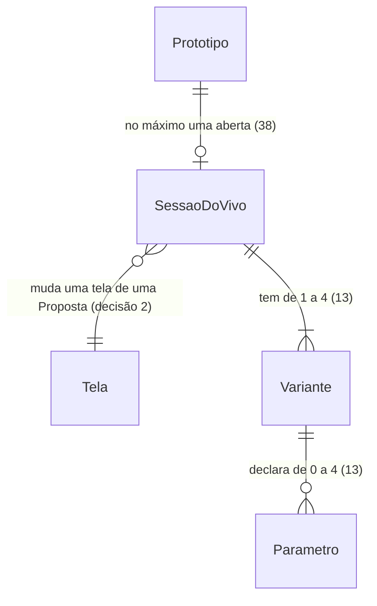

# 2b · Modo ao vivo do app

> Construa com **tlc-implement** (`.claude/skills/tlc-implement/`). Cada critério abaixo vira uma checagem com prova, referenciada pelo número. Nada em `Unresolved` se decide durante a construção.

Ordem do corte: **T** e **1** em paralelo, depois **2**, depois **2b**, depois **3**. Esta tarefa saiu da tarefa 2 em 2026-10-08, depois da diretriz do usuário de que o modo ao vivo é 100% do app.

Ela usa, de outras tarefas:
- da **2**: os frames, as Propostas e os Pontos;
- da **T**: a forma de pastas, o arquivo de tokens e a conferência;
- da **1** e do Hive: o turno com escopo (`turnScope.ts`) e o perfil de design.

## Intent

No live da impeccable, quem conduz é o agente. Ele mantém o loop de eventos (`live-poll`), acha o elemento no código e escreve as Variantes. Também roda o aceite e a limpeza depois dele ("carbonize"), e se recupera de quedas com comandos próprios. São oito passos que precisam acontecer na ordem ("No step skipped, no step reordered", `reference/live.md` 4.3.1), e a própria skill traz uma trava (`source_dirty`) para pegar o que o agente deixou para trás.

Um passo pulado deixa o Protótipo com marcas soltas, uma barra presa ou Variantes que nunca aparecem, e a pessoa de produto não tem como entender nem corrigir (PRODUCT, "Esconder a máquina"). A ADR 0003 já registrava que um loop mantido pelo agente só funciona razoavelmente com o Claude Code numa sessão viva, e o instalador da impeccable não tem destino para o Devin. O overlay do live tem cerca de 13 mil linhas de JavaScript sem tipos (`scripts/live-browser.js`).

O que muda: o modo ao vivo é todo do app, como pede a diretriz de 2026-10-08.
- O app lê a tela por uma ponte própria e desenha as ferramentas com o DS, em pt-BR.
- O app decide cada passo e só pede ao agente o conteúdo das Variantes, num formato que valida antes de usar.
- O app aplica, compila, mostra, aceita, descarta e recupera sozinho, sempre do mesmo jeito.
- Cada falha tem um aviso do próprio app.

Entram todas as funcionalidades do live da impeccable 4.3.1:
- Editar, com todas as ações e com o modo de mudar o estilo (o "departure" da impeccable), que o perfil Livre do POC libera (ADR 0006);
- Inserir;
- anotações e parâmetros;
- o ciclo de Variantes;
- o aceite com os parâmetros fixados, e o descarte;
- a edição de texto na tela;
- a recuperação.

Também ficam aqui o Comentar e o Ajustar do estúdio. A orientação da página inteira ("steer") já existe como a conversa do Protótipo (tarefa 2).

Tudo é tipado e tem prova automatizada: unitário e integração com Vitest, e E2E com Playwright no app Electron real.

48 critérios em 9 fatias · 6 portas de mão única · 14 em aberto, nenhum bloqueia

## Criteria

### A ponte do app lê a tela

1. Sempre, a ponte do app é injetada em todo frame de Proposta a cada carga da página, inclusive depois de uma recompilação, e nenhum arquivo do Protótipo muda para isso.
2. Se a ponte não responde num frame, então Comentar, Editar, Inserir, Texto e Ajustar ficam desabilitados naquele frame, com o aviso A1.
3. Com Editar ligado, o contorno de seleção do estúdio acompanha o elemento sob o ponteiro, em qualquer zoom e deslocamento do quadro.
4. Quando a pessoa escolhe um elemento, então o app localiza, no `.html` da tela (forma de pastas da tarefa T), o trecho exato que gerou aquele elemento. Se não acha um trecho único, não gera nada e mostra A2.
5. Quando o elemento escolhido se repete por uma lista (`@for`), então o painel mostra A3 antes de gerar.
6. Sempre, o modo ao vivo nunca muda o Atual. Ligar uma ferramenta com o Atual selecionado passa a seleção para a Proposta ativa. Sem nenhuma Proposta, as ferramentas ficam desabilitadas com A13.

### Gerar Variantes de um elemento (Editar)

7. O painel do Editar abre junto do elemento, com o alvo e a tela, e oferece:
   - as ações Livre, Deixar mais claro, Simplificar, Mais destaque, Mais discreto, Espaçamento, Tipografia, Cor, Adaptar, Acabamento, Animar, Encantar e Ousar, que correspondem a `impeccable`, `clarify`, `distill`, `bolder`, `quieter`, `layout`, `typeset`, `colorize`, `adapt`, `polish`, `animate`, `delight` e `overdrive`;
   - o pedido em texto, que é opcional ("Diga o que você quer (opcional)");
   - Quantas Variantes, de 1 a 4;
   - as anotações (8).

   Quando o perfil de design libera a troca de estilo (o Livre libera), o painel também oferece "Mudar o estilo". Com ele ligado, as Variantes podem sair da identidade atual da tela, no modo "departure" da Skill de UX. Quando o perfil não libera, o controle não aparece.

   "Gerar Variantes" e `Enter` no pedido começam a geração.
8. Antes de gerar, a pessoa pode anotar o elemento com notas presas a um ponto e com traços à mão. Ao gerar, o turno leva uma imagem do elemento com as anotações por cima e o texto de cada nota com a posição dela no elemento.
9. Sempre, para as mesmas entradas, o app monta o mesmo turno, byte a byte. As entradas são a versão da Skill de UX, a ação, o pedido, as anotações, o elemento e a tela. O turno traz:
   - as partes da Skill de UX listadas na decisão 5;
   - o trecho de código do elemento, o HTML renderizado e os estilos calculados;
   - o arquivo de tokens do Protótipo e os documentos de regras do perfil de design ativo;
   - o modo de geração: o padrão, que preserva a identidade, ou o de mudar o estilo, quando ligado;
   - o pedido e as anotações;
   - por último, o formato de resposta da decisão 1.
10. Sempre, no turno de geração o agente não tem ferramenta: não lê nem escreve arquivo e não roda comando. Uma tentativa é negada e não muda nada.
11. Quando a pessoa gera, então:
    - a conversa ganha a linha "<elemento> · <ação> · <pedido>";
    - o painel mostra "Gerando <n> Variantes para <elemento>…" com a barra de progresso;
    - o elemento ganha o brilho de geração, e o cursor do agente vai até ele.

    "Cancelar" encerra o turno, e nada muda.
12. Se a resposta não segue o formato da decisão 1, então o app pede de novo, até 2 vezes, apontando os erros. Se a terceira resposta também não segue, o app mostra A4, e nada muda. Depois de A4, A6 ou A10, o painel continua aberto com a ação, o pedido e as anotações, pronto para gerar de novo.
13. Sempre, uma Variante só entra na navegação se:
    - a raiz é um único elemento, da mesma tag do original;
    - o eixo declarado é diferente do eixo das outras Variantes da mesma geração;
    - tem no máximo 4 parâmetros, cada um com os campos do seu tipo;
    - cada parâmetro `range` é usado sem unidade, dentro de `calc()` (ADR 0004);
    - quando o perfil restringe cores, toda cor do CSS é um token do Protótipo; quando restringe fontes, toda família é uma das permitidas;
    - compila.
14. Quando parte das Variantes não passa no critério 13, só as que passaram aparecem, e o painel mostra A5. Quando nenhuma passa, o painel mostra A6, e os arquivos da tela voltam byte a byte ao que eram.
15. Sempre, o frame só mostra a Variante 1 quando ela já está montada e nenhum `{{` cru aparece na tela (ADR 0004).
16. A navegação "Variante <i> de <n>", com o nome e o resumo da Variante, troca a Variante no próprio frame sem novo turno e sem nova compilação. Com o foco no painel, as setas para a esquerda e para a direita fazem o mesmo.
17. Se o agente não responde em 3 minutos, então o app encerra o turno e mostra A10, e nada muda.

### Inserir

18. Com Inserir, o ponteiro sobre a tela de uma Proposta mostra a mira entre dois blocos: linha laranja de 2px, ponto de 14px e a pílula "Inserir antes do bloco <rótulo>" ou "Inserir depois do bloco <rótulo>". Clicar abre o painel com:
    - Onde (Antes ou Depois);
    - o pedido em texto livre;
    - as sugestões por tipo (aviso, ajuda, botão, campo, etapas, resumo);
    - Tamanho (P, M ou G);
    - Quantas Variantes (1 a 4);
    - as anotações.

    "Gerar" fica habilitado quando há pedido ou anotação.
19. Ao gerar, a tela abre a vaga tracejada no ponto escolhido, com altura mínima de 56, 96 ou 160px conforme P, M ou G. A pessoa pode arrastar a borda da vaga para mudar o tamanho pedido. O brilho varre a vaga e o cursor do agente vai até ela. Depois, cada Variante aparece na vaga com o contorno tracejado da prévia.
20. Sempre, no Inserir o bloco âncora fica byte a byte igual: as Variantes entram antes ou depois dele.

### Parâmetros das Variantes

21. Quando a Variante mostrada declara parâmetros, o painel mostra um controle por parâmetro: deslizante para `range`, segmentado para `steps` e liga-desliga para `toggle`, com o rótulo que a Variante deu. Mexer num controle muda a tela na hora, sem novo turno e sem nova compilação.
22. Trocar de Variante volta os parâmetros aos valores padrão da Variante nova.

### Aceitar e descartar

23. "Aceitar" (no Editar) e "Inserir" (no Inserir) gravam no `.html` e no `.css` da tela só a Variante escolhida, com os valores atuais dos parâmetros já fixados. Em seguida:
    - aparece "Variante aceita · Ponto de restauração criado" ou "Elemento inserido · Ponto de restauração criado";
    - nasce o Ponto "Variante <i> aceita" ou "Elemento inserido";
    - a conversa ganha "Apliquei a Variante <i> (<nome>) em <elemento>, na <Proposta>."
24. Sempre, depois de aceitar, nenhuma marca da sessão sobra no código da Proposta (os comentários `ds-vivo`, os atributos `data-ds-vivo-*` e `data-p-*` e as variáveis `--p-*`), e a conferência da tarefa T aprova o Protótipo.
25. Sempre, a captura do frame logo antes de aceitar e a captura logo depois são iguais pixel a pixel.
26. "Descartar" devolve os arquivos da tela byte a byte ao que eram antes da sessão, fecha o painel e mostra "Variantes descartadas. Nada mudou." No Inserir, o aviso é "Variantes descartadas. Nada foi inserido." Nenhum Ponto é criado.
27. Se um arquivo da tela mudou fora da sessão enquanto ela estava aberta, então "Aceitar" é recusado com A7, e só "Descartar" fica disponível.
28. Depois de aceitar, o app roda `impeccable detect --json` na tela mudada, sem desfazer o aceite, e mostra o resultado na conversa. A forma de mostrar é o Unresolved 5.

### Editar texto na tela

29. Com a ferramenta Texto, tocar num texto fixo de uma Proposta deixa esse texto editável no próprio frame. A barra "<n> textos alterados" oferece "Aplicar" e "Descartar".
30. "Aplicar" grava cada texto no `.html` da tela, sem chamar o agente, e cria o Ponto "Textos editados". Um texto que não pôde ser gravado aparece listado com o motivo (A8), e os outros continuam gravados.
31. Se o texto vem dos dados da tela (`{{ … }}`), então ele não fica editável, e o app mostra A9.
32. "Descartar" devolve os textos da tela ao que eram, sem criar Ponto.

### Ajustar e Comentar

33. Com Ajustar, o painel muda densidade, texto, cantos e cor, e mostra o efeito no frame na hora. As cores oferecidas são as do arquivo de tokens do Protótipo. "Desfazer" volta ao que era. "Aplicar" grava os valores no CSS da tela, sem chamar o agente, e cria o Ponto "Ajustes aplicados".
34. Com Comentar, clicar numa tela põe um pino numerado com o campo "O que mudar aqui?", e `Enter` salva. A barra "<n> comentários na tela", com "Enviar ao agente", manda todos os pendentes numa mensagem "Aplique estes comentários:", com a tela de cada um. Quando o agente termina, os pinos viram resolvidos (✓) e nasce o Ponto "Comentários aplicados".
35. Todo painel do modo ao vivo é um diálogo não modal: o quadro continua usável, e `Esc` fecha o painel e desliga a ferramenta.

### Falhas e recuperação controladas pelo app

36. Se a ponte cai durante uma sessão (o frame recarregou), então o app a injeta de novo e volta a mostrar a mesma Variante, com os mesmos valores de parâmetro.
37. Se o app fecha no meio de uma sessão, então, ao reabrir o Protótipo, os arquivos da tela voltam byte a byte ao que eram antes dela, e aparece A11.
38. Enquanto há uma sessão aberta (Variantes, textos ou ajustes ainda não aplicados), estas ações mostram A12 e não fazem nada: enviar mensagem, tocar num atalho, "Voltar para este ponto" e ligar uma ferramenta em outra tela.
39. Sempre, um Ponto só nasce com a sessão fechada, e por isso nenhum Ponto guarda marcas de uma sessão.
40. Sempre, toda falha do modo ao vivo mostra um aviso da tabela abaixo e grava no log local o código dele. Nenhuma mensagem crua de compilador, de ferramenta ou de agente chega à pessoa.

### Tipado e testado

41. Sempre, o código do modo ao vivo, no app e na ponte, passa no `tsc --noEmit` com `strict: true`, sem `any` explícito, sem `@ts-ignore` e sem `@ts-expect-error`.
42. Sempre, toda mensagem entre a ponte e o app, e toda resposta do agente, passa por um validador de esquema antes de ser usada. Uma mensagem que não passa é descartada e registrada no log.
43. Cada critério desta tarefa tem prova automatizada no nível certo:
    - regras e transformações, em teste unitário;
    - o caminho de montar o turno, validar, gravar, compilar, aceitar e descartar, em teste de integração contra um Protótipo criado do template;
    - cada fluxo de tela, em E2E com Playwright contra o app Electron real.
44. Sempre, os testes de integração e os E2E do modo ao vivo usam o agente de teste (decisão 6), com respostas gravadas, e passam sem rede e sem as CLIs dos agentes.
45. A cobertura de linhas e de ramos do código do modo ao vivo é de 100%.
46. Sempre que um trecho do overlay da impeccable é portado, o arquivo traz o aviso da licença Apache 2.0 e a nota de que foi modificado, e o aviso de terceiros do app cita a impeccable.
47. Sempre, os testes de integração e E2E do modo ao vivo rodam com o perfil Livre e com o perfil de exemplo restrito (tarefa 1, decisão 2), e passam nos dois:
    - no Livre, "Mudar o estilo" aparece, e o validador aceita qualquer cor e qualquer fonte;
    - no restrito, "Mudar o estilo" não aparece, e uma Variante com cor fora dos tokens ou fonte fora da lista cai (13).
48. Sempre, o código novo desta tarefa continua passando no `dsOnly.test.ts`. O painel flutuante, a mira, a vaga, a prévia, o deslizante e o liga-desliga entram no `@hive/design-system`, com o comportamento das peças de mesmo nome da lib de referência `design-studio/design-system/`.

**Avisos do modo ao vivo.** Os textos são propostas (Unresolved 2) e seguem a voz do DESIGN.md: pt-BR simples, sem exclamação e sem nomes da máquina.

| Código | Quando | Texto proposto |
|---|---|---|
| A1 | a ponte não responde no frame (2) | "Esta tela ainda não carregou. Espere um instante para mexer nela." |
| A2 | o elemento não tem um trecho único no código (4) | "Não consegui achar este elemento no código da tela. Escolha um elemento vizinho ou peça a mudança no chat." |
| A3 | o elemento se repete numa lista (5) | "Este elemento se repete numa lista. A mudança vale para todos os itens." |
| A4 | três respostas fora do formato (12) | "O agente respondeu de um jeito que não consigo usar. Nada mudou. Tente de novo." |
| A5 | parte das Variantes caiu (14) | "<k> de <n> Variantes ficaram prontas. As outras não seguiam as regras da tela." |
| A6 | nenhuma Variante passou (14) | "Nenhuma Variante ficou pronta. Nada mudou. Tente outro pedido." |
| A7 | a tela mudou fora da sessão (27) | "Esta tela mudou enquanto você escolhia. Descarte as Variantes e gere de novo." |
| A8 | um texto não foi gravado (30) | "<k> textos não puderam ser aplicados: <motivo>." |
| A9 | o texto vem dos dados (31) | "Este texto vem dos dados da tela e não dá para editar aqui. Peça a mudança no chat." |
| A10 | o agente não respondeu em 3 minutos (17) | "O agente demorou demais para responder. Nada mudou. Tente de novo." |
| A11 | o Hive fechou no meio de uma sessão (37) | "O Hive fechou no meio de uma mudança. A tela voltou a como estava antes." |
| A12 | outra ação com uma sessão aberta (38) | "Termine o que está aberto na tela (aceite, aplique ou descarte) antes de continuar." |
| A13 | ainda não há Proposta (6) | "Peça uma Proposta ao agente primeiro." |

## States

Uma sessão do modo ao vivo (Editar ou Inserir):

```mermaid
stateDiagram-v2
    [*] --> Gerando: Gerar (7, 18)
    Gerando --> Aberta: ao menos uma Variante passou (14, 15)
    Gerando --> [*]: Cancelar, formato inválido, tempo esgotado ou nenhuma Variante (11, 12, 14, 17)
    Aberta --> Aberta: trocar de Variante ou mexer num parâmetro (16, 21, 22)
    Aberta --> Aberta: a ponte caiu e voltou (36)
    Aberta --> [*]: Aceitar ou Inserir, com Ponto (23)
    Aberta --> [*]: Descartar, sem Ponto (26)
    Gerando --> [*]: o app fechou; ao reabrir, a tela volta ao que era (37)
    Aberta --> [*]: o app fechou; ao reabrir, a tela volta ao que era (37)
```



As sessões de Texto e de Ajustar só têm o estado Aberta, e saem dele por Aplicar (30, 33) ou por Descartar e Desfazer (32, 33).

## Out of scope

- Injeção em arquivo, configuração e CSP do live da impeccable (`live-setup.md`): a ponte é injetada pelo app em tempo de execução (decisão 4).
- Adaptadores Svelte, JSX e Astro: o template é Angular (ADR 0004).
- O evento `prefetch`: o app já sabe o arquivo de cada tela pela forma de pastas da tarefa T.
- "Steer" como controle à parte: a conversa do Protótipo já é esse canal (tarefa 2). A versão falada usa o ditado do Hive (tarefa 1, critério 9).
- "Click to copy" do overlay, que copia o contexto do elemento para colar no chat de um agente: no estúdio, a escolha do elemento já vai para a conversa (11).
- Voltar a uma Variante descartada: o descarte é definitivo, e a volta é gerar de novo.

## Observable

| Surface | Decision | Landing |
| --- | --- | --- |
| frame de Proposta | sem ponte | 2 |
| frame de Proposta | sem Proposta | 6 |
| painel do Editar | vazio | 7: o pedido é opcional, e Gerar funciona com qualquer ação |
| painel do Editar | carregando | 11 |
| painel do Editar | erro | 12, 14, 17 |
| painel do Editar | ação destrutiva | 26: Descartar não pede confirmação, porque devolve tudo |
| painel do Inserir | vazio | 18 (Gerar exige pedido ou anotação) |
| painel do Inserir | carregando | 19 |
| controles de parâmetro | vazio | 21: Variante sem parâmetro não mostra controle |
| barra de textos | vazio e erro | 29, 30, 31 |
| painel do Ajustar | ação destrutiva | 33 ("Desfazer") |
| cartão do detector | forma | Unresolved 5 |
| qualquer falha | texto | tabela de avisos, Unresolved 2 |
| coleção: Variantes de uma geração | ordem e duplicatas | 16 (ordem de chegada), 13 (eixo repetido cai) |
| coleção: textos alterados | duplicatas | n/a: o mesmo texto editado duas vezes guarda a última versão |
| documento: turno de geração, lido pelo agente | estrutura e próximo passo | 9 e decisão 5; o próximo passo do agente é só responder no formato da decisão 1 |

## Swept

- validation: 13, 31, 42
- failure modes: 12, 14, 17, 27, 36, 37, 40
- idempotency and retry: 12 (novas tentativas com os erros apontados), 26 (descartar devolve byte a byte)
- authorization: 10 (o agente não tem ferramenta no turno de geração)
- concurrency and ordering: 38 (uma sessão por vez; chat, atalhos e "Voltar" esperam)
- data lifecycle: decisão 3 (o diário some quando a sessão fecha), 39
- external-dependency failure: 17 (agente sem resposta), 44 (testes sem rede e sem CLI)
- state transitions: 7 a 37 (diagrama em States)
- observability: 40 (o código do aviso vai para o log)

## Impact

| Front | What changes |
|---|---|
| domain | termo existente: Variante passa a ser um objeto do app, validado (decisão 1), com nome, resumo, eixo e parâmetros |
| domain | termo novo: Parâmetro, o controle de uma Variante (deslizante, segmentado ou liga-desliga) que muda a tela sem gerar de novo. Ainda não está no GLOSSARY (Unresolved 10) |
| domain | termo novo: Anotação, uma nota ou um traço sobre o elemento, feito antes de gerar |
| domain | termo interno: sessão do modo ao vivo. A pessoa nunca vê a palavra; ela vê Variantes, textos e ajustes |
| domain | termo existente: a Skill de UX deixa de dar o modo live (GLOSSARY emendado) |
| tarefa 2 | a barra do quadro ganha Comentar, Editar, Inserir, Texto e Ajustar (critério 35 de lá), e os Pontos não guardam `.design-studio\vivo\` (decisão 3 de lá) |
| tarefa 1 e Hive | o turno com escopo do Hive (`turnScope.ts`) ganha o caso do turno de geração, sem ferramenta. O perfil de design (decisão 2 da tarefa 1) decide a troca de estilo (7), as regras do turno (9) e o que o validador cobra (13) |
| tarefa 3 | o teste rápido confere o contrato da decisão 5 |
| design system | o `@hive/design-system` ganha o painel flutuante, a mira, a vaga, a prévia, o deslizante e o liga-desliga (48). Na lib de referência, o README do Inserir passa a aceitar anotação no lugar do pedido (Unresolved 9) |
| stored data | nada a migrar |
| sources | em 2026-10-08: ADR 0005 reescrita, ADR 0003 substituída, ROADMAP e GLOSSARY emendados. O PRODUCT foi emendado no mesmo dia, com as ferramentas desta tarefa |

## Decided

| Decision | Shape | Alternative rejected |
|---|---|---|
| 1. Formato da resposta do agente no modo ao vivo | JSON, no bloco "Resposta do agente" abaixo; o app valida antes de usar (12, 13, 42) | O agente escreve as Variantes direto no arquivo, como no live da impeccable: o app não poderia validar antes de a tela mudar, e o agente voltaria a conduzir a sessão. Também rejeitado: HTML com atributos `data-impeccable-*`, que prende o app ao formato interno da skill |
| 2. A sessão vive no código da tela, num bloco que o app escreve e remove | no bloco "Sessão no código" abaixo: as N Variantes de uma vez, só a mostrada visível. A ponte troca a Variante e os parâmetros sem compilar (16, 21). O aceite e o descarte são feitos pelo app (23, 26) | Uma Variante por vez no arquivo, com uma compilação por troca: acima de 750 ms no Windows, o template cru pisca (ROADMAP, Riscos). A ponte injetar a Variante direto na página: os bindings do Angular (`{{ }}`) não seriam compilados, o problema medido na ADR 0004. Componentes de prévia à parte, como o caminho Svelte da impeccable: exigiria que o template soubesse montá-los, e o template é ponto de troca (ADR 0001) |
| 3. Diário da sessão dentro da pasta do Protótipo | `<Protótipo>\.design-studio\vivo\<sessão>\`, no bloco "Diário" abaixo. Ele é apagado quando a sessão fecha e nunca entra num Ponto (tarefa 2, decisão 3) | Guardar só em memória: um fechamento no meio deixaria o bloco de sessão no código, sem como voltar (37). Usar o diário da impeccable (`.impeccable/live/sessions/`): é da skill e do agente |
| 4. A ponte é um script do app, injetado em tempo de execução | script tipado, injetado pelo Electron no carregamento de cada frame de Proposta. Conversa com o app só por mensagens validadas (42). Nenhum arquivo do Protótipo, do template ou da Skill de UX o carrega | Injetar no `index.html`, como o `live-inject` da impeccable: muda arquivos do Protótipo, pede ajuste de CSP e quebra na troca do template (ADR 0001). Ponte dentro do template: morre na troca pelo iu-memorable |
| 5. O que o app lê da Skill de UX, por versão | a lista do bloco "Contrato com a Skill de UX" abaixo. O app extrai as seções pelo início do título, e o turno termina com o formato da decisão 1, que se sobrepõe a qualquer instrução de entrega da skill. **Alcança a tarefa 3:** uma versão nova que não traga um desses arquivos ou títulos é recusada no teste rápido | Copiar essas regras para dentro do app: as melhorias da Skill de UX não chegariam ao agente, contra "utilizando todas as capacidades do impeccable" (diretriz de 2026-10-08). Deixar o agente ler a skill sozinho: ele seguiria o contrato do live da skill (poll e scripts), que a ADR 0005 tirou dele |
| 6. O agente é uma porta com três adaptadores | Claude e Devin, pelo harness do Hive e sem ferramentas no turno (10), e o agente de teste, que devolve respostas gravadas por caso (44) | Testar com os agentes reais: o resultado não seria determinístico, gastaria tokens e dependeria de rede, contra o critério 44 |

Resposta do agente (decisão 1):

```jsonc
{
  "formato": "variantes/1",
  "variantes": [
    {
      "n": 1,
      "nome": "Mais compacto",                // aparece em "Variante 1 de 3"
      "resumo": "Menos espaço interno, o mesmo conteúdo.",
      "eixo": "densidade",                    // diferente em cada Variante; no Livre, um dos seis eixos da Skill de UX
                                              // (hierarquia | layout | tipografia | cor | densidade | estrutura)
      "html": "<section class=\"aviso\">…</section>",   // um só elemento raiz; no Editar, a mesma tag do original
      "css": ".aviso { … }",                  // regras para o elemento e os filhos dele; quem escopa é o app
      "parametros": [                         // 0 a 4
        { "id": "densidade", "tipo": "steps", "rotulo": "Densidade", "padrao": "justa",
          "opcoes": [{ "valor": "folgada", "rotulo": "Folgada" }, { "valor": "justa", "rotulo": "Justa" }] },
        { "id": "acento", "tipo": "range", "rotulo": "Quantidade de cor",
          "min": 0, "max": 1, "passo": 0.05, "padrao": 0.5 },
        { "id": "serifa", "tipo": "toggle", "rotulo": "Título com serifa", "padrao": false }
      ]
    }
  ]
}
```

Sessão no código (decisão 2), no `.html` da tela, no lugar do elemento escolhido (no Inserir, ao lado do bloco âncora):

```html
<!-- ds-vivo:inicio s-20260928-150201 -->
<div data-ds-vivo-sessao="s-20260928-150201" style="display: contents">
  <style>
    @scope ([data-ds-vivo-variante="1"]) { .aviso { … } }
    @scope ([data-ds-vivo-variante="2"]) { .aviso { … } }
  </style>
  <div data-ds-vivo-variante="1" style="display: contents">…html da Variante 1…</div>
  <div data-ds-vivo-variante="2" style="display: none">…html da Variante 2…</div>
</div>
<!-- ds-vivo:fim s-20260928-150201 -->
```

Os parâmetros entram na Variante mostrada como `--p-<id>` (em `range` e `toggle`) e `data-p-<id>` (em `steps` e `toggle`). Quem os põe é a ponte.

Diário (decisão 3):

```
<Protótipo>\.design-studio\vivo\<sessão>\
  sessao.json     abaixo
  antes\          cópia dos arquivos da tela no início da sessão
```

```jsonc
{
  "formato": "sessao-vivo/1",
  "id": "s-20260928-150201",
  "ferramenta": "editar",                     // editar | inserir | texto | ajustar
  "estado": "aberta",                         // gerando | aberta
  "proposta": "a", "tela": "confirmar",
  "arquivos": { "src/app/propostas/a/confirmar/confirmar.component.html": "<sha256 no início>" },
  "variantes": [],                            // o formato da decisão 1, já validado
  "mostrada": 2,
  "parametros": { "densidade": "folgada" }
}
```

Contrato com a Skill de UX (decisão 5), relativo à pasta da versão em uso:

```
SKILL.md                         regras gerais de design (ação Livre)
reference/craft-floor.md         piso de contraste, espaçamento e tipo (toda geração)
reference/<ação>.md              clarify distill bolder quieter layout typeset colorize adapt polish animate delight overdrive
reference/live.md, só as seções  "### 1. Read the screenshot" (anotações), "### 4. Plan three variants",
                                 "### 5. Apply the freeform prompt", "### 7. Parameters"
reference/<comando>.md           critique audit clarify distill polish adapt onboard (atalhos da tarefa 2)
o motor (IMPECCABLE_BIN)         impeccable detect --json (28)
```

## Relations



## Sources

- Diretriz do usuário, 2026-10-08: "Eu preciso que o modo live do app seja 100% do app e controlado pelo app, invertendo a dependência e garantindo controle de forma 100% determinística. Copie todas as funcionalidades do modo live para dentro do app de forma 100% tipada e testada, tanto unitários/integração quanto e2e com playwright. Dessa forma o APP tem 100% do controle de tudo, tratando controle de erros, execuções e exceções da melhor forma, com feedbacks controlados pela aplicação pro usuário e utilizando todas as capacidades do impeccable (skill)."
- A impeccable 4.3.1 instalada em `.claude/skills/impeccable/`, na raiz do repositório `hive`, é **a referência das funcionalidades a copiar**:
  - `reference/live.md` traz o contrato e cada evento;
  - `reference/live-setup.md` trata da injeção e da CSP, que o app não copia;
  - `scripts/live-browser.js` é o overlay, com cerca de 13 mil linhas.

  As funcionalidades e onde cada uma entra:

  | Funcionalidade do live | Aqui |
  |---|---|
  | escolher elemento, ação, pedido e quantidade (`generate`, modo replace) | 3, 4, 7 |
  | anotações: notas e traços sobre o elemento, com a imagem dele | 8 |
  | plano das Variantes: identidade, eixos e orçamento de parâmetros | 9 (decisão 5), 13 |
  | Inserir: posição, âncora e vaga de tamanho ajustável ("Drag to resize") | 18, 19, 20 |
  | parâmetros ("Tune"): `range`, `steps` e `toggle`, que voltam ao padrão na troca | 21, 22 |
  | ciclo de Variantes, com as setas | 16 |
  | aceite com os parâmetros fixados e a limpeza (`carbonize`, `live-complete`) | 23, 24, 25 |
  | descarte | 26 |
  | edição de texto na página (`manual_edit_apply`, "Apply copy edits") | 29 a 32 |
  | recuperação (o diário, `live-resume`) | 36, 37 e decisão 3 |
  | Variante que não monta (`variant_mount_failed`) | 13, 14, 15 |
  | verificação no aceite (`craft-floor`) | 28 (detector) |
  | "steer", digitado ou falado | a conversa do Protótipo (tarefa 2) |
- [ADR 0005](../docs/adr/0005-modo-ao-vivo-desenhado-pelo-estudio.md): as duas decisões e a dependência invertida. [ADR 0004](../docs/adr/0004-template-angular.md): a checagem de compilação e os parâmetros sem unidade dentro de `calc()`. [ADR 0001](../docs/adr/0001-porte-com-pontos-de-troca.md): o template e a Skill de UX são pontos de troca.
- [DESIGN.md](../DESIGN.md), seções "Modo ao vivo", "Painel flutuante do modo ao vivo" e "Inserir (modo ao vivo)": **vinculante para a interface**. A "Camada do Protótipo" não vale para o conteúdo dos frames no POC.
- [ADR 0006](../docs/adr/0006-telas-livres-no-poc-ids-por-perfil.md): telas livres no POC, com o modo de mudar o estilo liberado; o IDS entra no porte pelo perfil de design.
- [design-system/](../design-system/), a lib de referência: **vinculante para o comportamento e a anatomia** de PainelFlutuante, LinhaDoPainel, Sugestoes, NavegacaoDeVariantes, MiraDeInsercao, VagaDeInsercao, PreviaDeInsercao, BarraDeProgresso, BarraDeFerramentas e CursorDoAgente. Os valores visuais e o código vêm do `@hive/design-system` (ADR 0007, 48).
- `hive-desktop/.specs/project/STATE.md`, decisões D-DS-4 a D-DS-8 do Design Studio anterior do Hive (M18, removido em 2026-09-02): as lições de telas em frames isolados dentro do Hive (origem opaca, `srcDoc` sem base URL, recursos fora do asar). Valem para a ponte (decisão 4).
- [prototype/](../prototype/): **vinculante para as ferramentas que já existiam e para o texto delas**. O Editar, o Ajustar e o Comentar estão em `workspace.js`, o Inserir em `inserir.js`, e as ações em `data.js` (`acoesLive`). Há um desvio: o "Pedir ao agente" do Ajustar vira "Aplicar" (33), porque quem grava é o app (Unresolved 13).
- [Tarefa 2](2-prototipo-e-sessao-de-design.md): frames, Propostas, Pontos e a Skill de UX embarcada (decisão 5 de lá). [Tarefa T](t-template-angular.md): forma de pastas, arquivo de tokens e conferência. [Tarefa 1](1-modulo-e-dados-de-dor.md): turno com escopo do Hive e perfil de design (decisão 2).

Esta tarefa é o registro da decisão. Se um documento linkado divergir dela, pergunte antes de construir.

## Unresolved

| # | Kind | Question | Until answered |
|---|---|---|---|
| 1 | open | Quais são os rótulos das três ações que o protótipo não tinha: `animate`, `delight` e `overdrive`? | Escrito por enquanto: Animar, Encantar e Ousar (7). |
| 2 | open | Quais são os textos dos avisos A1 a A13? | Escritos por enquanto os textos propostos da tabela de avisos. |
| 3 | open | Qual é o nome e o lugar da ferramenta de editar texto, que é nova? | Escrito por enquanto: "Texto", na barra, entre Inserir e Ajustar. |
| 4 | open | As peças novas (anotações, controles de parâmetro, edição de texto e vaga redimensionável) não têm desenho no protótipo nem no DESIGN.md. | Escrito por enquanto: são construídas com os componentes e tokens do DS, no padrão do PainelFlutuante, e o DS ganha deslizante e liga-desliga. Elas não passam antes pelo protótipo de validação. |
| 5 | open | O que o app mostra dos achados do detector depois de aceitar (28)? | Escrito por enquanto: um cartão de revisão na conversa, com a contagem por gravidade e o nome de cada regra em pt-BR. Uma regra que o app não conhece aparece como "Outro achado". O cartão não bloqueia o aceite. |
| 6 | open | Ao reabrir no meio de uma sessão, o app retoma as Variantes (como o live da impeccable faz) ou volta ao que era antes (37)? | Escrito por enquanto: volta ao que era antes. |
| 7 | open | Os 100% de cobertura (45) valem também para os componentes de tela, ou só para a lógica? | Escrito por enquanto: valem para todo o código do modo ao vivo. |
| 8 | open | Quantas novas tentativas (12) e quanto tempo de espera (17)? | Escrito por enquanto: 2 novas tentativas e 3 minutos. |
| 9 | open | O Inserir aceita anotação no lugar do pedido? O protótipo e o README do Inserir no DS exigem pedido; o live da impeccable aceita um ou outro. | Escrito por enquanto: aceita (18), e o README do DS é emendado na construção. |
| 10 | open | "Parâmetro" entra no GLOSSARY? | Definição proposta: "Parâmetro: um controle de uma Variante (deslizante, segmentado ou liga-desliga) que muda a tela sem gerar de novo." |
| 11 | open | O agente que não aceita imagem recebe as anotações só como texto? | Escrito por enquanto: sim. A imagem só vai quando o adaptador do agente aceita imagem (8). |
| 12 | open | O overlay é reescrito a partir do comportamento, ou trechos do `live-browser.js` são portados? | Escrito por enquanto: reescrito em TypeScript a partir do `live.md` e do comportamento do overlay. Um trecho portado segue o critério 46. |
| 13 | open | O "Pedir ao agente" do Ajustar no protótipo vira "Aplicar", porque quem grava é o app (33)? | Escrito por enquanto: "Aplicar". |
| 14 | open | Qual é o rótulo do controle que libera a troca de estilo (7)? | Escrito por enquanto: "Mudar o estilo", um liga-desliga no painel do Editar. |
