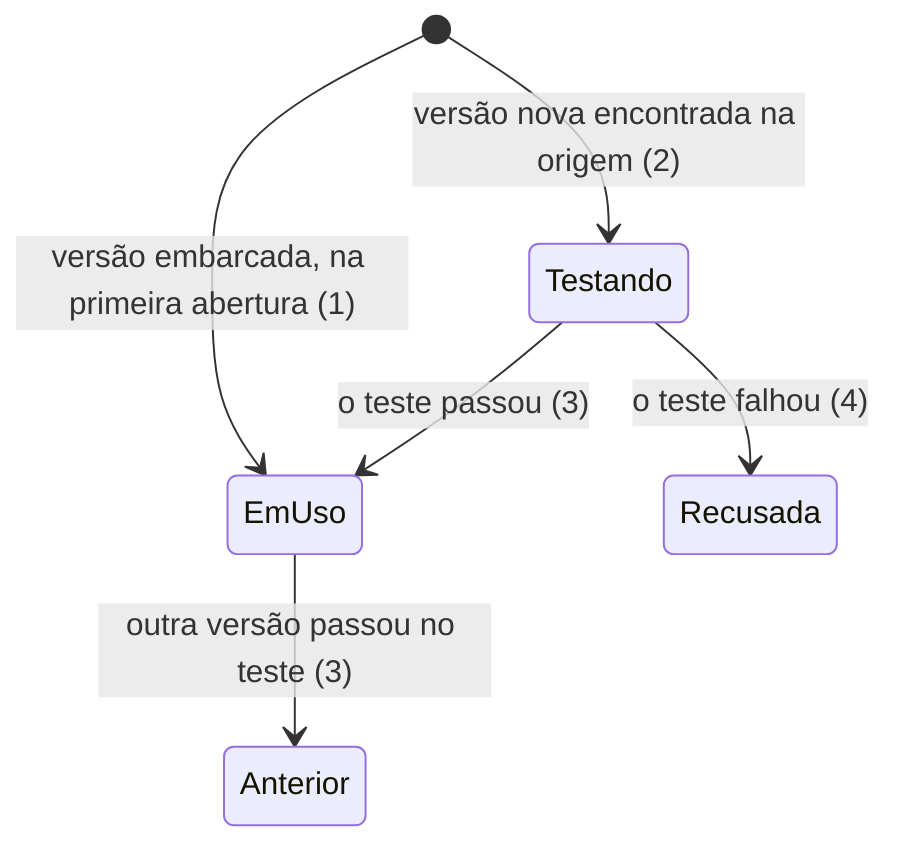

# 3 · Skill de UX que se atualiza, Configurações e guia de porte

> Construa com **tlc-implement** (`.claude/skills/tlc-implement/`). Cada critério abaixo vira uma checagem com prova, referenciada pelo número. Nada em `Unresolved` se decide durante a construção.

Ordem do corte: **T** e **1** em paralelo, depois **2**, depois **2b**, depois **3**. O Design Studio é um módulo do Hive (ADR 0007). Esta tarefa usa a Skill de UX embarcada da **2** (decisão 5 de lá) e confere o que o app lê dela, conforme a **2b** (decisão 5 de lá). Ela também mostra a versão do template da **T**.

## Intent

A Skill de UX é a régua de UX do agente e um dos quatro diferenciais do produto (PRODUCT, Posicionamento 4). O ROADMAP pede que ela "atualiza sempre para a versão mais nova", mas o app lê arquivos e seções dela que podem mudar de uma versão para outra sem aviso (ROADMAP, Riscos: "Contrato com a Skill de UX"). Sem teste e sem volta, o app ou fica preso numa versão velha ou uma atualização quebra a sessão de design no meio do trabalho de alguém. Além disso, depois das tarefas 1 e 2 a pessoa ainda não tem onde ver qual versão da Skill de UX está em uso, de onde vêm os dados e onde ficam os Protótipos no computador.

O que muda: a Skill de UX vem embarcada no instalador, com o binário do Windows. O app procura uma versão nova, testa num Protótipo de teste, adota se passar e, se não passar, mantém a anterior e avisa. A página Configurações do módulo mostra a Skill de UX (com as versões e o modelo de Protótipo), as Fontes de dados e a pasta dos Protótipos, como no protótipo de validação. Agente, modelo e tema ficam nas configurações do Hive.

Por fim, o app ganha um guia de porte. O POC é livre do IDS, e dentro do Itaú outro agente aplica as restrições com o iu-memorable (ADR 0006). O guia `docs/porte.md` ensina esse agente a trocar cada ponto de troca e traz uma lista de verificação que já roda hoje com o perfil de exemplo restrito. Assim, o caminho do banco chega provado.

19 critérios em 3 fatias · 2 portas de mão única · 7 em aberto, nenhum bloqueia

## Criteria

### A Skill de UX se atualiza sozinha e volta se quebrar

1. Numa máquina sem internet, o app usa a Skill de UX embarcada no instalador, com o binário do Windows, e os atalhos da tarefa 2 funcionam.
2. Quando o app abre, e quando a pessoa toca em "Procurar atualização", então ele consulta no registro npm a versão mais nova do pacote `impeccable` (decisão 2). Durante a consulta, o botão mostra "Procurando…" e fica desabilitado. Se a versão mais nova é a que está em uso, a consulta termina com o aviso "Você já tem a versão mais recente da Skill de UX".
3. Dada uma versão nova que passa no teste rápido, então:
   - ela passa a "Em uso", e a anterior vira "Anterior";
   - as Configurações mostram a versão nova, "Atualizada <quando>" e o resultado do teste;
   - as respostas seguintes do agente usam a versão nova.
4. Se o teste rápido de uma versão nova falha, então a versão em uso não muda, e aparece um aviso que diz qual versão foi recusada e qual continua (o texto depende do Unresolved 1).
5. Se a origem não responde, então a versão em uso não muda. Na abertura do app nada aparece. Se a consulta foi pedida em "Procurar atualização", ela termina com um aviso (o texto depende do Unresolved 1).
6. Sempre, os arquivos de uma versão adotada são idênticos aos baixados da origem. Nenhum patch é aplicado, e as defesas ficam no app (ADR 0004).
7. O teste rápido roda num Protótipo de teste criado do template, fora de `<raiz>`, sem chamar agente, e confere três coisas:
   - que a versão nova traz cada arquivo e cada título do contrato da tarefa 2b (decisão 5 de lá);
   - que `impeccable detect --json`, rodado com o motor do pacote da plataforma dessa versão, termina com código 0 ou 2 e devolve um JSON válido;
   - que nenhum Protótipo da pessoa foi tocado.

   Uma falha em qualquer um dos três recusa a versão (4).

### Configurações

8. A navegação do módulo ganha o item Configurações. A página mostra as seções nesta ordem: Skill de UX, Fontes de dados, "Onde os Protótipos ficam" e o atalho "Agentes e aparência".
9. "Agentes e aparência" abre as configurações do Hive, onde já ficam o agente padrão, o modelo padrão e o tema. O módulo não duplica essas escolhas: as conversas novas do módulo usam o agente e o modelo padrão do Hive, e, se o padrão do Hive for o Copilot, o módulo começa com o Claude.
10. Em Skill de UX aparecem "impeccable <versão>", "Atualizada <quando>", o resultado do último teste, "Versões" e "Procurar atualização". "Versões" abre a lista com versão, data e "Em uso" ou "Anterior", da mais nova para a mais antiga. Logo abaixo, "Modelo de Protótipo" mostra o nome e a versão do `prototipo-angular` (tarefa T, critério 12).
11. Em Fontes de dados aparecem Likert, Voz do Cliente e FullStory, cada uma com "Dados de exemplo", e a frase "Nenhum dado de cliente real é lido."
12. Sempre, o módulo segue o tema do Hive: trocar o tema nas configurações do Hive troca o módulo na hora, sem reabrir.
13. Em "Onde os Protótipos ficam" aparece o caminho real de `<raiz>`, e "Abrir a pasta" abre essa pasta no Explorador de Arquivos.
14. Sempre, nos dois temas, a página não tem nenhuma violação no axe, todo controle funciona por Tab e Enter ou Espaço, e o foco aparece como contorno de 2px na cor `tinta`.

### Guia de porte para o banco (ADR 0006)

15. O app traz `docs/porte.md`, escrito em pt-BR para o agente que vai portar o app para o banco. O guia tem:
    - uma seção por campo de `pontos-de-troca.json` (tarefa 1, decisão 1);
    - uma seção para cada linha da tabela da ADR 0001 que não é campo do arquivo: o login do agente e o passo "Conecte seus dados";
    - uma abertura dizendo que vai para o banco o Hive inteiro, com o módulo (ADR 0007), e não a pasta `design-studio/` sozinha.

    Cada seção diz o valor do POC, o que muda no banco e o comando que prova a troca.
16. A seção do perfil de design ensina a criar `perfis/ids.json` a partir do iu-memorable:
    - o que procurar no pacote do iu-memorable para achar os tokens e as regras do IDS, e como apontar `tokens.arquivo`, `tokens.modelo` e `regras` para eles;
    - que `trocaDeEstilo` fica `false`, `cores` fica `so-tokens`, e `fontes` lista as famílias do IDS;
    - qual comando roda, com o perfil `ids`, as suítes que hoje provam o perfil de exemplo restrito (tarefa 2, critério 47; tarefa 2b, critério 47).
17. O guia lista os contratos que o porte não muda sem rever o plano:
    - o formato do Relatório (`relatorioFormato.ts`, que as skills reescritas para o Athena precisam gravar);
    - a forma de pastas das Propostas (tarefa T, decisão 1);
    - o arquivo de tokens (tarefa T, decisão 3);
    - o contrato com a Skill de UX (tarefa 2b, decisão 5).

    Para cada contrato, o guia diz como conferir se o iu-memorable o cumpre. O que fazer quando não cumpre é o Unresolved 7.
18. O guia termina com uma lista de verificação em que cada item é um comando com o resultado esperado. A lista inclui:
    - as suítes com o perfil `ids`;
    - o teste rápido da Skill de UX (7) com o pacote do iu-memorable;
    - a abertura do app com a configuração nova (tarefa 1, critérios 21 e 22).
19. Sempre, a lista de verificação do guia roda hoje, no POC, com o perfil de exemplo restrito no lugar do `ids` e com a impeccable no lugar do iu-memorable, e passa.

## States

Uma versão da Skill de UX:



## Out of scope

- Voltar à mão para uma versão anterior: a lista "Versões" é só leitura no protótipo, e nenhuma fonte pede essa volta.
- A marca do iu-memorable nas Configurações: só entra no porte, quando a Skill de UX for ele (DESIGN.md, Marca e agentes).
- Atualizar o `prototipo-angular`: ele vem com o app. Só a impeccable vem da origem (ADR 0001).
- O espelho interno das atualizações: entra no porte (ADR 0001), pela decisão 2.
- Publicação e conta AWS por Protótipo: estão no Futuro do ROADMAP.

## Observable

| Surface | Decision | Landing |
| --- | --- | --- |
| página Configurações | vazio | n/a: toda seção tem conteúdo desde a instalação (1) |
| página Configurações | carregando | 2 ("Procurando…") |
| página Configurações | erro | 4, 5 |
| página Configurações | sem autorização | n/a: o app é local e de uma pessoa só |
| página Configurações | densidade e ordem | 8 |
| página Configurações | ação destrutiva confirma | n/a: nada se apaga aqui, e trocar o agente padrão é reversível |
| coleção: Versões | ordem | 10 |
| coleção: Versões | duplicatas e a exceção | n/a: cada versão aparece uma vez; a recusada não entra na lista (4) |
| aviso de atualização | texto | 2, Unresolved 1 |
| documento `docs/porte.md` (lido pelo agente do porte) | estrutura, leitor e próximo passo | 15, 16, 17, 18 |
| documento `docs/porte.md` | o caso que não encaixa (contrato descumprido) | Unresolved 7 |

## Swept

- validation: 6 (nenhum patch), 7 (contrato conferido antes de adotar); existing: o npm confere o sha512 (`dist.integrity`) do launcher e do pacote do motor, e o `IMPECCABLE_BIN` (tarefa 2, decisão 5) impede o download de reserva
- failure modes: 4, 5
- idempotency and retry: 2 (procurar de novo sem versão nova não muda nada), 19 (a lista de verificação roda de novo com o mesmo resultado)
- authorization: n/a: o app é de uma pessoa só; a Skill de UX roda dentro do turno com escopo do Hive (`turnScope.ts`)
- concurrency and ordering: Unresolved 2 (troca de versão durante um turno)
- data lifecycle: decisão 1 (a embarcada nunca é apagada), Unresolved 6 (quantas versões antigas ficam)
- external-dependency failure: 5
- state transitions: 3, 4 (diagrama em States)
- observability: Unresolved 5

## Impact

| Front | What changes |
|---|---|
| domain | termo existente: Skill de UX. O GLOSSARY foi emendado em 2026-10-08: ela não dá mais o modo live, e o app lê dela as referências e o detector (tarefa 2b, decisão 5) |
| tarefa 2 e 2b | os atalhos e o modo ao vivo passam a usar a versão em uso, e não mais só a embarcada |
| Hive | o módulo lê o agente padrão, o modelo padrão e o tema das configurações do Hive (9, 12), e não guarda os seus |
| tarefa 2 | o instalador e o `IMPECCABLE_BIN` vêm da decisão 5 de lá; esta tarefa só troca a versão |
| tarefa 2b | o teste rápido (7) confere o contrato da decisão 5 de lá |
| tarefa 2 | o `npx impeccable` roda com o Node, o npm e o npx da decisão 4 de lá; a impeccable exige Node ≥22.18 |
| tarefa 1 | o guia descreve cada campo de `pontos-de-troca.json` e do perfil de design (decisões 1 e 2 de lá) |
| stored data | nada a migrar: as versões começam com a embarcada |

## Decided

| Decision | Shape | Alternative rejected |
|---|---|---|
| 1. Versões da Skill de UX lado a lado | `<userData do Hive>\design-studio\skill-de-ux\<versão>\` para cada versão baixada, e `<userData do Hive>\design-studio\skill-de-ux\em-uso.json` no bloco abaixo. A embarcada fica nos recursos do app, só para leitura, e nunca é apagada | Substituir a versão no lugar: não haveria para onde voltar se a nova quebrasse |
| 2. A versão nova vem do instalador da própria impeccable, e a origem é um ponto de troca único | a versão mais nova é a `latest` do registro npm (`npm view impeccable version`). Cada versão nova é instalada pelo mesmo comando da tarefa 2 (decisão 5), `npx impeccable@<versão> install …`, numa pasta nova da decisão 1. O `IMPECCABLE_BIN` só passa a apontar para o motor dela depois que ela passa no teste. O registro (o npm público no POC, o espelho interno no banco) fica em `pontos-de-troca.json` (tarefa 1, decisão 1) | `npx impeccable update` na pasta em uso: atualiza no lugar e não deixa versão anterior para onde voltar, contra "volta à versão anterior se quebrar" (PRODUCT). Registro espalhado pelo código: o porte teria de caçá-lo, contra o princípio 5 ("Portável", PRODUCT) e a tabela da ADR 0001 |

`em-uso.json` (decisão 1):

```jsonc
{
  "emUso": "4.3.1",
  "anterior": "4.3.0",
  "historico": [                        // teste: passou | falhou
    { "versao": "4.3.1", "testadaEm": "2026-10-01T09:12:00-03:00", "teste": "passou" },
    { "versao": "4.3.0", "testadaEm": "2026-09-24T08:40:00-03:00", "teste": "passou" }
  ]
}
```

## Sources

- [ROADMAP.md](../ROADMAP.md), v1, Skill de UX: embarcada com o binário do Windows; atualiza sempre para a versão mais nova; um teste rápido antes de adotar; se falhar, mantém a anterior e avisa. Riscos: "Contrato com a Skill de UX".
- [PRODUCT.md](../PRODUCT.md): Configurações mostram a Skill de UX, que se atualiza sozinha e volta à versão anterior se quebrar; o princípio 5 ("Portável").
- Resposta do usuário em 2026-10-08: as atualizações vêm "do próprio instalador do impeccable via NPX". Lidos no mesmo dia: [impeccable.style, Downloads](https://impeccable.style/#downloads) (`npx impeccable install`, `npx impeccable update`) e o README do pacote npm `impeccable` 4.1.0 (launcher mais o motor `@impeccable/cli-windows-x64` como dependência opcional; busca do motor por `IMPECCABLE_BIN`, pacote da plataforma, `~/.impeccable/bin/<versão>/` e download; Node ≥22.18).
- Decisão do usuário em 2026-10-08: a primeira versão é livre do IDS, e o app deve ficar preparado para que, dentro do Itaú, outro agente aplique as restrições do IDS com o iu-memorable. Está registrada na [ADR 0006](../docs/adr/0006-telas-livres-no-poc-ids-por-perfil.md).
- [ADR 0001](../docs/adr/0001-porte-com-pontos-de-troca.md): a origem das atualizações é um ponto de troca, e a tabela lista todos os pontos de troca que o guia cobre. [ADR 0004](../docs/adr/0004-template-angular.md): nenhum patch na skill embarcada. [ADR 0005](../docs/adr/0005-modo-ao-vivo-desenhado-pelo-estudio.md): o modo ao vivo é do app, e o teste rápido confere o que ele lê da skill, sem chamar agente.
- [prototype/pages.js](../prototype/pages.js), Configurações: **vinculante para a tela e para o texto dela**. Seções, rótulos, "Procurar atualização", "Procurando…", "Versões" e as frases citadas nos critérios. Ficam de fora os itens marcados "Próxima versão" (tarefa 1, Unresolved 3) e o "Neste protótipo," da frase de Fontes de dados, que fala do protótipo de validação.
- [DESIGN.md](../DESIGN.md) e a lib de referência [design-system/](../design-system/): **vinculantes para o comportamento**. Os valores visuais vêm do `@hive/design-system`, e as configurações de agente e de tema são as do Hive (ADR 0007).

Esta tarefa é o registro da decisão. Se um documento linkado divergir dela, pergunte antes de construir.

## Unresolved

| # | Kind | Question | Until answered |
|---|---|---|---|
| 1 | open | Quais são os textos dos avisos de 4 e de 5? | Escrito por enquanto: "A versão <nova> da Skill de UX não passou no teste. Você continua na <atual>." e "Não consegui procurar atualização agora. Você continua na <atual>." |
| 2 | open | O que acontece se uma versão nova passa no teste enquanto um turno do agente está rodando? | Escrito por enquanto: a troca espera o turno terminar. |
| 3 | open | As Configurações mostram os itens "Próxima versão" do protótipo (Conectar ao banco de dados, Publicação)? | Segue o Unresolved 3 da tarefa 1. Escrito por enquanto: não mostram. |
| 4 | open | Quanto tempo o teste rápido pode levar antes de ser dado como falho? | Escrito por enquanto: 5 minutos. |
| 5 | open | Onde fica o registro de cada teste, para diagnosticar uma versão recusada? | Escrito por enquanto: o resultado vai para o `em-uso.json`, e o detalhe vai para o log local (tarefa 1, Unresolved 4). |
| 6 | open | Quantas versões antigas ficam no disco? | Escrito por enquanto: todas, no POC. |
| 7 | open | O que o guia manda o agente do porte fazer quando o iu-memorable não cumpre um dos contratos (17)? | Escrito por enquanto: parar e pedir decisão de uma pessoa, sem adaptar o app por conta própria. |
