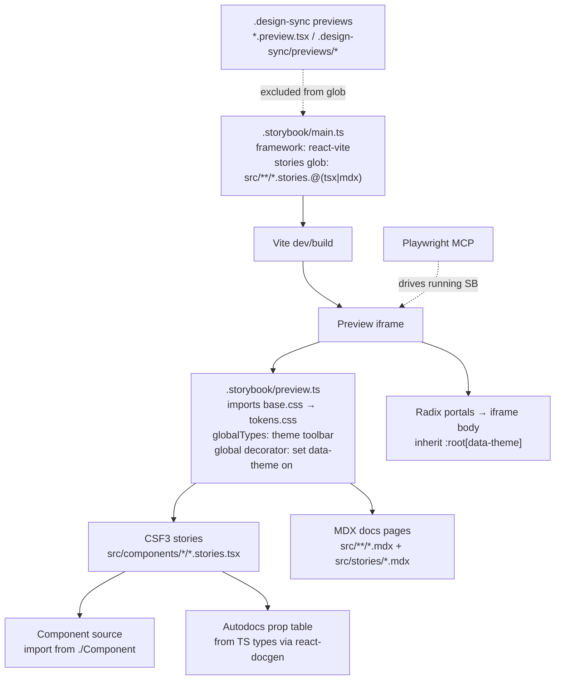

# Storybook Documentation Design

**Spec**: `.specs/features/storybook-documentation/spec.md`
**Context**: `.specs/features/storybook-documentation/context.md`
**Status**: Draft

---

## Architecture Overview

Storybook is added as a **dev-only documentation surface** that reads component **source** (not `dist/`). It runs on the Vite builder, loads the DS's own `base.css`/`tokens.css` into the preview, and themes each story by setting `data-theme` on the preview iframe's root element. The existing esbuild `build.mjs` and `.design-sync` pipeline are untouched; Storybook coexists via a scoped story glob.



**Validation loop (per component):** author stories → run Storybook → Playwright MCP navigates to the story iframe URL (`/iframe.html?id=<storyId>&globals=theme:dark`), screenshots light + dark + key states → confirm correctness → mark task done.

---

## Code Reuse Analysis

### Existing assets to leverage

| Asset | Location | How to Use |
| --- | --- | --- |
| `base.css` (imports `tokens.css`) | `src/base.css` | Import once in `preview.ts` — loads reset + all tokens + fonts. Single import themes everything. |
| Two-layer token system | `src/tokens.css` | Theme roles live on `:root[data-theme="light"|"dark"]`. The theme decorator sets the attribute on `<html>` so roles resolve (see Tech Decisions). |
| Component source + barrel | `src/components/*/*.tsx`, `src/index.ts` | Stories import directly from `./Component` (source, not `dist/`). Barrel confirms the 61-component surface. |
| TS prop interfaces | each `*.tsx` | Autodocs derives prop tables from these via `react-docgen`. TSDoc comments (added where missing, docs-only) surface as prop descriptions. |
| Existing story pattern | `src/components/HarnessMark/HarnessMark.stories.tsx` | Reference for variant coverage — but it's custom `window.__dsPreview`, **not** CSF; relocate out of the CSF glob (see Integration Points). |
| `PRODUCT.md` / `DESIGN.md` (impeccable) | package root | Source material for the Introduction, Foundations, and Accessibility MDX pages and for impeccable usage sections. |
| `useToast()` provider, Radix providers | component sources | Overlay/toast stories wrap in the required provider via a per-story decorator. |

### Integration Points

| System | Integration Method |
| --- | --- |
| `.design-sync` preview pipeline | **Isolated.** Storybook glob is `src/**/*.stories.@(tsx|mdx)` scoped to CSF; the one legacy custom preview `HarnessMark.stories.tsx` is renamed to the design-sync convention (`*.preview.tsx` or moved under `.design-sync/previews/`) so Storybook never loads it. `.design-sync/**` is excluded from the glob regardless. |
| esbuild production build (`build.mjs`) | **Untouched.** Storybook uses Vite only for its own dev/build. `dist/` output identical. |
| vitest coverage gate | `*.stories.tsx` already excluded (STATE.md). CSF stories inherit exclusion; verify gate stays green after adding stories. |
| git | Add `storybook-static/` to `.gitignore`. Config + stories are committed; static build is not. |

### CONCERNS.md-flagged components (extra care)

Per `.specs/codebase/CONCERNS.md`, three components depend on **real browser layout** that jsdom can't provide but a real browser (Storybook) **can** — Storybook is actually the *right* place to see them work:
- **Resizable** — keyboard-resize throws only in jsdom; in Storybook it works. Story must render a real two-panel layout with fixed height so drag/keyboard resize is demonstrable.
- **MessageList** — ResizeObserver-driven auto-follow needs real geometry; story seeds a scrollable height + enough messages to show pin-to-latest.
- **ScrollArea** — overflow-based scrollbar visibility needs real overflow; story constrains height and overflows content.
These are exactly the components where Playwright-MCP visual validation adds the most value (behavior untestable in jsdom).

---

## Components (files to build)

### Config layer (`.storybook/`)

#### `main.ts`
- **Purpose:** Framework + builder + story discovery + addons.
- **Key config:** `framework: '@storybook/react-vite'`; `stories: ['../src/**/*.mdx', '../src/**/*.stories.@(tsx)']`; `addons: ['@storybook/addon-a11y', '@storybook/addon-docs'/essentials-equivalent]`; `docs: { autodocs: 'tag' }`; explicitly no `.design-sync` in glob.
- **Reuses:** existing source tree.

#### `preview.ts`
- **Purpose:** Global rendering context — CSS, theme toolbar, decorators, a11y params.
- **Key config:**
  - `import '../src/base.css'` (pulls tokens + reset + fonts).
  - `globalTypes.theme` → toolbar with `light`/`dark` items, default `dark` (DS's native theme).
  - Global decorator: `useEffect` sets `document.documentElement.setAttribute('data-theme', context.globals.theme)` on the **iframe root** (not a wrapper div) — required because roles are `:root[data-theme]`.
  - `parameters.backgrounds` mapped to `--bg` per theme (or driven by the theme decorator so canvas surface matches).
  - `parameters.a11y` (axe rules), `parameters.controls`, `parameters.layout`.
- **Reuses:** `base.css`, `tokens.css` theme selectors.

#### `preview-head.html` (if needed)
- **Purpose:** Ensure fonts / any `<head>`-level assets the DS expects are present in the iframe.

### Story layer (`src/components/<Name>/<Name>.stories.tsx`) — 61 files

CSF3, one file per component. Each: `Meta` with `title: '<Group>/<Name>'`, `component`, `tags: ['autodocs']`, `argTypes` for controls; plus named exports for each variant/state story. Overlay/provider components get a per-story decorator. Grouping via `title` prefix:

| Group | Components |
| --- | --- |
| **Brand** | BrandMark, HarnessMark, Logo, Footer |
| **Forms** | Input, Textarea, Label, Field, Checkbox, RadioGroup, Switch, Select, Slider |
| **Overlays** | Dialog, AlertDialog, Popover, Tooltip, DropdownMenu, ContextMenu, Sheet, Command |
| **Feedback** | Toast, Spinner, Skeleton, Progress, Alert, Empty, Callout |
| **Navigation** | Tabs, Breadcrumb, Nav, Accordion, Tree, SteppedList, Timeline |
| **Layout** | Separator, ScrollArea, Resizable, Panel, SectionHeading |
| **Data Display** | Table, Badge, Chip, PinChip, Avatar, Kbd, CodeBlock, Terminal, ModeBlock, CaseCard, SkillCard, ValueCard |
| **AI Chat** | ChatMessage, TypingIndicator, MessageList, Attachment, PromptInput |
| **Utilities** | VisuallyHidden, Reveal, DotsBackground, Button, Chip… |

*(Button → Forms/Actions; exact leaf placement finalized per-task. All 61 folders map to exactly one group.)*

### Docs layer (`src/stories/*.mdx`) — foundations

| Page | Content |
| --- | --- |
| `Introduction.mdx` | What the DS is, Zup/HIVE brand language, how to install/consume, theme model. Sourced from `PRODUCT.md`/`README.md`. |
| `Foundations/Tokens.mdx` | Live swatches for color roles, spacing, radius, z-index, typography — rendered by reading CSS custom properties. Sourced from `tokens.css`/`DESIGN.md`. |
| `Foundations/Theming.mdx` | `data-theme` light/dark model, how to set it, portal considerations. |
| `Accessibility.mdx` | Radix a11y engine, focus/`aria-modal`/keyboard conventions, reduced-motion — impeccable-shaped. |
| `Contributing.mdx` (P3) | How to author a story in this repo (CSF3 + tags + theme). |

### Per-component usage sections (impeccable, P2)
Delivered as an MDX `Description` block or a `Docs`-tab section per component: **When to use / When not**, **Do's & Don'ts**, **A11y notes**, **Relevant tokens**. Authored with the `impeccable` skill, concentrated on the components with real UX judgment calls (forms, overlays, feedback, AI-chat), lighter on trivial primitives.

---

## Data Models

Not a data feature. The only "model" is the CSF `Meta`/`StoryObj` shape (standard Storybook types) and the theme global:

```typescript
// preview.ts global
type ThemeGlobal = 'light' | 'dark'; // default 'dark' (DS native)
// applied as: document.documentElement.setAttribute('data-theme', theme)
```

---

## Error Handling Strategy

| Scenario | Handling | Result |
| --- | --- | --- |
| Story imports built `dist/` by mistake | Lint/review rule: stories import `./Component` source only | Docs track source |
| Portal (Radix overlay) renders unthemed | Theme set on `<html>` (iframe root), portals mount to iframe body → inherit | Overlays themed correctly |
| Legacy `HarnessMark.stories.tsx` picked up by glob | Renamed/relocated out of CSF glob before first Storybook run | No collision; design-sync intact |
| Animation/observer component shows blank/unstable snapshot | Story seeds deterministic state + honors reduced-motion | Screenshot-able, stable |
| Missing prop descriptions → empty Autodocs cells | Add concise TSDoc (docs-only, no behavior change) | Populated prop table |
| Storybook artifacts committed | `storybook-static/` in `.gitignore` | Clean repo |
| Coverage gate breaks | Confirm stories excluded; run gate after each phase | Gate stays green |

---

## Tech Decisions (non-obvious)

| Decision | Choice | Rationale |
| --- | --- | --- |
| Theme application target | Set `data-theme` on `document.documentElement` (iframe `<html>`), **not** a wrapper `<div>`, via a custom `globalTypes` + decorator | Token roles are defined as `:root[data-theme="…"]`; a wrapper div would never match the selector, so tokens wouldn't resolve. Also themes Radix portals (mounted to iframe body). |
| Theme switching mechanism | Custom decorator over `@storybook/addon-themes`' default wrapper behavior | `addon-themes` applies attributes to a wrapper by default; our selector needs the root. A ~10-line custom decorator is simpler and correct. (May still use addon-themes if its `<html>` targeting is configured.) |
| Default theme | `dark` | DS's native/original theme; bare `:root` already mirrors dark. |
| Builder | `@storybook/react-vite` | Modern default; Storybook has no esbuild builder. Dev-only; production stays esbuild. |
| Story glob | `src/**/*.stories.@(tsx)` + `src/**/*.mdx`, excluding `.design-sync/**` and `*.preview.tsx` | Coexist with design-sync per D-SB1. |
| Autodocs | `tags: ['autodocs']` per component + `docs: { autodocs: 'tag' }` | Prop tables from TS types with zero per-prop wiring. |
| Import source | Stories import from `./Component`, not `@hive/design-system`/`dist` | Docs reflect live source, hot-reload during authoring. |
| Storybook version | Latest stable (Storybook 9.x), pinned at install | Verify exact version at install; don't hardcode a fabricated patch. |

---

## Open questions / to verify at install
- Exact Storybook 9.x addon package split (essentials vs. standalone `addon-docs`) — confirm from the installed version's docs during Phase 0, don't assume.
- Whether the DS fonts (`--ff-body`) need explicit loading in `preview-head.html` or are already `@font-face`'d via `base.css`/assets — check `assets/` during Phase 0.
