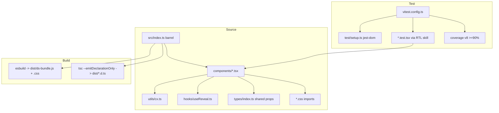

# TypeScript Migration + Test Infrastructure Design

**Spec**: `.specs/features/typescript-migration/spec.md`
**Status**: Complete

---

## Architecture Overview

Big-bang, behavior-preserving migration. Every `src/**/*.{jsx,js}` becomes `.{tsx,ts}` with `strict: true`. CSS imports and runtime logic are untouched. The esbuild bundler already accepts `.ts`/`.tsx` natively, so bundling changes only its entrypoint (`index.js` → `index.ts`). A separate `tsc --emitDeclarationOnly` pass produces published `.d.ts`. Vitest (jsdom) + RTL provide the test layer, wired to the same `tsconfig`.



---

## Code Reuse Analysis

### Existing Components to Leverage

| Component | Location | How to Use |
| --- | --- | --- |
| `cx` helper | `src/utils/cx.js` | Migrate to `.ts`; already the shared class-join util used by nearly every component — keep signature |
| `useReveal` hook | `src/hooks/useReveal.js` | Migrate to `.ts`; consumed by `Reveal`/`Stagger` — type the `[ref, isIn]` tuple |
| `HarnessMark.d.ts` | `src/components/HarnessMark/` | Source of truth for `HarnessMarkProps`; inline into `HarnessMark.tsx`, then delete the `.d.ts` |
| esbuild config | `build.mjs` | Extend, not replace: swap entry to `index.ts`, add post-step for `tsc` declarations |
| Barrel exports | `src/index.js` | Convert 1:1 to `index.ts`; export list is the frozen public contract |

### Integration Points

| System | Integration Method |
| --- | --- |
| esbuild bundler | Entry `src/index.ts`; `.ts/.tsx` loaders are built-in — no loader config change beyond existing `.svg` |
| Published package | `package.json` gains `"types": "dist/index.d.ts"`; `dist` still the only published dir |
| `.stories.jsx` preview (`window.__dsPreview`) | Rename to `.stories.tsx`; excluded from coverage; must still compile |

---

## Type Foundation

### `src/types/index.ts` (new)

Shared helpers to type the recurring patterns (spread `...rest`, polymorphic `as`, `href` union):

```typescript
import type { ComponentPropsWithoutRef, ElementType, ReactNode } from "react"

// Props that spread onto a host element of tag T, plus children/className already implied.
export type HostProps<T extends ElementType> = ComponentPropsWithoutRef<T>

// Polymorphic component props: `as` chooses the rendered element (default D).
export type PolymorphicProps<D extends ElementType> = {
  as?: ElementType
  className?: string
  children?: ReactNode
} & Omit<HostProps<D>, "as" | "className" | "children">
```

### Recurring per-component pattern

- **Host-spread components** (`Badge`, `Chip`, `Panel`, `DotsBackground`, …): `interface XProps extends ComponentPropsWithoutRef<"div"|"span"|...> { /* own props */ }`.
- **Polymorphic** (`Reveal`, `Stagger`): use `PolymorphicProps<"div">` + `as`.
- **Link-or-button** (`Button`): discriminated by presence of `href` — type as `ComponentPropsWithoutRef<"a"> & ComponentPropsWithoutRef<"button">` narrowed by `href?`, matching current runtime branch.

---

## Components (migration units)

All 23 component folders migrate `.jsx → .tsx` (+ co-located `.css` untouched). Multi-export files keep every export.

| Folder | Exports to preserve | Notes |
| --- | --- | --- |
| Badge | `Badge` | host-span props |
| BrandMark | `BrandMark` | trivial render |
| Button | `Button` | link/button union (TSM-10) |
| Callout | `Callout` | host props |
| CaseCard | `CaseGrid`, `CaseCard` | two exports |
| Chip | `Chip` | host props |
| CodeBlock | `CodeBlock`, `Cor`, `Cmt` | three exports |
| DotsBackground | `DotsBackground` | no branching — 1 render test |
| Footer | `Footer` | host props |
| HarnessMark | `HarnessMark` | inline `.d.ts` → delete it; migrate `.stories.jsx` |
| Logo | `Logo` | host props |
| ModeBlock | `ModeSplit`, `ModeBlock` | two exports |
| Nav | `Nav` | host props |
| Panel | `Panel` | host props |
| PinChip | `PinChip` | host props |
| Reveal | `Reveal`, `Stagger` | polymorphic `as` (TSM-10); uses `useReveal` |
| SectionHeading | `SectionHeading` | host props |
| SkillCard | `SkillGrid`, `SkillCard`, `SkillSpinePin` | three exports |
| SteppedList | `SteppedList`, `SteppedListItem` | two exports |
| Table | `Table`, `Pkg`, `Stack`, `Cond` | four exports |
| Terminal | `Terminal` | host props |
| Timeline | `Flow`, `SpineLabel`, `Steps`, `Step`, `Substeps`, `Sub` | six exports — largest surface |
| ValueCard | `ValueGrid`, `ValueCard` | two exports |

Non-component units: `utils/cx.ts`, `hooks/useReveal.ts`, `index.ts`.

---

## Build & Config

### `tsconfig.json` (typecheck + Vitest)

```jsonc
{
  "compilerOptions": {
    "target": "ES2020",
    "module": "ESNext",
    "moduleResolution": "Bundler",
    "jsx": "react-jsx",
    "strict": true,
    "noUncheckedIndexedAccess": true,
    "esModuleInterop": true,
    "skipLibCheck": true,
    "types": ["vitest/globals", "@testing-library/jest-dom"],
    "lib": ["ES2020", "DOM", "DOM.Iterable"],
    "noEmit": true
  },
  "include": ["src", "vitest.config.ts", "test"]
}
```

### `tsconfig.build.json` (declaration emit only)

```jsonc
{
  "extends": "./tsconfig.json",
  "compilerOptions": {
    "noEmit": false,
    "declaration": true,
    "emitDeclarationOnly": true,
    "outDir": "dist"
  },
  "include": ["src"],
  "exclude": ["**/*.test.tsx", "**/*.stories.tsx", "test"]
}
```

> **CSS modules**: add `src/css.d.ts` with `declare module "*.css";` so `import "./X.css"` typechecks.

### `build.mjs` change

Entry `src/index.js` → `src/index.ts`; after esbuild, run declaration emit:

```js
// after esbuild.build(...)
import { execSync } from "node:child_process"
execSync("tsc -p tsconfig.build.json", { stdio: "inherit" })
```

### `package.json` additions

- `"types": "dist/index.d.ts"`
- scripts: `"typecheck": "tsc --noEmit"`, `"test": "vitest run"`, `"test:watch": "vitest"`, `"test:coverage": "vitest run --coverage"`
- devDeps: `typescript`, `vitest`, `@vitest/coverage-v8`, `jsdom`, `@testing-library/react`, `@testing-library/dom`, `@testing-library/user-event`, `@testing-library/jest-dom`, `@types/react`, `@types/react-dom`

### `vitest.config.ts`

```typescript
import { defineConfig } from "vitest/config"

export default defineConfig({
  test: {
    globals: true,
    environment: "jsdom",
    setupFiles: ["./test/setup.ts"],
    css: false,
    coverage: {
      provider: "v8",
      reporter: ["text", "html"],
      include: ["src/**/*.{ts,tsx}"],
      exclude: [
        "src/index.ts",
        "src/**/*.stories.tsx",
        "src/**/*.d.ts",
        "src/types/**",
      ],
      thresholds: { lines: 90, branches: 90, functions: 90, statements: 90 },
    },
  },
})
```

### `test/setup.ts`

```typescript
import "@testing-library/jest-dom/vitest"
```

---

## Testing Strategy (per react-testing-library skill)

- Query by role/label/text; `getByRole("link"|"button")` for `Button`'s two branches; `userEvent` for any interaction.
- **`useReveal`** (`renderHook`): (a) mock `IntersectionObserver` to fire `isIntersecting: true` → assert `isIn` flips; (b) delete `window.IntersectionObserver` / stub `matchMedia` reduced-motion → assert immediate `true`. Covers both branches (TSM-09).
- **`cx`**: unit test filtering falsy values and joining.
- **Polymorphic** `Reveal`/`Stagger`: assert `as` renders the chosen tag and `in` class toggles.
- **Multi-export files**: one `describe` block per export; each export needs at least a render assertion to hit the 90% function metric.
- No snapshot-only tests; assert visible output/roles, never internal state.

---

## Error Handling Strategy

| Error Scenario | Handling | User Impact |
| --- | --- | --- |
| `strict` surfaces implicit `any` | Add explicit type annotation only | None (author-time) |
| CSS import fails typecheck | `src/css.d.ts` ambient module | None |
| Coverage below 90% on a file | Add targeted RTL test for uncovered branch | Build/test fails until fixed |
| `IntersectionObserver` undefined in jsdom | Tested fallback path already handles it | None |

---

## Tech Decisions

| Decision | Choice | Rationale |
| --- | --- | --- |
| Migration style | Big-bang + `strict` | 27 files, small surface; hybrid JS/TS state adds no value |
| Coverage provider | v8 | Fast, zero-instrumentation, default for Vitest |
| Coverage scope | Global 90% with exclusions | Barrels/stories/type-only files have no testable logic |
| Declaration emit | `tsc --emitDeclarationOnly` via `tsconfig.build.json` | esbuild doesn't emit types; package is published |
| moduleResolution | `Bundler` | Matches esbuild; allows extensionless `HarnessMark` import already in barrel |
| Test env | jsdom | RTL requires a DOM; `useReveal` needs `matchMedia`/`IntersectionObserver` seams |
