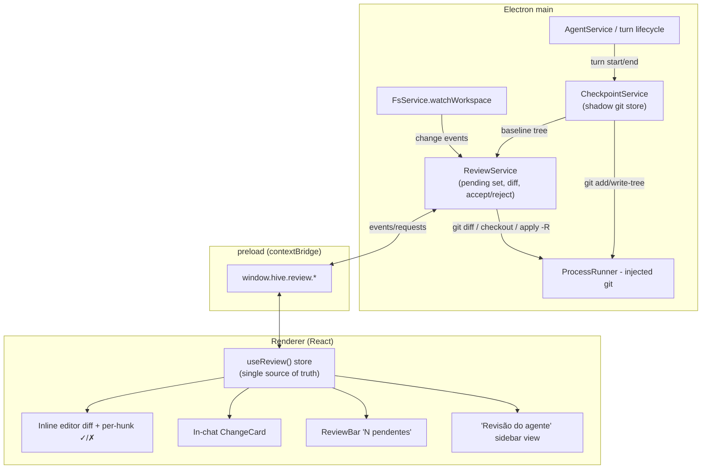

# Design — Agent Change Review

**Spec:** `spec.md` · **Context:** `context.md`
**Status:** Ready for tasks
**Scope:** Large/Complex.

This design realizes the three locked decisions — **optimistic apply+revert**
(ACR-C1), **app-managed git-independent snapshots** via a shadow checkpoint store
(ACR-C2), and a **tiered review surface** (ACR-C3) — plus the derived decisions
ACR-C4..C7. It reuses M10's diff engine (`DiffView`/`gitParse`), M4's STALE
guard, M8's unsaved-guard, and the M10 sidebar switcher and editor gutter.

---

## 1. Architecture Overview



**Data flow (one turn):**

1. **Turn start** (`AgentService` about to spawn the CLI): `CheckpointService.
   snapshot(workspace)` records a **baseline tree** (race-free, pre-write).
2. **During the turn**: `claude` writes files (`acceptEdits`). `FsService.
   watchWorkspace` fires; `ReviewService` debounces and **recomputes the pending
   set** = `git diff <baseline> <work-tree>`, pushing a `review:changed` event.
3. **Turn end** (`done`/`interrupted`/`error`): a final recompute finalizes the
   set; the chat card for that turn is emitted with its file summary.
4. **Accept/Reject** (any surface → IPC): `ReviewService` applies the decision
   (keep+re-baseline, or revert via `checkout`/`apply -R`), recomputes, and
   emits `review:changed`. All four renderer surfaces re-render from one store.

---

## 2. Main — `CheckpointService` (shadow git store)

**File:** `src/main/checkpointService.ts` (+ `.test.ts`).
**Purpose:** a fast, race-free, content-addressed snapshot + diff engine that is
**invisible to and independent of the user's git** (ACR-C2).

**Mechanics:**

- A **private git dir** per workspace: `app.getPath('userData')/checkpoints/
  <sha1(workspaceAbsPath)>/git`. Work tree = the workspace. All git runs through
  the injected `ProcessRunner` with explicit env:
  `GIT_DIR=<store>/git`, `GIT_WORK_TREE=<workspace>`,
  `GIT_INDEX_FILE=<store>/index` (isolated index so we never touch a user index).
- **init** (lazy, first snapshot): `git init` in the shadow dir; write
  `<store>/git/info/exclude` with the heavy-dir excludes (OQ2):
  `.git/`, `node_modules/`, `dist/`, `out/`, `.playwright-mcp/`, `coverage/`,
  `*.log` — **plus** the workspace's own `.gitignore` is honored automatically
  (it lives in the work tree). Reviewable artifacts (`_bmad-output/`, docs) are
  **not** excluded.
- **snapshot(workspace) → baselineRef**: `git add -A` then `git write-tree`
  (returns a tree OID). No commit needed — a dangling tree is enough and cheap;
  git only re-hashes files whose size/mtime changed since the persisted index, so
  subsequent snapshots are incremental. The OID is the baseline handle.
- **diffToWorkTree(baselineRef) → GitDiff[]**: `git diff <baselineRef>` (name-
  status + patch), parsed by the **existing `gitParse`** into `GitDiff` per path
  (add/modify/delete, binary/too-large states preserved).
- **fileAtRef(baselineRef, path) → string | null**: `git show <ref>:<path>` for
  the pre-turn content (null = didn't exist → created). Used by revert + inline
  "before" pane.
- **revertPath(baselineRef, path)**: created → delete on disk (via `FsService`
  trash? no — hard delete, it never existed pre-turn); modified/deleted →
  `git checkout <baselineRef> -- <path>` (writes pre-turn bytes to the work tree).
- **applyReverseHunk(path, hunk)**: build a minimal unified patch for one
  `GitDiffHunk` and `git apply -R --unidiff-zero` it (per-hunk reject). For
  per-hunk *accept* of an otherwise-rejected file, we invert: reject the
  complement. (Design keeps the primitive = reverse-apply a patch; the service
  composes file/hunk decisions from it.)

**DI & testability:** constructor-injected `ProcessRunner` + a `paths` provider
(so tests point `userData` at a temp dir), mirroring `GitService`. Unit tests run
real `git` against a throwaway workspace + throwaway shadow store (M10 precedent:
`gitService.test.ts` already drives real git in temp dirs).

**Why a shadow git and not `git diff --no-index` per file:** pre-images must be
captured **before** the write; the only race-free, adapter-agnostic source is a
turn-start whole-tree baseline, and a shadow git makes that incremental + gives
diff/checkout/apply for free (context ACR-C2). `--no-index` remains available as
a two-file compare primitive where simpler.

---

## 3. Main — `ReviewService` (pending set + decisions)

**File:** `src/main/reviewService.ts` (+ `.test.ts`).
**Owns:** the single pending set per workspace (ACR-C5) and the accept/reject
semantics. Depends on `CheckpointService` + `FsService` (watcher, mtime) — both
injected.

**State (per active workspace):**

```ts
interface ReviewState {
  baseline: string | null        // shadow tree OID; null = clean/no turn yet
  turns: TurnMark[]              // { turnId, at, paths[] } — for the chat cards
  changes: ReviewChange[]        // derived: git diff(baseline → work-tree)
}
interface ReviewChange {
  path: string                   // workspace-relative POSIX
  status: 'created' | 'modified' | 'deleted'
  diff: GitDiff                  // from gitParse (hunks, +/- counts, binary/large)
  adds: number; dels: number
  attribution?: { tool: string; skill?: string }[]  // ACR-R3.3, best-effort (P2)
  staleUserEdit?: boolean        // ACR-R3.2 — user edited after the turn
}
```

**Lifecycle API (called by the turn wiring, §4):**

- `beginTurn(workspace, turnId)` → if `baseline` is null, `snapshot()` to set it
  (accumulating set: only the *first* un-reviewed turn establishes the baseline;
  ACR-C5). Record a `TurnMark`.
- `onFsActivity(workspace)` (debounced ~250ms) → recompute `changes` from
  `diffToWorkTree(baseline)`; emit `review:changed`.
- `endTurn(workspace, turnId, paths)` → final recompute; attach `paths` to the
  `TurnMark` for the card.

**Decision API (called by IPC):**

- `acceptFile(ws, path)` → keep on-disk bytes; **advance baseline for that path**
  (re-add just that path into the shadow index + write-tree → new baseline that
  no longer diffs it). Recompute.
- `rejectFile(ws, path)` → `revertPath(baseline, path)`; if the change was the
  only remaining one, clear baseline. Recompute. Live editor/gutter/explorer
  refresh via the existing watcher + a `review:reverted` hint.
- `acceptHunk(ws, path, hunkId)` / `rejectHunk(ws, path, hunkId)` →
  `applyReverseHunk` composition (§2); recompute; if the file has no remaining
  hunks, it leaves the set.
- `acceptAll(ws)` → re-baseline whole work tree (`snapshot()` becomes new
  baseline); clear turns. `rejectAll(ws)` → `git checkout <baseline> -- .` +
  delete created files; clear baseline + turns. (Reject-all is confirmed in UI.)
- **STALE guard (ACR-R3.2):** before a revert/accept, compare the path's current
  mtime to the mtime captured at last recompute; mismatch ⇒ set
  `staleUserEdit`, return a `STALE` result the UI turns into a choice (reuses the
  M4 `ConflictError('STALE')` convention) instead of silently clobbering.

**Accumulation invariant:** `changes = diff(baseline → now)` always. Accept/reject
only move the baseline or the work tree; the set is never hand-mutated, so no
surface can drift and re-touched files never duplicate (ACR-R1.3).

---

## 4. Main — turn-lifecycle wiring

The hook points already exist; we add three calls (no new streaming behavior):

- **`AgentService`** (or the `index.ts` IPC turn handler that owns `runTurn`):
  before spawning the CLI for a turn → `reviewService.beginTurn(ws, turnId)`;
  on the terminal event (`done`/`interrupted`/`error`) →
  `reviewService.endTurn(ws, turnId, paths)`. `paths` best-effort from the
  Claude stream `tool_use` (ACR-C7); empty is fine (the diff is authoritative).
- **Watcher:** the existing `fsService.watchWorkspace` subscription (already live
  for explorer refresh) also calls `reviewService.onFsActivity(ws)` — debounced,
  and gated to "a turn is active or the set is non-empty" so idle manual edits
  don't spin up snapshots.
- **Attribution groundwork (ACR-C7, P2):** extend `cliAdapterCore`'s stdout
  parser to additionally recognize `assistant` `tool_use` blocks for
  `Write|Edit|MultiEdit` and emit a new `{ type: 'tool', name, detail: file_path }`
  `AgentEvent` (the type already exists but is unpopulated). `Chat`/`AgentService`
  collect these per turn → `paths`/`attribution`. Purely additive; no effect on
  token streaming. **v1 wires the plumbing; rich per-hunk attribution UI is P2.**

---

## 5. IPC + preload surface

New namespace `window.hive.review.*` (mirrors `git`/`mcp` handler style in
`index.ts` + `preload/index.ts`):

| IPC channel | Renderer call | Shape |
| --- | --- | --- |
| `review:get` | `review.get(ws)` | → `ReviewChange[]` + `turns` (rehydrate on mount / workspace switch) |
| `review:acceptFile` | `review.acceptFile(ws, path)` | → `ReviewResult` |
| `review:rejectFile` | `review.rejectFile(ws, path)` | → `ReviewResult` (may be `{stale:true}`) |
| `review:acceptHunk` | `review.acceptHunk(ws, path, hunkId)` | → `ReviewResult` |
| `review:rejectHunk` | `review.rejectHunk(ws, path, hunkId)` | → `ReviewResult` |
| `review:acceptAll` | `review.acceptAll(ws)` | → `ReviewResult` |
| `review:rejectAll` | `review.rejectAll(ws)` | → `ReviewResult` |
| `review:changed` (push) | `review.onChanged(cb)` | main→renderer event: new `ReviewChange[]` + `turns` |

`hunkId` is a stable per-file hunk key (index + old/new start lines from
`GitDiffHunk.header`) computed in `gitParse` so main and renderer agree. All
handlers are workspace-scoped and reject paths escaping the root (reuse the
`FsService` path-safety helper).

---

## 6. Renderer — store + surfaces

### 6.1 `useReview()` — single source of truth
**File:** `src/renderer/src/scm/useReview.ts` (+ `.test.ts`), styled on the M10
`useGit.ts` hook. Holds `changes`, `turns`, derived `pendingCount`,
`byStatus`, `isStale`; subscribes to `review:onChanged`; exposes
`acceptFile/rejectFile/acceptHunk/rejectHunk/acceptAll/rejectAll`. One instance
lifted to the work surface (`WorkUI`) and shared via context so **all four
surfaces read the same object** (ACR-R2.5). Reject-all + stale confirmations use
the existing dialog convention.

### 6.2 Inline editor diff (Cursor tier) — ACR-R2.1
- **File:** `src/renderer/src/scm/InlineAgentDiff.tsx` (+ helper
  `inlineDiff.ts`), layered on the existing gutter (`scm/gutter.ts`/`useGutter`).
- For the open file, if it's in the pending set, render the diff **inline**:
  removed lines shown struck/red above added green lines, per `GitDiffHunk`.
- Each hunk carries a floating **`✓ Aceitar` / `✗ Rejeitar`** control (a new small
  DS-adjacent `HunkActions` affordance) + a header count. `‹ n de m ›`
  prev/next jumps between hunks; keyboard (ACR-R4.1).
- Reuses `DiffView`'s line rendering primitives; the *new* part is the in-editor
  overlay + per-hunk controls. This is the most novel surface → its own tasks.

### 6.3 In-chat ChangeCard (Claude Desktop tier) — ACR-R2.2
- **File:** `src/renderer/src/chat/ChangeCard.tsx` (+ `.test.ts`). Rendered in the
  transcript for a turn that changed files (keyed off the `TurnMark`).
- Compact: agent glyph + "Editei N arquivos", a file list with `+adds/-dels`
  pills and status dots, expand → inline `DiffView` per file, and
  `✗ Rejeitar` / `✓ Aceitar` for that turn's files. Accepted files check off
  live; fully-reviewed card collapses to a quiet "revisado" state.

### 6.4 Persistent ReviewBar — ACR-R2.3
- **File:** `src/renderer/src/ui/ReviewBar.tsx` (+ `.test.ts`). Slim ambient bar
  shown only when `pendingCount > 0`, docked above the composer / at the work
  footer. `● N mudanças pendentes · [Rejeitar tudo] [Aceitar tudo] · Revisar →`.
  `Revisar →` opens the sidebar panel (§6.5). Uses `--accent` sparingly; morphs
  in/out with a calm height transition, reserving no space when clean.

### 6.5 "Revisão do agente" sidebar view — ACR-R2.4
- **File:** `src/renderer/src/scm/AgentReviewPanel.tsx` (+ `.test.ts`), a third
  view in `ui/SidebarHost.tsx` (Explorer ⇄ Source Control ⇄ **Revisão**), with a
  rail toggle carrying a `pendingCount` badge.
- Grouped list (`Criados` / `Modificados` / `Removidos`) reusing the M10
  `ChangeGroups` pattern; per-row `+/-`, status glyph, per-row `✗`/`✓`, click →
  opens that file's diff (in a `DiffTab`, reusing the M10 diff-tab plumbing) with
  per-hunk controls; header bulk `Aceitar tudo`/`Rejeitar tudo` + empty state.

### 6.6 DS extensions (authorized by the user)
- **`DiffView` per-hunk actions:** extend `DiffViewProps` with an optional
  `onHunkAccept(hunkId)`/`onHunkReject(hunkId)` + render a per-hunk control strip
  when provided (backward compatible — M10 SCM callers pass nothing).
- **`HunkActions`** small control (the ✓/✗ pair + count) — new DS-adjacent
  component reused by inline diff, card, and panel for one consistent gesture.
- **`ReviewBar`** as a DS-adjacent ambient bar primitive. All additive; no
  existing DS component changes behavior.

---

## 7. UX / Visual design (impeccable register)

Shaped with `impeccable` (loaded during execution, per house pattern D16/D19/D20)
on the DS committed tokens + `workbench.css`. Principles driving this surface:

- **Legibility first, chrome second.** The diff *is* the interface; controls are
  quiet until hovered/focused (Cursor's restraint). Add = the DS success/green
  role token, Del = the danger/red role token, both at diff-surface tints (not
  full saturation) so a big diff never screams.
- **One gesture, everywhere.** The ✓/✗ pair looks and behaves identically inline,
  in the card, and in the panel (`HunkActions`) — earned familiarity (G3).
- **Ambient, not modal.** Nothing blocks the app. The review bar is a calm
  presence; the only modal moments are the two *destructive* confirmations
  (reject-all, stale-clobber) — friction exactly where it protects the user (G4).
- **Motion with meaning.** Accepted hunks fade the diff decoration out to the
  final state (the change "settles"); rejected hunks briefly flash the restored
  lines. The bar morphs height in/out. Respect `prefers-reduced-motion`.
- **Status by shape + text, not color alone** (a11y): status dots pair with
  glyphs/labels (`novo`/`mod`/`removido`); never color as the sole signal.
- **Empty state that teaches** (ACR-R1.8): "Sem mudanças para revisar — quando o
  agente editar arquivos, elas aparecem aqui" with a subtle glyph.
- **Theme-aware:** every state authored + validated in **dark and light**
  (ACR-R9.5) via the Playwright MCP static-build + `window.hive`-mock recipe.

The full `impeccable` pass (hierarchy audit, spacing/token pass, motion,
micro-interactions, copy) runs as an explicit execution task per surface, exactly
as M19/M20 did.

---

## 8. Edge cases & failure modes

| Case | Handling |
| --- | --- |
| Workspace is **not** a git repo | Irrelevant — the shadow store is independent (ACR-C2). Works identically. |
| Workspace **is** a git repo | Shadow store uses its own `GIT_DIR`/`GIT_INDEX_FILE`; the user's `.git`/index are never touched. M10 SCM keeps working unchanged. |
| Binary / oversized changed file | `gitParse` already yields binary/too-large states; `DiffView` renders the calm affordance; accept/reject act at whole-file only (no hunks). |
| Created file rejected | Hard-delete on disk (it never existed pre-turn). Confirmed only via reject-all's single confirm; per-file created reject is safe (recoverable = re-run agent). |
| Deleted file rejected | `git checkout <baseline> -- path` restores it. |
| Rename | git sees add+delete (or a rename with `-M`); v1 treats as delete+create (two rows) — simplest correct behavior; true rename pairing is P3. |
| **User edited a pending file by hand** after the turn (ACR-R3.2) | mtime baseline mismatch ⇒ `staleUserEdit`; accept/reject returns `STALE`; UI offers keep-mine / take-agent / cancel. Never silent clobber. |
| Agent turn **errors/interrupted** mid-write | `endTurn` still finalizes; partial writes are just a normal pending set to review. |
| Concurrent turns (background-turns) | Baseline is per-workspace and set once for the un-reviewed accumulation (ACR-C5); both turns' changes land in the same set. `turnId` only tags cards. |
| Very large diff (200+ files) | Recompute is one `git diff`; panel virtualizes the list; inline renders only the open file. ACR-R9.6. |
| Workspace switch with pending set (ACR-R4.3) | Unsaved-guard-style prompt (accept / reject / leave-pending); `ReviewService` tears down + persists nothing cross-workspace beyond the shadow store on disk. |
| Snapshot cost on a huge tree | `info/exclude` + `.gitignore` keep `add -A` cheap and incremental; first snapshot bounded by excluding `node_modules` et al. (OQ2). |
| Shadow store corruption / git missing | Degrade: `review.get` returns empty + a one-line non-blocking notice; the app never blocks on review. |

---

## 9. Testing strategy

- **`checkpointService.test.ts`** — real `git` in a temp workspace + temp
  `userData`: snapshot→edit→diff, created/modified/deleted, revertPath,
  applyReverseHunk (per-hunk), exclude honoring, incremental re-snapshot. (M10
  precedent for real-git temp-dir tests.)
- **`reviewService.test.ts`** — pending-set lifecycle (beginTurn/onFsActivity/
  endTurn), accumulation across two turns, acceptFile/rejectFile re-baseline,
  accept/reject hunk, acceptAll/rejectAll, STALE guard, event emission — against
  a fake `ProcessRunner`? No: uses the **real** `CheckpointService` over temp
  git (integration-leaning, like `gitService.test.ts`), with `FsService` mtime
  stubbed for the STALE path.
- **`gitParse` additions** — `hunkId` computation + minimal-patch reconstruction
  for `applyReverseHunk` (round-trip: parse → rebuild → `git apply` restores).
- **Renderer** — `useReview.test.ts` (store + event wiring, fake `window.hive`),
  `ChangeCard`/`ReviewBar`/`AgentReviewPanel`/`InlineAgentDiff` component tests
  (jsdom), `DiffView` per-hunk-actions test. Coverage gate extends the per-file
  90/90/90/90 globs to the new main + parse/apply files; shell components
  (`AgentReviewPanel`, `InlineAgentDiff`) follow the `SkillStudio`/`McpManager`
  gating precedent.
- **E2E (ACR-R9.4)** — `e2e/agent-change-review.spec.ts` (`_electron.launch`):
  scripted-adapter turn writes/edits/deletes real files → assert pending set →
  `acceptFile` keeps bytes, `rejectFile` restores bytes, `rejectAll` restores
  all — all asserted **on disk**.
- **Visual (ACR-R9.5)** — Playwright MCP, dark+light, every state.

---

## 10. File-by-file change map

**New (main):** `checkpointService.ts`, `reviewService.ts` (+ tests).
**New (renderer):** `scm/useReview.ts`, `scm/InlineAgentDiff.tsx`,
`scm/AgentReviewPanel.tsx`, `scm/inlineDiff.ts`, `chat/ChangeCard.tsx`,
`ui/ReviewBar.tsx`, `ui/HunkActions.tsx` (+ tests each).
**Extended:** `main/index.ts` (+ `review:*` handlers, turn wiring),
`preload/index.ts` (+ `review` bridge), `main/agentService.ts` (begin/endTurn),
`main/cliAdapterCore.ts` (tool_use → `tool` event, ACR-C7),
`main/gitParse.ts` (`hunkId` + minimal-patch builder),
`renderer/ui/DiffView.tsx` (per-hunk actions), `renderer/ui/SidebarHost.tsx`
(third view + badge), `renderer/src/WorkUI.tsx` (lift `useReview`, mount bar +
panel), `renderer/src/chat/Chat.tsx` (render `ChangeCard`),
`renderer/src/i18n/pt-BR.ts` (all new strings), `vitest.config.ts` (coverage
globs), `renderer/.../workbench.css` (review styles).
**New tests infra:** `e2e/agent-change-review.spec.ts`.
