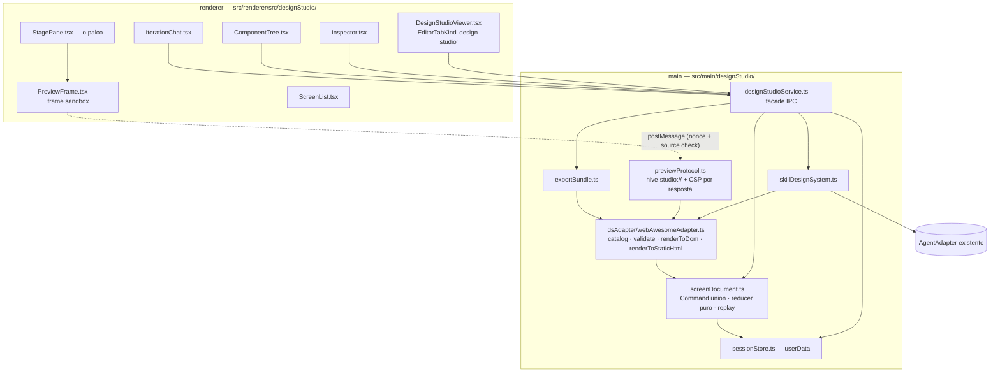

# Design — `design-studio` (M18)

**Spec:** `.specs/features/design-studio/spec.md`
**Context (decisões travadas):** `.specs/features/design-studio/context.md`
**Contrato canônico:** `_bmad-output/specs/spec-design-studio/` (SPEC + AD-1..AD-11)
**Status:** Draft

---

## 0. Achados de pesquisa (verificados, não assumidos)

Tudo aqui foi medido contra o pacote real em 2026-08-09, não inferido.

| # | Achado | Consequência no design |
| --- | --- | --- |
| P-1 | `@awesome.me/webawesome@3.11.0` existe, **MIT**, `lit ^3.2.1`. Confere com `stack.md`. | Stack confirmada, sem alternativa necessária. |
| P-2 | O pacote publica **`dist/custom-elements.json`** (CEM, 2.0 MB) com **70 custom elements**, e por elemento: atributos com **tipo** (`'neutral' \| 'brand' \| 'success' \| 'warning' \| 'danger'`, `boolean`, `string \| null`), slots e eventos. | **O catálogo (DS-R13) é derivado, não escrito à mão.** É o que faz "fonte única de verdade" ser mecânico em vez de aspiracional, e o que dá ao Inspetor o tipo de controle certo por prop (enum→Select, boolean→Switch, string→Input). |
| P-3 | Nenhum `wa-combobox` / `wa-date-picker` / `wa-file-input` / `wa-data-grid` no tarball — consistente com o tier Pro descrito em `stack.md`. Os 70 que estão lá são MIT. | O catálogo v1 é exatamente "o que o pacote publica". Nada de checagem manual de Pro por componente. |
| P-4 | **`dist/webawesome.js` tem 1,3 KB** — é um barrel que reexporta de `dist/chunks/*`. **Não é um bundle self-contained.** | DS-R14 ("zero rede") **exige um passo de build**. Não dá para inlinar o arquivo do pacote. |
| P-5 | Bundle medido com esbuild: **os 70 componentes + core = 774 KB** minificado (ESM). Tema + `native.css` = **56 KB**. | ~830 KB por HTML exportado — confortável para um artefato de handoff. Um bundle único, sem tree-shaking por Tela na v1. **Corrigido na execução (T7.8):** o artefato que shippou mede **845,2 KB de JS + 90,4 KB de CSS = 935,6 KB**. O CSS quase dobrou porque a entrada `styles/webawesome.css` puxa `layers.css` + `utilities.css` junto — não dava para saber sem construir. Continua sob o teto de 1 MB que `dsBundle.test.ts` afirma; todo o resto de §0 bateu com o pacote real. |
| P-6 | **`wa-icon` resolve ícones num CDN da Font Awesome (`ka-p.fontawesome.com`) por padrão, e o pacote não traz nenhum `.svg`** (0 arquivos). | **Sob `connect-src 'none'` (AD-5) todo ícone quebraria em silêncio**, no Preview e no Bundle. Mitigação obrigatória: `registerIconLibrary()` (exportado pelo pacote) apontando para SVGs locais do `@fortawesome/fontawesome-free` (CC-BY-4.0/OFL/MIT), embutidos no bundle. Vira tarefa própria (T2.6). |

> P-4 e P-6 são os dois achados que teriam virado bug tarde: sem eles, "export
> autocontido" e "CSP fecha a rede" pareceriam prontos e falhariam só na mão do
> usuário.

---

## 1. Visão da arquitetura

Paradigma travado pelo contrato canônico: **documento command-sourced atrás de
uma fronteira ports-and-adapters para o Design System.** Não há liberdade de
design aqui — AD-1..AD-11 já decidiram. O que este documento acrescenta é o
*como* dentro dessa moldura, e a superfície.



**A regra que o grafo codifica:** só `dsAdapter/` conhece o pacote de DS, e só
o reducer muta o documento. Ambas são verificadas por teste de fronteira (T1.7,
T2.7), não por disciplina.

### 1.1 Correção de precisão sobre AD-5

O SPEC diz "atualizações via `postMessage` same-origin". Com
`sandbox="allow-scripts"` **sem** `allow-same-origin`, o iframe tem **origem
opaca** — `event.origin` chega como `"null"`, e não existe origem para casar.
Validar por string de origem seria um controle que não controla nada.

O controle correto, e o que este design implementa:

- **pai → iframe:** `frame.contentWindow.postMessage(msg, '*')` (obrigatório:
  origem opaca não aceita um target origin específico).
- **iframe → pai:** o pai aceita a mensagem **somente** se
  `event.source === frame.contentWindow` **e** `msg.nonce === sessionNonce` — o
  mesmo token aleatório da URL da sessão (AD-7).
- Nenhuma mensagem é processada antes do handshake `ready` do receptor.

Isso preserva a intenção de AD-5 (só o nosso frame fala com a gente) com o
mecanismo que de fato funciona sob origem opaca. Registrado como **D-DS-4** em
`## Tech Decisions`.

---

## 2. Reuso de código

O módulo é novo, mas quase toda a mecânica já existe no app — copiar o padrão
importa mais do que importar o arquivo.

| O que | Onde já existe | Como se usa aqui |
| --- | --- | --- |
| Registro de protocolo privilegiado | `src/main/whisperProtocol.ts` | Molde exato para `previewProtocol.ts`: `registerSchemesAsPrivileged` antes do `whenReady`, resolvedor puro e testável, guarda de path-escape, host-based. Diferença: o bundle vem de `process.resourcesPath` (build-time), não de `userData` (runtime). |
| Persistência em `userData` | `src/main/chatHistoryStore.ts` | Molde para `sessionStore.ts`: `baseDir` injetado (testável em tmpdir), disco é fonte de verdade, write-temp-then-rename, arquivo corrompido lido como `null` em vez de derrubar a superfície. |
| Contrato de agente | `src/main/agentAdapter.ts` (`AgentSession`, `AgentEvent`, `composeTurnPrompt`) | `skillDesignSystem.ts` fala só isso (AD-9). Sem branch por `agentId`. |
| Streaming de eventos de agente por IPC | `runSbStream` em `src/main/index.ts` | Mesmo shape para o streaming da Skill: um stop-handle por `sender.id`. |
| Abas do viewer | `src/renderer/src/ui/useEditorTabs.ts` + `WorkUI.tsx:929-947` | `EditorTabKind` ganha `'design-studio'`; chave sintética `⟨studio⟩<specPath>`, no molde de `⟨review⟩`/`⟨diff⟩`. |
| Layout redimensionável | `Resizable`/`ResizablePanel` do DS (já usado em `WorkUI`) | Colunas do palco. |
| Presets de viewport | `SegmentedControl` do DS (`options/value/onChange/ariaLabel`) | Controle de dispositivo. Já usado no MCP Console. |
| Árvore | `Tree` do DS (`TreeNode { id, label, children }`, `TreeRenderState`) | Árvore de Componentes, com roving tabindex já resolvido. |
| Campos e erro inline | `Field` do DS (`label`/`description`/`error`, fia `aria-invalid`) | Inspetor: `CapabilityViolation` entra como `error` do `Field`. |
| Chat | `MessageList`, `ChatMessage`, `PromptInput`, `TypingIndicator` do DS | Chat de Iteração. |
| Vazios que ensinam | `Empty` do DS (`icon`/`title`/`description`/`action`) | Todos os estados vazios de DS-R1/R6/R7. |
| Carregamento | `Skeleton` do DS | DS-R2: esqueleto no palco, nunca spinner no meio do conteúdo. |
| Teste de fronteira entre processos | `src/main/moduleBoundaries.test.ts` | Molde para os dois guards novos (import de DS, mutação fora do reducer). |
| Passe visual | `hive-desktop/tools/visual/*.mjs` + `e2e/contrast.spec.ts` | `tools/visual/design-studio.mjs` e extensão do sweep de contraste. |
| i18n | `src/renderer/src/i18n/pt-BR.ts` + `t()` | Toda copy nova. Guard `noInlineStrings` já pega violação. |

### Pontos de integração

| Sistema | Como conecta |
| --- | --- |
| Explorer | Item de menu de contexto "Abrir no Design Studio" em `.md`, chamando `editor.openDesignStudio(path)` — mesmo padrão de `openReviewDiff`. |
| Paleta (Ctrl+P) | Entrada que lista Specs de UX do workspace. |
| `WorkUI` | Novo ramo em `tab.kind === 'design-studio'`; e um `onRequestFocusMode(boolean)` que colapsa `rail`/`chat` de `visiblePanes` (DS-R16). |
| `preload` | Namespace `designStudio:*` ⇄ `window.hive.designStudio.*`, `index.ts` e `index.d.ts` em lockstep. |
| `electron-builder.yml` | `resources/**` já é `asarUnpack` — o bundle do DS entra sem mudança de config. |
| CSP do renderer (`src/renderer/index.html`) | Ganha `frame-src hive-studio:` (hoje `default-src 'self'` bloquearia o iframe). |

---

## 3. A Bancada — design de superfície

Registro: **product** (`PRODUCT.md`). A régua não é "parece feito por IA?", é
*um usuário fluente em Figma/Framer senta aqui e confia?*

### 3.1 A ideia central

O Preview não é um painel — é um **objeto sobre uma bancada**. Tudo no layout
serve essa leitura, porque é ela que autoriza o usuário a tratar a Tela como
algo manipulável em vez de um relatório renderizado.

```
┌───────────────────────────────────────────────────────────────────────────┐
│ Login ▾ ·3 Telas    ⌁ Mobile │ Tablet │ Desktop │ ⤢     ↶ ↷   ⛶   Exportar│  toolbar 44px
├──────────────┬────────────────────────────────────────────┬───────────────┤
│ TELAS        │                                            │ INSPETOR      │
│ ● Login    ✎ │            ╭─── 390 × 844 ───╮  75%        │ wa-button     │
│ ○ Cadastro   │            │                  │            │ ─────────────  │
│ ○ Sucesso    │            │   preview vivo   │            │ variant   ▾   │
│              │            │                  │            │ size      ▾   │
│ ÁRVORE       │            │                  │            │ appearance ▾  │
│ ▾ wa-page    │            ╰──────────────────╯            │ ◉ pill        │
│  ▾ wa-card   │                                            │ ○ disabled    │
│    wa-input  │         ← o palco: --bg-2, dot grid →       │               │
│    wa-button │                                            │               │
├──────────────┴────────────────────────────────────────────┴───────────────┤
│ 💬 Iteração          [no contexto: wa-button ✕]                       ⌃   │  faixa 56px
│    escreva o que mudar…                                            ⏎      │  (colapsada)
└───────────────────────────────────────────────────────────────────────────┘
```

### 3.2 Profundidade sem sombra

`DESIGN.md` tem a regra **Flat-Until-It-Floats**: `--shadow-1..3` existem só
para superfícies portaladas. Um dispositivo flutuando numa bancada *pede*
elevação — e a resposta aqui não é quebrar a regra, é resolver com **três
camadas de superfície**, que é como o próprio sistema já fala:

| Camada | Token | Papel |
| --- | --- | --- |
| Bancada (fundo do palco) | `--bg-2` (rebaixado) | O "chão". Mais fundo que qualquer painel. |
| Moldura do dispositivo (bezel) | `--bg` + hairline `--border-strong` | O aparelho. |
| Tela (dentro do iframe) | branco / `--surface` | O conteúdo. |

Três tons empilhados leem como profundidade real, sem uma única `box-shadow` —
e continuam corretos nos dois temas porque são role tokens, não valores.

**Textura do palco:** pontos de 1px em grade de 24px, na cor `--border` (12–14%
alpha). Não é decoração: é o que diferencia *espaço de trabalho* de *painel*, e
é convenção da categoria (Figma, Framer, tldraw, n8n) — "earned familiarity", a
régua do registro product. Some no Modo Foco reduzido e sob `forced-colors`.

### 3.3 Escala honesta (o detalhe que decide se o Preview presta)

Um preset Desktop de 1440px dentro de um palco de 700px **precisa** caber. O
jeito errado é encolher o iframe (as media queries do DS passariam a responder à
largura errada, e o Preview mentiria).

O jeito certo, e o que este design especifica:

- O `<iframe>` tem a largura/altura **reais** do preset (1440×900).
- O contêiner aplica `transform: scale(k)` com `transform-origin: top center`,
  `k = min(1, (largura_do_palco − margem) / largura_do_preset)`.
- O readout mostra `1440 × 900` e `75%` — o usuário sempre sabe que está vendo
  reduzido.
- Nunca amplia acima de 100%: `k` é limitado a 1.

Assim a Tela responde como no dispositivo real e ainda cabe na bancada.

**Transição entre presets:** a largura real do iframe **troca instantaneamente**
(um único reflow, media queries corretas de imediato); o que anima é só o
`transform` do contêiner, 200 ms `--ease-quart`, da escala antiga para a nova. O
usuário lê "o aparelho mudou de tamanho" sem nenhum frame de layout quebrado.

### 3.4 Seleção que parece devtools, não formulário

A seleção (DS-R5) é desenhada **dentro** do iframe, pelo receptor — é quem tem a
geometria. Uma camada de overlay separada da árvore do documento, que o
`renderToStaticHtml` do export nunca vê.

- **Hover:** contorno 1px `--accent` a 50%, sem preenchimento.
- **Selecionado:** contorno 2px `--accent` + chip de tag (`wa-button`) ancorado
  no canto superior esquerdo do bounding box, virando para dentro quando o
  elemento está colado no topo.
- **Aninhados:** o clique pega o alvo mais profundo (`composedPath()[0]`
  atravessa shadow DOM) — é o que cumpre "sem exigir troca de modo".
- **Bidirecional:** clicar no palco destaca a linha na Árvore e vice-versa.
- Entrada em 120 ms ease-out; sob `prefers-reduced-motion`, aparece sem transição.

### 3.5 Estado de edição visível (DS-R4)

O seletor de Telas distingue os dois estados **sem legenda**:

- `○` anel vazio, `--faint` → auto-gerada, ninguém tocou.
- `●` disco cheio, `--accent`, + `✎` → editada nesta sessão (`log.length > 0`).

O estado nunca é comunicado só por cor: o preenchimento da forma e o ícone
carregam a mesma informação (piso de a11y do `PRODUCT.md`).

### 3.6 Inspetor derivado do catálogo

Cada controle nasce do **tipo** que o CEM declara (P-2) — é isto que faz DS-R6
("cada prop editável corresponde a uma prop real") ser verdade por construção:

| Tipo no CEM | Controle | Exemplo |
| --- | --- | --- |
| União de literais | `Select` com exatamente esses valores | `variant: 'neutral' \| 'brand' \| …` |
| `boolean` | `Switch` | `pill`, `disabled`, `loading` |
| `string` / `string \| null` | `Input` | `name`, `title` |
| `number` | `Input type=number` | — |
| Conteúdo de slot | `Textarea` de uma linha por slot declarado | slot default, `start`, `end` |

Props ficam agrupadas: **Aparência** (variant/appearance/size/pill) → **Estado**
(disabled/loading/checked) → **Conteúdo** (slots) → **Avançado** (o resto,
recolhido). Um `wa-button` tem 20+ atributos; despejar os 20 numa lista plana é
o que transforma um inspetor em planilha.

`CapabilityViolation` entra como `error` do `Field` — mesma renderização que o
Chat usa para o mesmo fato (AD-10), porque é o mesmo componente.

### 3.7 O Chat como faixa, não como coluna

Colapsado (padrão): 56px, uma `PromptInput` + um `Chip` de contexto quando há
seleção (`no contexto: wa-button ✕`) — o que torna DS-R10 ("interpretado nesse
contexto por padrão") **visível** em vez de mágico. O `✕` solta o contexto.

Expandido: sobe para ~40% da altura com o transcript (`MessageList`). Cada turno
do agente mostra as mudanças que aplicou (`3 mudanças`) e um `↩ desfazer este
turno` — a materialização direta de DS-R9 AC-5.

Enquanto a Skill trabalha: `TypingIndicator` + uma linha de status viva
alimentada por `AgentEvent` ("lendo a Spec…", "escolhendo Componentes…"). Espera
assíncrona nunca fica sem cobertura (DS-R2).

### 3.8 Modo Foco e a cadeia de degradação (DS-R16)

A aba vive no painel `viewer` (≈44% da janela). Quatro superfícies não cabem
ali, e fingir que cabem é o que produziria um Studio inutilizável.

| Largura do palco | Comportamento |
| --- | --- |
| ≥ 1100px | Bancada completa: três colunas + faixa de chat. |
| 820–1100px | Inspetor vira gaveta ancorada à direita, abre na seleção e fecha no Esc. |
| < 820px | Coluna esquerda colapsa: Telas viram dropdown na toolbar, Árvore vira gaveta. |
| < 900px | A toolbar promove **Modo Foco** com um hint (uma vez por sessão). |

**Modo Foco** (`⛶`, e `Ctrl+Shift+.`): a aba pede a `WorkUI` para colapsar
`rail` e `chat`, e o palco toma a janela. Sair restaura a distribuição anterior
exatamente (DS-R16, P3) — a distribuição é guardada antes de colapsar, não
recalculada.

### 3.9 Movimento

Tudo dentro de 150–250 ms, `--ease-quart`, e todo item com alternativa sob
`prefers-reduced-motion: reduce` (piso de `PRODUCT.md`).

| Momento | Movimento | Reduzido |
| --- | --- | --- |
| Troca de preset | `transform: scale` 200 ms | instantâneo |
| Seleção | contorno fade+scale 120 ms | instantâneo |
| Chat expandir/colapsar | altura 200 ms | instantâneo |
| Commands do chat aplicados | pulso de 1 frame no contorno dos nós afetados | sem pulso |
| Gaveta do Inspetor | slide 180 ms | crossfade |
| Geração (DS-R2) | Skeleton no palco | Skeleton (estático, já é) |

O pulso nos nós que o chat mudou é o único movimento "extra" — e ganha lugar
porque responde a uma pergunta real que o usuário faz toda vez: *o que mudou?*

### 3.10 Estados vazios que ensinam

| Onde | O que diz |
| --- | --- |
| Spec sem Tela (DS-R1) | O que procurou (`## Tela …` / cabeçalhos de seção), o que achou, e "Abrir a Spec no editor" como ação. Nunca palco em branco. |
| Nenhuma seleção (DS-R6) | "Clique em qualquer elemento no palco para editar." + atalho para a Árvore. |
| Tela sem Componentes (DS-R7) | "Esta Tela ainda não tem Componentes." + **Gerar com a Skill** (primária) e **Adicionar Componente** (secundária). |
| Falha do bundle (DS-R8) | `OperationError` com **Tentar de novo** — `retryable: true` vira botão, não texto. |

---

## 4. Componentes

### main — `src/main/designStudio/`

**`screenDocument.ts`** — *Purpose:* modelo do documento e a única mutação.
*Interfaces:* `applyCommand(doc, cmd): ScreenDocument` (puro, **não valida** —
AD-2); `replay(origin, log): ScreenDocument`; `pushCommands(log, cmds, groupId)`;
`undo(log)/redo(log)`. **Corrigido na execução:** o `replay(log, upTo)` deste
plano não tinha de onde tirar `screenId`/`title` — um log é uma lista de
`Command`, não um documento. O documento de origem entra como primeiro
parâmetro explícito e o cursor do próprio log diz até onde ir. *Dependências:* nenhuma (zero Electron/DOM/agente).
*Reusa:* nada — é a raiz.

**`dsAdapter/types.ts`** — *Purpose:* o port. `DesignSystemAdapter { id,
catalog(), validate(cmd, doc), renderToDom(...), renderToStaticHtml(doc) }` +
`ComponentCatalog`. *Reusa:* padrão de port do `AgentAdapter`.

**`dsAdapter/webAwesomeAdapter.ts`** — *Purpose:* o adaptador concreto v1.
*Interfaces:* implementa o port; `renderToDom` constrói via `createElement` +
atribuição (AD-4), com allowlist de esquema em props URL-shaped;
`renderToStaticHtml` produz o HTML autocontido. *Dependências:* `catalog.json`
gerado (T2.1) e o bundle em `resources/`. **É o único arquivo do repo autorizado
a conhecer o Web Awesome.**

**`dsAdapter/catalogBuild.ts`** (script de build) — *Purpose:* CEM → catálogo
enxuto. Lê `custom-elements.json`, extrai tag/props/tipos/slots, classifica cada
prop em `enum|boolean|string|number`, escreve `resources/design-system-web-awesome/catalog.json`.
*Reusa:* padrão dos scripts em `hive-desktop/scripts/`.

**`previewProtocol.ts`** — *Purpose:* servir a casca e o bundle.
*Interfaces:* `STUDIO_SCHEME`, `STUDIO_SCHEME_PRIVILEGES`,
`resolveStudioRequest(roots, url): string | null` (puro, testável, com guarda de
path-escape), `studioHeaders(file)` com a CSP por resposta. *Reusa:*
`whisperProtocol.ts` quase linha a linha.

**`skillDesignSystem.ts`** — *Purpose:* NL/Spec → `Command[]`.
*Interfaces:* `generateScreens(specText)`, `iterate(doc, selection, message)`;
ambos devolvem `Command[] | CapabilityViolation | OperationError`. Parse
estrito: resposta que não é o JSON esperado → `OperationError` (não
`CapabilityViolation` — não é mismatch de catálogo). *Dependências:*
`AgentSession` (AD-9). *Reusa:* `composeTurnPrompt`, streaming de `AgentEvent`.

**`sessionStore.ts`** — *Purpose:* persistir sessão. *Interfaces:*
`get(key)`, `save(key, session)`, `key(specPath, workspace)`.
*Reusa:* `chatHistoryStore.ts`.

**`exportBundle.ts`** — *Purpose:* Tela → HTML autocontido.
*Interfaces:* `exportScreen(doc, outDir)`, `exportMany(docs, outDir): ExportResult[]`
(isola falha por Tela — AD-11). *Reusa:* só `renderToStaticHtml` do adaptador
(AD-6). **Nenhuma lógica de markup própria.**

**`designStudioService.ts`** — *Purpose:* fachada IPC `designStudio:*`.
*Interfaces:* `open`, `screens`, `dispatch`, `undo`, `redo`, `chat`, `export`,
`catalog`. *Reusa:* forma dos services existentes (`reviewService`, `mcpService`).

### renderer — `src/renderer/src/designStudio/`

| Arquivo | Papel | Reusa |
| --- | --- | --- |
| `DesignStudioViewer.tsx` | Casca da aba, dono do estado de sessão e do Modo Foco | `Resizable` |
| `StudioToolbar.tsx` | Telas, viewport, undo/redo, foco, exportar | `SegmentedControl`, `Button`, `Tooltip`, `Kbd` |
| `StagePane.tsx` | O palco: bancada, escala, readout | — |
| `PreviewFrame.tsx` | O iframe sandbox + ponte `postMessage` | — |
| `ScreenList.tsx` | Telas + estado editada/auto | — |
| `ComponentTree.tsx` | Árvore + add/remove/move | `Tree` (+ `TreeActions`) |
| `Inspector.tsx` | Props derivadas do catálogo, agrupadas | `Field`, `Select`, `Switch`, `Input`, `Accordion` |
| `IterationChat.tsx` | Faixa/painel de chat | `MessageList`, `ChatMessage`, `PromptInput`, `TypingIndicator` |
| `useDesignStudio.ts` | Estado + IPC + atalhos | padrão de `useEditorTabs` |

### preview (servido pelo protocolo) — `src/preview/`

**`receiver.ts`** — script in-frame. Handshake `ready` com nonce; recebe
`ScreenDocument`; reconcilia por id de nó (patch de props no lugar, add/remove/
move só do que mudou — é isto que dá o "instantâneo" de DS-R8 sem re-render
total); desenha a camada de overlay de seleção; publica cliques de volta.
Construção de DOM só por API segura (AD-4). Compilado como bundle próprio para
`resources/`.

---

## 5. Modelos de dados

```typescript
/** Um nó da Tela. `id` é estável por Tela, atribuído na criação (AD-2). */
interface ScreenNode {
  id: string
  tag: string                          // sempre uma tag do catálogo ativo
  props: Record<string, string | number | boolean>
  slot?: string                        // slot do pai; ausente = slot default
  children: ScreenNode[]
}

interface ScreenDocument {
  screenId: string
  title: string
  root: ScreenNode | null              // null = Tela ainda vazia
}

/** Vocabulário FECHADO. Cada Command = exatamente uma mudança atômica (AD-2). */
type Command =
  | { type: 'AddComponent'; parentId: string | null; slot?: string; index: number; node: ScreenNode }
  | { type: 'RemoveComponent'; componentId: string }
  | { type: 'MoveComponent'; componentId: string; newParentId: string; slot?: string; index: number }
  | { type: 'SetProp'; componentId: string; key: string; value: string | number | boolean | null }

/** Log linear por Tela. `groupId` agrupa o turno de chat num passo (AD-8). */
interface CommandLog {
  entries: { command: Command; groupId: string; at: number }[]
  cursor: number                       // quantas entradas estão aplicadas
}

/** Catálogo derivado do CEM (P-2). Única fonte de verdade (DS-R13). */
interface ComponentCatalog {
  dsId: string
  version: string
  components: {
    tag: string
    summary?: string
    slots: string[]
    props: {
      name: string
      kind: 'enum' | 'boolean' | 'string' | 'number'
      values?: string[]                // presente sse kind === 'enum'
      default?: string | number | boolean
      group: 'appearance' | 'state' | 'content' | 'advanced'
    }[]
  }[]
}

/** Exatamente duas formas de falha, nunca uma terceira (AD-10, AD-11). */
interface CapabilityViolation { kind: 'capability'; componentId: string; reason: string; attemptedValue?: unknown }
interface OperationError { kind: 'operation'; scope: 'agent' | 'preview' | 'export' | 'io'; message: string; retryable: boolean }

/** Uma sessão em disco, chaveada por (specPathHash, workspaceHash) (AD-7). */
interface StudioSession {
  specPath: string
  workspace: string
  dsId: string                         // Telas não migram ao trocar DS (DS-R12)
  activeScreenId: string | null
  screens: { screenId: string; title: string; log: CommandLog; transcript: StudioChatMessage[] }[]
}
```

**Fora do documento, por decisão** (AD, "State & cross-cutting"): preset de
viewport, seleção, zoom, Modo Foco e estado da gaveta. Não entram no undo nem na
persistência.

---

## 6. Tratamento de erros

| Cenário | Forma | O que o usuário vê |
| --- | --- | --- |
| Prop fora do catálogo (Inspetor) | `CapabilityViolation` | Erro inline no `Field`; valor anterior mantido |
| Componente/prop fora do catálogo (Chat) | `CapabilityViolation` | Mesma renderização, dentro do turno; **zero** Command aplicado |
| Esquema de URL não permitido | `CapabilityViolation` | Erro no campo; nada atribuído ao DOM |
| Move que cria ciclo | `CapabilityViolation` | Drop rejeitado; árvore intacta |
| Agente indisponível / timeout | `OperationError{agent, retryable:true}` | Erro no chat com **Tentar de novo** |
| Resposta da Skill malformada | `OperationError{agent, retryable:true}` | Idem — não é mismatch de catálogo |
| Bundle do DS não carrega | `OperationError{preview, retryable:true}` | Erro no palco com **Tentar de novo** |
| Export de uma Tela falha | `OperationError{export}` escopado | Demais Telas seguem; relatório por Tela |
| Sessão em disco corrompida | — | Trata como sessão nova; aba não cai |
| Spec ilegível | `OperationError{io, retryable:true}` | Vazio com o motivo e ação de repetir |

---

## 6.1 Correções medidas na execução (T7.8)

O que este documento planejou e a execução teve de mudar, com o motivo. Cada
linha é uma coisa que só se descobre construindo.

| O que mudou | Por quê |
| --- | --- |
| **Mover é indentar/desindentar por botão**, não arrastar nem menu de contexto | DS-R18 exige operabilidade completa por teclado, e **arrastar é o único gesto que um teclado não faz**. Somando: o `Tree` do DS não expõe gancho por linha, e dnd em jsdom é notoriamente instável. Dois botões (`Mover para dentro` / `Mover para fora`) fazem o mesmo trabalho e são testáveis e teclável. |
| **A biblioteca de ícones é um conjunto fixo de 136 ícones** (123 solid + 13 brands), não a FA Free inteira | Só o conjunto solid completo estoura o teto de 1 MB que o Bundle precisa respeitar. **Limitação conhecida do produto:** um ícone fora dessa lista não renderiza nada — e, por construção (D-DS-8), **nunca** cai para o CDN. |
| **`connect-src` é `data:`, não `'none'`** | Medido na fase 2 e travado em D-DS-4: `wa-icon` resolve todo ícone por `fetch()`, inclusive de uma URL `data:`. O egresso de rede continua zero — uma URL `data:` não alcança servidor nenhum — e a prova é a T3.8, que observa o tráfego real do frame. |
| **A raiz de `resources/` sai do bundle do main, não de `process.resourcesPath`** | `asarUnpack: resources/**` coloca os artefatos em `<resourcesPath>/app.asar.unpacked/resources/`, não em `<resourcesPath>/`. A expressão original 404'ava tudo **só no app empacotado** — nenhum teste, nenhum dev run e nenhum E2E contra `out/` veria. Achado por `npm run build:unpack` na T7.8 e provado corrigido contra o binário empacotado. |

**Limitação registrada, não resolvida:** a detecção de Telas (T4.2) foi calibrada
contra casos construídos e contra os exemplos que a skill `bmad-ux` traz — **nenhuma
Spec de UX real deste repositório usa cabeçalhos `## Tela —`**. O **R-8 continua
aberto**: a heurística não foi validada contra uma Spec real, e a primeira que
aparecer é a que vai dizer se ela presta.

---

## 7. Riscos e preocupações

| # | Preocupação | Onde | Impacto | Mitigação |
| --- | --- | --- | --- | --- |
| R-1 | `wa-icon` busca ícones num CDN e o pacote não traz SVG (P-6) | `dsAdapter/` | Sob `connect-src 'none'`, **todo ícone some** — no Preview e no Bundle, em silêncio | **T2.6**: `registerIconLibrary()` com resolvedor local sobre SVGs do `@fortawesome/fontawesome-free` embutidos; **T3.8** afirma que nenhuma requisição de rede sai do frame |
| R-2 | `dist/webawesome.js` é um barrel de 1,3 KB, não um bundle (P-4) | build | "HTML autocontido" falharia ao abrir sem rede | **T2.2**: passo de build com esbuild produz bundle único (medido: 774 KB + 56 KB CSS) |
| R-3 | `WorkUI.tsx` tem 1252 linhas e o corpo das abas é uma cadeia ternária (`WorkUI.tsx:929-947`) | `src/renderer/src/WorkUI.tsx` | Mais um ramo aumenta um trecho já denso | Um único ramo delegando a `DesignStudioViewer`; toda a complexidade fica no módulo novo. Refatorar a cadeia inteira fica fora do escopo desta milestone |
| R-4 | Contrato do Figma Agent segue indefinido (SPEC OQ-1) | `exportBundle.ts` | Se o Agent não atravessar shadow DOM, o Bundle vivo não serve direto | Decisão travada em D-DS-1. `renderToStaticHtml` é o único produtor de string, então um `renderToFlatHtml` futuro é aditivo — um método a mais no mesmo adaptador, não uma reescrita |
| R-5 | Origem opaca torna a checagem de origem inútil (§1.1) | `PreviewFrame.tsx` | Um controle que parece existir e não controla | `event.source === contentWindow` **e** nonce por sessão; **T3.7** tenta uma mensagem forjada e afirma que é ignorada |
| R-6 | Documento em main + UI em renderer = round-trip por tecla no Inspetor | IPC | Digitar num campo pode parecer travado | Debounce de 120 ms em campos de texto; enum/boolean despacham na hora. **T5.4** mede que a reconciliação não faz re-render total |
| R-7 | +830 KB em `resources/` | empacotamento | Cresce o instalador | `resources/**` já é `asarUnpack`, e o payload é hospedado em GitHub Releases (D21) — o limite do npm não é tocado |
| R-8 **(aberto)** | Spec de UX é markdown livre; "Tela" não tem marcação garantida | `skillDesignSystem.ts` | Detecção pode achar 0 Telas numa Spec válida | DS-R1 AC-3 exige um vazio que **nomeia o que procurou**, e isso foi entregue. O que **não** foi entregue é a calibração contra Specs reais: não existe nenhuma neste repo com `## Tela —`, então a heurística está testada só contra casos construídos e contra os exemplos da skill `bmad-ux`. Continua aberto (§6.1) |
| R-9 | Sem undo/redo prévio no codebase para herdar (AD-8) | `screenDocument.ts` | Padrão novo, sem precedente local | Replay-from-origin é a implementação mais simples que satisfaz AD-8; a fase 1 é inteira de testes de propriedade sobre o log antes de qualquer UI existir |

---

## 8. Tech Decisions

| Decisão | Escolha | Racional |
| --- | --- | --- |
| **D-DS-4** — validar mensagens do iframe | `event.source === frame.contentWindow` + nonce por sessão; **não** por `event.origin` | Origem opaca (`sandbox` sem `allow-same-origin`) entrega `origin: "null"`; casar string de origem seria teatro de segurança. Preserva a intenção de AD-5 com o mecanismo que funciona (§1.1) |
| **D-DS-5** — origem do catálogo | Derivado do `custom-elements.json` no build, congelado em `catalog.json` versionado | Torna DS-R13 mecânico (P-2). Congelar no build mantém o main sem parse de 2 MB no boot e deixa o catálogo revisável em diff |
| **D-DS-6** — o que trafega para o Preview | `ScreenDocument` inteiro; o receptor reconcilia por id | Mandar `Command` exigiria o reducer duplicado dentro do frame (duas implementações divergindo é exatamente o que AD-2 evita). Reconciliação por id dá o "instantâneo" sem re-render total |
| **D-DS-7** — escala do Preview | `transform: scale` no contêiner, iframe na largura real | Encolher o iframe faria as media queries do DS responderem à largura errada — o Preview mentiria sobre o dispositivo |
| **D-DS-8** — ícones | Biblioteca local registrada via `registerIconLibrary`, SVGs do FA Free embutidos | Única forma de honrar `connect-src 'none'` e "zero rede" no Bundle (R-1) |
| **D-DS-9** — elevação do palco | Três camadas de superfície (`--bg-2` → `--bg` → `--surface`), zero `box-shadow` | Honra **Flat-Until-It-Floats** do `DESIGN.md` e ainda entrega profundidade real (§3.2) |

> **Nível de projeto:** D-DS-4, D-DS-5 e D-DS-8 viram convenção para qualquer
> futuro conteúdo isolado ou segundo Adaptador de DS — entram em
> `.specs/project/STATE.md` como **D29**, **D30** e **D31** ao fim da fase 3.

---

## 9. Estratégia de teste

Herda o piso do `HARNESS.md`: `npm run verify` (typecheck + lint + testes com
gate de cobertura) verde, passe visual nos dois temas, E2E de contraste sobre o
app real.

| Camada | Como se prova |
| --- | --- |
| Documento (F1) | Testes de propriedade sobre o log: replay(undo(x)) ≡ x; um turno agrupado desfaz junto; undo de turno de chat não toca edições manuais posteriores |
| Catálogo/Adaptador (F2) | Catálogo gerado casa com o CEM real do pacote instalado; `validate()` rejeita tag/prop/valor fora do catálogo; allowlist de esquema |
| Protocolo (F3) | Resolvedor puro (host desconhecido, path-escape); a CSP da resposta contém `connect-src 'none'`; mensagem forjada é ignorada (R-5) |
| UI (F4–F6) | Testes de componente no molde dos existentes (`*.test.ts` em cada pasta); estados vazios; teclado |
| Export (F7) | Bundle abre sem rede e bate com o Preview; falha isolada por Tela |
| Fronteira | Dois guards no molde de `moduleBoundaries.test.ts`: (a) só `dsAdapter/` importa o pacote de DS; (b) nenhuma superfície muta o documento fora do reducer |
| Visual | `tools/visual/design-studio.mjs` varrendo palco/Inspetor/Árvore/Chat × estados × 2 temas; `e2e/contrast.spec.ts` abre a aba no app real |
