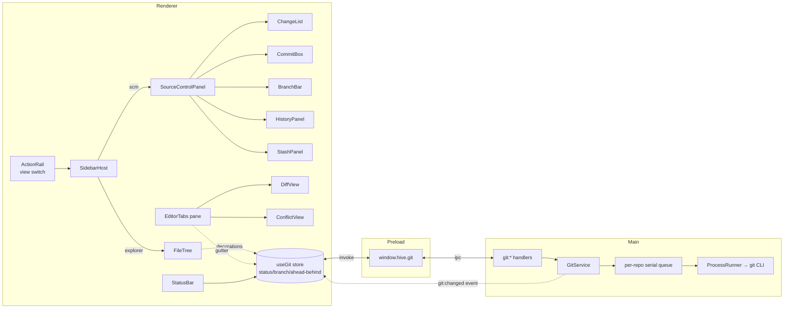

# Design — Git Management

**Feature dir:** `.specs/features/git-management/`
**Spec:** `spec.md` · **Context:** `context.md`
**Reads locked decisions:** D-GIT-1 (system credentials), D-GIT-2 (switchable
sidebar), D-GIT-3 (full P1 scope).

> Diagram note: the `mermaid-studio` skill isn't installed; diagrams below are
> inline mermaid. Installing it would give rendered SVG/validation — recommended
> once, not required.

---

## 1. Architecture Overview

Git is a **new domain module** that plugs into the app's established seams — it
does not invent a new pattern. It mirrors `fsService`/`agentService`: a pure
main-process service driven through the injected `ProcessRunner`, exposed over
one typed IPC namespace, consumed by a new renderer surface that swaps into the
existing left rail.



**Guiding fit with the codebase**

- **Same service shape** as `fsService`/`bmadService`: no `electron` import in
  the service; `ProcessRunner` injected (real in `main/index.ts`, fake in
  tests). Reuses `createFakeProcessRunner` for deterministic unit tests.
- **Same IPC pattern**: `ipcMain.handle('git:<name>', …)` in `main/index.ts`,
  typed `window.hive.git.<name>` in `preload/index.ts`, one streaming channel
  (`git:changed`) following the exact `watchWorkspace`/`agent.onEvent` shape.
- **Same renderer conventions**: `@hive/design-system` role tokens, pt-BR `t()`
  for every string, `workbench.css` `wb-*` classes, DS `Command`/`ContextMenu`/
  `Toast`/`Dialog` reused; the three-way unsaved guard reused for branch switch.

---

## 2. Module Responsibilities

| Layer | New/changed | Responsibility |
| --- | --- | --- |
| `main/gitService.ts` | **new** | All git porcelain: detect/init, status, stage/unstage/discard, commit, branches, remotes/sync, log, diff, conflicts, stash. Parses machine-readable git output into typed structs. Serializes mutations. |
| `main/gitService.test.ts` | **new** | Unit tests over `createFakeProcessRunner` scripting real git output fixtures. |
| `main/gitParse.ts` | **new** | Pure parsers (porcelain v2 status, `log` records, `branch`/`for-each-ref`, `stash list`, numstat). Split out so parsing is unit-tested without a runner. |
| `main/index.ts` | changed | Register `git:*` handlers + the `git:changed` stream; wire `GitService` with the real `ProcessRunner`. |
| `preload/index.ts` | changed | Add the `git` namespace to `window.hive`. |
| `renderer/.../scm/*` | **new** | `SourceControlPanel` + children (ChangeList, CommitBox, BranchBar, HistoryPanel, StashPanel, ConflictView), `useGit` store hook, `gitDecorations` helpers. |
| `renderer/.../ui/StatusBar.tsx` | **new** | Bottom status bar (branch, sync, changes, op spinner). |
| `renderer/.../ui/DiffView.tsx` | **new** | Unified + side-by-side diff renderer. |
| `renderer/.../ui/SidebarHost.tsx` | **new** | Hosts the rail pane's swappable body (explorer ⇄ scm), keyed so pane identity/width survive the switch. |
| `renderer/.../ui/ActionRail.tsx` | changed | Becomes a **view switcher** (Explorer + Source Control entries with active state + change badge) plus the existing tool buttons. |
| `renderer/.../WorkUI.tsx` | changed | Rail pane renders `SidebarHost`; mounts `StatusBar`; routes diff/conflict tabs into the editor pane; `Ctrl+Shift+G`. |
| `renderer/.../ui/useEditorTabs.ts` | changed | `EditorTab` gains `kind: 'file' \| 'diff' \| 'conflict'` + a `git` descriptor; preview-slot logic unchanged. |
| `renderer/.../explorer/Explorer.tsx` | changed | `FileTree` `renderLabel` consumes a git-status map for row decorations + folder rollups; `FileViewer` renders the gutter. |
| `renderer/.../ui/icons.tsx` | changed | Add git glyphs (branch, commit, merge, sync/cloud, stash, check-circle, arrow-down, source-control). |
| `@hive/design-system` `Tree` | maybe extended | Only if `renderLabel` can't express folder rollup dots cleanly; prefer no DS change (see §6.3). |
| `i18n/pt-BR.ts` | changed | New `git.*` key group. |

---

## 3. `GitService` (main)

### 3.1 Mechanism — git CLI via `ProcessRunner` (Agent's Discretion, D-GIT engine)

**Decision:** drive the system `git` binary through the existing
`processRunner.ts`. **Not** `simple-git`/`isomorphic-git`/`nodegit`.

Rationale (knowledge chain: codebase → existing pattern):
- The app already spawns CLIs this way (BMAD, Claude, Copilot, Devin adapters);
  `ProcessRunner` gives streaming, `cwd`, `kill`, and a battle-tested fake.
- `git` is present (2.34.1) and is the exact binary VS Code shells out to — same
  credential-helper/SSH behavior for free, satisfying **D-GIT-1** with zero
  secret-handling code.
- No 300-file native dep, no bundling risk, no second source of truth.
- Trade-off accepted: we parse text output. Mitigated by using **machine
  formats** (porcelain v2, `-z` NUL separators, explicit `--format`) and keeping
  parsers pure + fixture-tested in `gitParse.ts`.

A thin `git(args, opts)` helper wraps `ProcessRunner.run('git', args, {cwd})`,
collects stdout/stderr, and resolves `{ stdout, stderr, code }`. Non-zero exit →
throws a `GitError` carrying `{ code, stderr, command }` (stderr surfaced
verbatim upstream per G3). `-c core.quotepath=false` and
`GIT_TERMINAL_PROMPT=0` are set on every call (never hang on a credential
prompt — fail fast so the renderer can show git's message, D-GIT-1).

### 3.2 Command catalog (porcelain, machine-readable)

| Method | git invocation (essentials) | Parsed into |
| --- | --- | --- |
| `detect(ws)` | `rev-parse --is-inside-work-tree` / `--show-toplevel` | `{ isRepo, root }` |
| `init(ws)` | `init` | void |
| `status(ws)` | `status --porcelain=v2 --branch -z` | `GitStatus` (branch, upstream, ahead/behind, `GitFileChange[]` w/ index+worktree codes, conflicts, untracked) |
| `stage/unstage(paths)` | `add -- <p>` / `restore --staged -- <p>` | void |
| `discard(paths)` | tracked → `restore -- <p>`; staged+tracked → `restore --staged --worktree`; untracked → OS **trash** (reuse `fsService` trash, never `clean -f`) | void |
| `commit(msg,{amend})` | `commit -m <msg> [--amend]` (message via temp file / `--file=-` to avoid arg limits) | `{ hash }` |
| `branches()` | `for-each-ref --format='…' refs/heads refs/remotes` + `symbolic-ref` | `GitBranch[]`, current, detached |
| `createBranch/checkout/rename/deleteBranch` | `switch -c` / `switch` / `branch -m` / `branch -d\|-D` | void (checkout refusal → `GitError`) |
| `fetch/pull/push/sync` | `fetch` / `pull --ff` / `push` / (pull then push); publish → `push -u origin <b>` | streamed progress + result |
| `log({file?,skip,limit})` | `log --pretty=format:'%H%x1f%h%x1f%an%x1f%aI%x1f%s' -z [-- <file>]` | `GitCommit[]` |
| `commitDiff(hash)` / `diff(path,side)` | `show --numstat`/`diff [--staged] -- <p>` (unified) | `GitDiff` (hunks) |
| `conflicts()` / `resolve` | derived from status `UU/AA/…`; accept = `checkout --theirs/--ours` or marker rewrite; `merge --continue`/`--abort` | `GitConflict[]` |
| `stash({message,untracked})` / `stashList` / `stashApply/Pop/Drop` | `stash push [-u] [-m]` / `stash list --format` / `stash apply\|pop\|drop stash@{n}` | `GitStash[]` |

### 3.3 Serialization & refresh (GIT-R14.2)

- A **per-repo FIFO queue** wraps every **mutating** op (`stage`, `commit`,
  `checkout`, `pull`, `stash`, …). Reads (`status`, `diff`, `log`) run directly
  but a post-mutation `status` is enqueued so the UI settles on truth.
- `index.lock` present (a concurrent git) → the op waits/retries briefly, then
  surfaces a clear "repositório ocupado" error rather than corrupting.
- **Change notifications:** `GitService` emits `git:changed` when a mutation
  completes. The renderer store also listens to the existing `watchWorkspace`
  fs stream (external edits / agent writes) and to window focus, **debounced
  ~250 ms + coalesced**, to re-run `status`. Never a busy poll.

### 3.4 Errors

`GitError { code, stderr, command }`. Crossing IPC, stderr is preserved and
i18n-wrapped in the renderer: a short human sentence (`git.error.pushAuth`,
`git.error.checkoutDirty`, …) with the **raw git stderr** available in a
"Detalhes" disclosure (G3 — truthful, never swallowed). Sensitive tokens never
appear because Hive never handles them (D-GIT-1); URLs are shown as-is (git
already redacts credentials in remote URLs it prints).

---

## 4. IPC + Preload Contract (`window.hive.git`)

Mirrors the existing bridge exactly: plain `invoke` for request/response, the
`watchWorkspace` channel-pattern for the one stream. All methods take the
workspace root as the first arg (like `fs.*`), so no hidden main-side "current
repo" state — the renderer owns which workspace is active.

```ts
// preload/index.ts — new namespace
git: {
  detect: (ws) => Promise<{ isRepo: boolean; root: string | null }>,
  init: (ws) => Promise<void>,
  status: (ws) => Promise<GitStatus>,
  stage: (ws, paths: string[]) => Promise<void>,
  unstage: (ws, paths: string[]) => Promise<void>,
  discard: (ws, paths: string[]) => Promise<void>,        // trashes untracked
  commit: (ws, message: string, opts?: { amend?: boolean; stageAll?: boolean }) => Promise<{ hash: string }>,
  branches: (ws) => Promise<GitBranches>,
  createBranch: (ws, name: string, from?: string) => Promise<void>,
  checkout: (ws, ref: string) => Promise<void>,           // GitError on dirty refusal
  renameBranch: (ws, from: string, to: string) => Promise<void>,
  deleteBranch: (ws, name: string, force?: boolean) => Promise<void>,
  fetch: (ws) => Promise<void>,
  pull: (ws) => Promise<void>,
  push: (ws, opts?: { setUpstream?: boolean }) => Promise<void>,
  sync: (ws) => Promise<void>,
  log: (ws, opts?: { file?: string; skip?: number; limit?: number }) => Promise<GitCommit[]>,
  diff: (ws, path: string, side: 'working' | 'staged') => Promise<GitDiff>,
  commitDiff: (ws, hash: string) => Promise<{ files: GitFileChange[]; diff?: GitDiff }>,
  conflicts: (ws) => Promise<GitConflict[]>,
  resolveConflict: (ws, path: string, choice: 'current' | 'incoming' | 'both') => Promise<void>,
  mergeContinue: (ws) => Promise<void>,
  mergeAbort: (ws) => Promise<void>,
  stash: (ws, opts?: { message?: string; untracked?: boolean }) => Promise<void>,
  stashList: (ws) => Promise<GitStash[]>,
  stashApply: (ws, index: number, pop?: boolean) => Promise<void>,
  stashDrop: (ws, index: number) => Promise<void>,
  onChanged: (cb: (evt: { root: string }) => void) => (() => void)   // stream, unsub
}
```

Long-running ops (`pull/push/fetch/sync`) additionally surface progress on the
`git:changed`-adjacent path via a `GitProgress` event so the status bar spinner
reflects real phases; kept minimal (a `busy: string | null` label) to avoid a
full second stream. Auth failures propagate as a rejected promise carrying the
`GitError` — same `withTypedConflict`-style prefix trick already used for
`CONFLICT:`/`STALE:` (add a `GIT:` prefix → `GitBridgeError` with `.stderr`).

Types (`GitStatus`, `GitFileChange`, `GitBranches`, `GitCommit`, `GitDiff`,
`GitConflict`, `GitStash`) live in `gitService.ts` and are imported by preload
(same as `fsService`'s `TreeNode` etc.).

---

## 5. Renderer Architecture

### 5.1 The switchable sidebar (D-GIT-2, GIT-R13)

Today the rail pane hardcodes `<FileTree>`. We introduce a **view** concept:

- `ActionRail` becomes the **activity bar**: two *view* entries at top —
  **Explorer** (`FilesIcon`) and **Source Control** (`SourceControlIcon` + a
  change-count `Badge`) — each toggling `activeView`; the existing tool buttons
  (search, studio, mcp) and bottom gear stay. Active entry shows the VS Code
  left-accent-bar + filled state.
- `SidebarHost` renders inside the rail `ResizablePanel` and swaps its body on
  `activeView`. The panel keeps `id="rail"`, so `hive.workLayout`/`paneOrder`
  and the movable-pane machinery are **untouched** — only the body swaps. The
  `PaneHeader` title follows the view ("Explorer" ⇄ "Controle de versão").
- `activeView` lives in `WorkUI` (persisted to `localStorage['hive.sidebarView']`
  so it survives reload, like the other view state). `Ctrl/Cmd+Shift+G` sets it
  to `scm` and focuses the commit box; clicking the status bar's changes count
  does the same.

```
┌────┬─────────────────────┬───────────────┬──────────────┐
│ ▐▊ │  CONTROLE DE VERSÃO  │     Chat      │  arquivo.md  │  ← editor pane
│ ⌕  │  ┌ mensagem ───────┐ │               │  (diff tab)  │
│ ⎇▸ │  │ Resumo do commit│ │               │              │
│ ⚙  │  └─────────[ ✓ ]───┘ │               │              │
│    │  ▾ Alterações   5  ⋯ │               │              │
│    │   M src/app.ts   ↩ +│ │               │              │
│    │   U notes.md     ↩ +│ │               │              │
├────┴─────────────────────┴───────────────┴──────────────┤
│  ⎇ main  ↑1 ↓0   ✓ 5 alterações        ⟳ Sincronizando… │  ← StatusBar
└──────────────────────────────────────────────────────────┘
```

### 5.2 Component tree

```
SourceControlPanel (rail body when activeView === 'scm')
├── ScmHeader            — repo name · current branch chip · overflow ⋯ (fetch/pull/push, stash, refresh, view history)
├── CommitBox            — multiline Textarea + primary split-button (Commit / ▾ amend · stage-all · commit & sync)
├── ChangeGroups (ScrollArea, virtualized)
│   ├── Group "Conflitos de merge"  (GitConflict rows → open ConflictView)
│   ├── Group "Alterações prontas"  (staged; row action: Unstage, Open diff)
│   └── Group "Alterações"          (unstaged+untracked; row action: Stage, Discard, Open diff)
├── HistoryPanel  (collapsible / its own sub-view: Timeline of commits → commit diff)
├── StashPanel    (collapsible: stash list; header action to stash)
└── EmptyStates   — not-a-repo (Inicializar), clean ("Nenhuma alteração · <branch>"), git-missing

EditorTabs pane
├── FileViewer      (kind:'file' — unchanged, now with gutter)
├── DiffView        (kind:'diff')
└── ConflictView    (kind:'conflict')

StatusBar (app chrome, bottom)
```

Change rows are **not** the DS `Tree` (flat, path-labeled, VS Code style). They
reuse `ContextMenu` for right-click (Stage/Unstage/Discard/Open diff/View
history/Copy path) and show hover/focus inline action buttons. The list
virtualizes for large repos (GIT-R2 perf) — a lightweight windowing over the
flat array.

### 5.3 State — `useGit(workspace)` store hook

One hook owns git state for the active workspace and is consumed by
`SourceControlPanel`, `StatusBar`, `FileTree` (decorations), and `FileViewer`
(gutter):

```ts
interface GitState {
  repo: { isRepo: boolean; gitMissing: boolean }
  status: GitStatus | null           // branch, upstream, ahead/behind, changes, conflicts
  busy: string | null                // op-in-flight label for the status bar
  decorations: Map<relpath, GitFileStatus>  // derived, for the tree
  refresh(): void                    // debounced status re-run
  // actions: stage/unstage/discard/commit/checkout/pull/push/sync/stash/… → optimistic where safe, else await+refresh
}
```

Mounted once in `WorkUI` (like `useUpdateFlow`) and passed down, or exposed via a
small context so `FileTree`/`FileViewer` read decorations without prop-drilling
through the pane machinery. Resets on `workspace` change (GIT-R1.3).

---

## 6. New / Extended Components

### 6.1 `DiffView` (new, app-local `ui/DiffView.tsx`)

`CodeBlock` is a plain `<pre>` + copy — **not** a diff renderer, so this is net
new. Requirements: unified + side-by-side, add/remove/context coloring, old/new
line numbers, hunk headers, binary/image affordance, large-diff late-load.

- Input: `GitDiff { hunks: { header, lines: {type:'add'|'del'|'ctx', oldNo, newNo, text}[] }[] , binary?, tooLarge? }`.
- Unified: single column, `+`/`-`/context rows; gutters show old|new numbers.
- Side-by-side: two synced-scroll columns (grid), deletions left / additions
  right, aligned by hunk. `flex`/`grid`, no card nesting.
- Color = **semantic state**, not decoration: add = `--success`-tinted row bg +
  ink; del = `--danger`/`--error`-tinted; context = plain. Verified ≥4.5:1 body
  contrast in both themes (impeccable color rule) — tints are backgrounds, text
  stays near-ink.
- Monospace via the DS code font token; wraps in an `overflow:auto` container
  (never horizontal page scroll).
- Toolbar: unified/side-by-side segmented toggle, stage/unstage-this-file,
  open-actual-file. Header shows "arquivo.ts (working tree)" / "(staged)".
- Reuse candidate: extract to `@hive/design-system` later if a second consumer
  appears; ships app-local first (extract.md path), avoiding premature DS churn.

### 6.2 `StatusBar` (new, app-local `ui/StatusBar.tsx`)

VS Code/Cursor bottom bar. Left cluster: branch pill (`⎇ main`, click → branch
`Command` quick-pick), sync (`↑1 ↓0`, click → sync, spinner while busy),
changes count (`✓ 5`, click → open SCM view). Right cluster reserved (future:
line/col, encoding). Height ~24px, `--surface` (the "second neutral layer" the
product register calls for), quiet until hovered. Not a repo → single
"Inicializar repositório" affordance (GIT-R12.3). Fully keyboardable; each
cluster is a real button with tooltip + `aria-label`.

### 6.3 Explorer `Tree` decorations (extend via `renderLabel`, no DS change)

DS `Tree` already accepts `renderLabel(node, state)`. `FileTree` supplies a
`renderLabel` that reads `useGit().decorations`:

- File row: status letter badge (M/A/D/R/U/C) right-aligned, row label tinted by
  status color; ignored → dimmed (`--muted`); staged vs unstaged distinguished
  by badge fill vs outline.
- Folder row: a small change **dot** when any descendant changed (rollup),
  computed once per status into a folder→bool map.
- Colors come from a shared `gitStatusColor(status)` → DS role token map, reused
  by the change list, diff, and decorations (one vocabulary). **No DS `Tree`
  edit needed** — decoration is fully expressible in `renderLabel`. (If folder
  rollup proves awkward, the fallback is a `node.badge?` field on DS `TreeNode`;
  prefer not to.)

### 6.4 Editor gutter (in `FileViewer`)

For a tracked, open file: compute a line-diff against HEAD and paint a gutter
strip — added (`--success` bar), modified (`--accent`/amber bar), deleted
(caret between lines). Recompute debounced as the draft changes. Diff source:
`git diff` for the committed baseline, then `fast-diff` (already in
`node_modules`) between the committed content and the live draft so typing
updates the gutter **without** shelling out on every keystroke. Runs in the
renderer (small inputs), off the typing critical path (rAF/idle).

### 6.5 `ConflictView` (new) & `EditorTab.kind`

`EditorTab` gains `kind: 'file' | 'diff' | 'conflict'` and an optional `git`
descriptor (`{ path, side }` for diff; `{ path }` for conflict). `useEditorTabs`
preview-slot logic is unchanged (keys stay unique — diff tabs use a synthetic
key like `⟨diff⟩path?side`). The viewer pane picks the component by `kind`.
`ConflictView` renders each conflict block with **Aceitar atual / recebido /
ambos** buttons and a compare link; when no markers remain it enables **Marcar
resolvido** (stage) and the merge-level **Continuar/Abortar** live in the SCM
header (GIT-R9).

### 6.6 New icons (`ui/icons.tsx`)

Add (no git glyphs exist today): `SourceControlIcon` (branch node — the rail
view entry), `BranchIcon`, `CommitIcon`, `MergeIcon`, `SyncIcon` (two-arrow
circle), `CloudIcon` optional, `StashIcon`, `CheckCircleIcon`, `DiscardIcon`
(counter-clock), `ArrowDownIcon` (behind; only `ArrowUpIcon` exists). Same
stroke style/size as the existing set.

---

## 7. Impeccable UI (product register)

Shaped by `reference/product.md` + the app's PRODUCT.md. The bar is **earned
familiarity** (G2): a VS Code/Cursor user trusts it on sight. Git-status color
is **semantic state**, never decoration (product color rule).

**Color / state.** One shared status→token map, both themes for free:

| Git state | Meaning | Token (role) |
| --- | --- | --- |
| Modified (M) | changed | `--accent` / amber ink `--wb-ic-amber` |
| Added / Untracked (A/U) | new | `--success` (green) |
| Deleted (D) | removed | `--error`/`--danger` (red) |
| Renamed (R) | moved | `--wb-ic-teal` |
| Conflict (U*) | needs resolution | `--warning` (orange) + glyph |
| Ignored | inert | `--muted` (dimmed) |
| Staged vs unstaged | ready vs not | filled badge vs outline badge |

All pairings verified against the ≥4.5:1 body / ≥3:1 large+UI floors documented
in `theme.css`; tints are used as backgrounds with near-ink text, never gray
text on tint (impeccable's most-common-failure rule).

**Typography.** Inter throughout, fixed rem scale (no clamp) — `#root` already
sets the product scale. Paths use the code/mono token; commit subject vs body
distinguished by weight, not font pairing.

**Layout.** Flat surfaces; the sidebar/toolbar/status bar sit on the cooler
`--surface` neutral layer, content on `--bg` (the product "second neutral
layer"). No cards for change rows (cards are the lazy answer — a dense list is
the right affordance). Plain radii (never the brand cut corner), per DS product
rules. Everything scrolls inside its own `overflow:auto` region.

**Every control, all states** (product requirement): rows and buttons ship
default / hover / focus-visible / active / disabled / loading. Loading uses
**skeletons** (change list, history) and inline spinners on the acting control
(commit, sync) — not a spinner in the middle of content. Empty states **teach**:
not-a-repo explains + offers init; clean names the branch and hints "faça uma
alteração"; git-missing explains install.

**Motion.** 150–250 ms ease-out, state-signaling only: stage/unstage row settle,
badge count tween, diff toggle crossfade, status-bar spinner. `prefers-reduced-
motion` → instant/crossfade. No orchestrated load sequence (product ban).

**Anti-slop guards** (app anti-references + impeccable bans): no wrapped-terminal
log dumps (git output is parsed into UI, raw kept behind "Detalhes"); no SaaS
hero-metric/gradient/card-grid; no side-stripe borders (full borders/tints); no
`border+≥16px shadow` ghost cards; no ≥32px radii; modal only where truly modal
(destructive confirms) — commit/branch/sync are inline/quick-pick, never modal.

**Playwright-MCP validation (rule from the request, GIT-R14.7):** during Execute,
every state above is captured and validated in **dark + light** via the
Playwright MCP against the running app (the `window.hive` mock recipe already in
project memory), fixing real visual defects before closeout — the same gate
`explorer-editor-ux` (UX-R9.4) and `npm-distribution` (ND-R7.5) used.

---

## 8. Data Flow & Refresh

1. Workspace resolves (or switches) → `useGit` runs `git.detect` → `isRepo`.
2. If repo → `git.status` populates `status` + `decorations`; `StatusBar` and
   `ActionRail` badge render.
3. User acts (stage/commit/…) → optimistic list update where safe → awaited
   `git.*` → `git:changed` (and/or the debounced fs-watch/focus refresh) →
   `git.status` re-run reconciles truth.
4. Long op (pull/push) → `busy` label drives the status-bar spinner → result
   `Toast`; on `GitError`, error toast + "Detalhes" with raw stderr.
5. Opening a diff/conflict adds an editor tab (`kind`) → pane renders
   `DiffView`/`ConflictView` fed by `git.diff`/`git.conflicts`.

Refresh is **debounced (~250 ms) + coalesced**; never a busy poll. Reuses the
existing `watchWorkspace` fs stream already mounted for the explorer.

---

## 9. i18n

One new `git.*` group in `pt-BR.ts` (labels, group titles, actions, status-bar,
every empty/error/confirm string, `aria-label`s). Enforced by the existing
`noInlineStrings` test (GIT-R14.8). Error keys map git failure classes
(`pushAuth`, `pullConflict`, `checkoutDirty`, `busy`, `noRemote`, `gitMissing`)
to a human sentence; raw stderr shown separately.

---

## 10. Testing Strategy

- **Unit (main):** `gitParse.test.ts` over real captured git output fixtures
  (porcelain v2 with renames/conflicts/untracked, `log -z`, `for-each-ref`,
  `stash list`, numstat). `gitService.test.ts` scripts `createFakeProcessRunner`
  to assert exact argv per method, serialization order, error mapping, and the
  untracked-discard-goes-to-trash rule. No real git needed → fast, deterministic.
- **Component (renderer):** `SourceControlPanel`, `DiffView`, `StatusBar`,
  `ConflictView`, decorations, and the sidebar switch, over a mocked
  `window.hive.git` (jsdom), covering every state (empty/clean/dirty/conflict/
  history/stash/busy/error). ≥90% per-file (GIT-R14.5).
- **E2E (real git):** `e2e/git-management.spec.ts` builds a throwaway repo + a
  local **bare** remote (`git init --bare` as origin — no network, satisfies
  D-GIT-1 with real credentials-not-needed), drives the real Electron app:
  detect → stage → commit → diff → branch → push → (simulate behind) pull →
  induce conflict → resolve → stash/pop, asserting `git`/on-disk state
  (GIT-R14.6). Mirrors `workspace-switching.spec.ts`'s `_electron.launch` setup.
- **Visual:** Playwright-MCP pass per §7 / GIT-R14.7.
- **Regression:** full suite green (GIT-R14.4); typecheck + lint clean.

---

## 11. Traceability (requirement → design)

| Req | Design locus |
| --- | --- |
| GIT-R1 detect/init/lifecycle | `GitService.detect/init` §3.2; `useGit` §5.3; empty states §5.2/§7 |
| GIT-R2 status & list | `status` porcelain-v2 §3.2; `gitParse` §2; `ChangeGroups` §5.2; refresh §3.3/§8 |
| GIT-R3 stage/unstage/discard | `GitService` §3.2 (trash rule); row/group actions §5.2 |
| GIT-R4 diff viewer | `DiffView` §6.1; `git.diff` §4; `EditorTab.kind` §6.5 |
| GIT-R5 commit | `commit(+amend/stageAll)` §3.2; `CommitBox` split-button §5.2 |
| GIT-R6 branches | branch cmds §3.2; `BranchBar`/quick-pick §5.2; dirty guard §5.1 |
| GIT-R7 sync | fetch/pull/push/sync §3.2; `busy`/progress §4; StatusBar §6.2; auth error §3.4 |
| GIT-R8 history | `log` §3.2; `HistoryPanel` Timeline §5.2; commit diff §6.1 |
| GIT-R9 conflicts | conflict cmds §3.2; `ConflictView` §6.5 |
| GIT-R10 stash | stash cmds §3.2; `StashPanel` §5.2 |
| GIT-R11 decorations+gutter | `Tree.renderLabel` §6.3; `FileViewer` gutter §6.4 |
| GIT-R12 status bar | `StatusBar` §6.2 |
| GIT-R13 sidebar switch | `ActionRail`+`SidebarHost` §5.1 |
| GIT-R14 gates | serialization §3.3; errors §3.4; tests §10 |

---

## 12. Risks & Mitigations

| Risk | Mitigation |
| --- | --- |
| Text-parsing brittleness across git versions | Machine formats only (porcelain v2, `-z`, explicit `--format`); pure parsers pinned by fixtures; feature-detect where needed. |
| E2E flakiness (Electron + real git + timing) | Local bare remote (no network); assert on `git`/disk not just DOM; follow `workspace-switching.spec.ts`'s stable `_electron.launch` recipe; keep as local gate if CI Electron is unstable (precedent: file-management T11). |
| Sidebar refactor disturbing persisted layout | Rail keeps `id="rail"`; only body swaps — `hive.workLayout`/`paneOrder` untouched; covered by a regression test. |
| Gutter recompute jank on large files | `fast-diff` in renderer, debounced/idle, off the keystroke path; cap huge files. |
| Long-running push/pull hanging on a prompt | `GIT_TERMINAL_PROMPT=0` + non-interactive; fail fast → surface git's error (D-GIT-1). |
| Scope creep (per-hunk, blame, PRs) | Fixed by spec Out-of-Scope + context Deferred Ideas; P2/P3 in ROADMAP. |
| DS `Tree` can't express decorations | Verified `renderLabel` suffices; DS `node.badge` fallback noted, not needed. |
