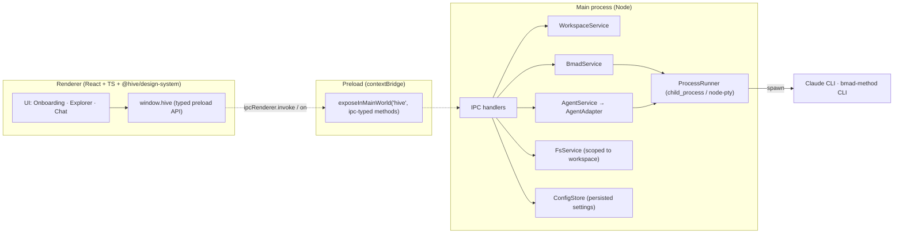
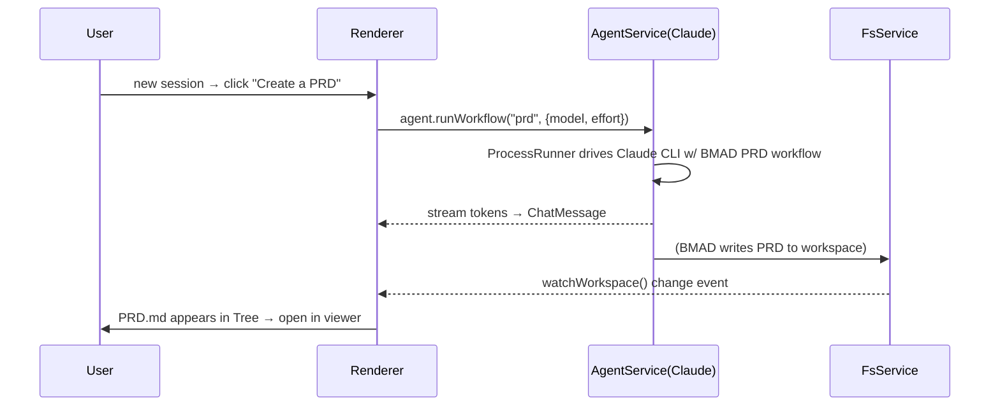

# Design — MVP Vertical Slice

Architecture and component design for M1. Traces to spec.md requirement IDs and
context.md decisions.

> **mermaid-studio not detected** — diagrams below are inline mermaid. Installing
> the `mermaid-studio` skill would enable rendered SVG/PNG + validation. (Noted once.)

---

## 1. Process Architecture (Electron)

Two-process Electron app with a strict security boundary (R1.3, C2).



**Security invariants (R1.3):** `contextIsolation: true`, `nodeIntegration: false`,
`sandbox: true` where possible. Renderer never imports Node/`fs`/`child_process`.
Every privileged call is an explicit, typed method on `window.hive`. `FsService`
rejects paths outside the active workspace root.

---

## 2. Module Responsibilities (Main)

| Module | Responsibility | Traces |
|---|---|---|
| `ConfigStore` | Persist workspace path, provisioned flag, last model/effort. JSON in `app.getPath('userData')`. | R2.2, R3.5 |
| `WorkspaceService` | Native dir picker, set/get active workspace, provisioned check. | R2.1–R2.4 |
| `FsService` | List tree, read file, watch for changes — all scoped to workspace root. | R5.1–R5.4 |
| `BmadService` | Install (first run) and update (subsequent) via `ProcessRunner`; parse progress/prompts into structured events; detect provisioned state. | R3.*, R4.* |
| `AgentService` | Own the active `AgentAdapter`; forward chat turns; stream tokens; expose adapter capabilities (models/efforts). | R6.* |
| `AgentAdapter` (interface) | Contract any agent CLI implements. MVP: `ClaudeCliAdapter`. | C1, R6.2, R6.4 |
| `WorkflowCatalog` | Curated intent→BMAD-command map + dynamic-discovery hook. | R7.3, C6 |
| `ProcessRunner` | Uniform spawn/stream/kill; pty when interactive prompts needed. | C2 |

---

## 3. Key Interfaces (TypeScript sketches)

> Illustrative shapes to align modules. Field names for BMAD-derived data are
> **provisional until B1 is resolved** (see §7).

```ts
// AgentAdapter — the decoupling boundary (C1, R6.2)
interface AgentAdapter {
  id: string;                       // "claude-cli"
  displayName: string;              // "Claude CLI"
  capabilities(): AgentCapabilities;          // curated, per-adapter (C5)
  startSession(opts: SessionOpts): AgentSession;
}
interface AgentCapabilities {
  models: { id: string; label: string }[];   // e.g. opus/sonnet/haiku
  efforts: { id: string; label: string }[];  // e.g. low/medium/high
  supportsAttachments: boolean;               // MVP: may be false (R6.5 = should)
}
interface SessionOpts { workspace: string; model: string; effort: string; }
interface AgentSession {
  send(input: AgentInput): void;              // text (+ future attachments)
  readonly events: AsyncIterable<AgentEvent>; // token | tool | done | error
  runWorkflow(cmd: WorkflowCommand): void;    // guided-intent entry (R7.2)
  stop(): void;
}

// Workflow catalog (C6, R7)
interface WorkflowEntry {
  key: "prd" | "domain-research" | "brainstorm" | "architecture" | "story";
  label: string;                   // "Create a PRD"
  command: WorkflowCommand;        // how the adapter drives BMAD for this intent
  status: "wired" | "planned";     // MVP: prd = wired, others = planned
}

// BMAD lifecycle (R3, R4) — events the UI renders as a guided flow
type BmadEvent =
  | { type: "step"; id: string; label: string }
  | { type: "prompt"; id: string; question: string; choices?: string[] } // pty
  | { type: "progress"; pct?: number; message: string }
  | { type: "done"; ok: true }
  | { type: "error"; message: string; detail?: string };
```

**IPC surface (`window.hive`):** `chooseWorkspace()`, `getWorkspace()`,
`isProvisioned()`, `installBmad()→AsyncIterable<BmadEvent>`, `updateBmad()→…`,
`listTree()`, `readFile(path)`, `watchWorkspace()`, `agent.capabilities()`,
`agent.start(opts)`, `agent.send(...)`, `agent.runWorkflow(key)`,
`workflows.list()`. All typed, all promise/stream-based.

---

## 4. UI Composition (Renderer) — maps to `@hive/design-system`

The DS already ships the components this slice needs — **reuse, don't reinvent**
(R1.2). Verified in `design-system/src/index.ts`.

| Surface | DS components | Traces |
|---|---|---|
| App shell / split layout | `Resizable`, `ResizablePanel`, `ResizableHandle`, `ScrollArea`, `Separator` | R1.2 |
| Onboarding — workspace pick | `Dialog`/`Sheet`, `Button`, `Empty`, `Field`/`Label` | R2.1 |
| Onboarding — guided install | `SteppedList` + `SteppedListItem`, `Progress`, `Spinner`, `Alert`, `Callout` | R3.2–R3.4 |
| BMAD update gate | `Progress`, `Spinner`, `Alert` | R4.2 |
| File explorer | `Tree`, `ScrollArea` | R5.1 |
| File viewer | `CodeBlock`/`Cor`/`Cmt` (code/text); markdown render for `.md` | R5.2, R5.3 |
| Chat | `MessageList`, `ChatMessage`, `PromptInput`, `TypingIndicator`, `Attachment` | R6.1, R6.5 |
| Model/effort pickers | `Select`, `Popover`, `Chip`/`Badge` | R6.4 |
| Intent placeholders | `Empty` (new-session state) + `Command`/`ValueCard`/`SkillCard` grid of intents | R7.1 |
| Global | `TooltipProvider`, `Toast` (feedback), theming (dark/light) | R1.4, R1.5 |
| Copy source | all UI strings from `renderer/i18n/pt-BR.ts` (no inline literals) | R1.6 |

**Layout (3-pane, product register):**

```
┌───────────────┬──────────────────────────────┬──────────────────┐
│  File Tree    │            Chat               │   File Viewer    │
│  (Tree)       │  MessageList / PromptInput    │  (CodeBlock/MD)  │
│               │  + intent placeholders on     │  opens on tree   │
│               │    new session (Empty+grid)   │    select / new  │
│               │  model/effort in composer bar │    artifact      │
└───────────────┴──────────────────────────────┴──────────────────┘
       R5                    R6 / R7                     R5
```

Every surface passes an **`impeccable` review** (R1.5): explicit loading / empty /
error states, focus order & keyboard nav, AA contrast on Zup tokens, and copy that
reads as first-party Hive.

### 4.1 Internationalization — pt-BR (R1.6)

All UI copy is Brazilian Portuguese and lives in a single strings module
(`renderer/i18n/pt-BR.ts`) accessed through a tiny `t(key)` helper. Components
reference keys, never inline literals — this keeps copy consistent, reviewable in
one place, and leaves the door open for adding a locale later without touching
components (no full i18n framework needed for the MVP; the module + helper is
enough). Scope of the requirement: **our** chrome only — labels, buttons,
placeholders, intent prompts, empty/loading/error states, tooltips, toasts,
onboarding. **Out of scope:** agent replies and BMAD-produced artifacts, whose
language is governed by the agent/workflow, not the UI. Date/number formatting uses
`pt-BR` locale where shown.

---

## 5. Key Flows

### 5.1 First run (R2 + R3)
```mermaid
sequenceDiagram
  participant U as User
  participant R as Renderer
  participant M as Main
  U->>R: launch (no config)
  R->>M: getWorkspace() → none
  R->>U: show workspace picker (Onboarding)
  U->>M: chooseWorkspace() (native dialog)
  M->>M: ConfigStore.setWorkspace(path)
  R->>M: isProvisioned() → false
  R->>U: guided install (SteppedList)
  R->>M: installBmad() (stream BmadEvent)
  M->>M: ProcessRunner.spawn(bmad install → workspace)
  M-->>R: step / prompt / progress / done
  R->>U: prompts as native UI; progress live
  M->>M: ConfigStore.setProvisioned(true)
  R->>U: enter work UI
```

### 5.2 Subsequent run (R2.3 + R4)
`getWorkspace()→path` → `isProvisioned()→true` → **gate work UI** behind
`updateBmad()` (visible progress) → on `done` show work UI; on `error` offer
"continue anyway".

### 5.3 Guided intent → artifact (R6 + R7 + R5.4)


---

## 6. Data & Persistence

- **ConfigStore** (`userData/config.json`): `{ workspacePath, provisioned,
  lastModel, lastEffort }`. No secrets stored by us in MVP; agent CLIs manage their
  own auth.
- **Workspace** is the single source of truth for artifacts (BMAD + agent write
  there; we read/watch). We never duplicate artifacts into app storage.

---

## 7. BMAD Integration — **VERIFIED (2026-07-09, real throwaway install)**

Verified by running `bmad-method@6.10.0` for real in a scratchpad directory
(`/tmp/.../scratchpad/bmad-verify-20260709235256/target-ws`, left in place for
inspection). Node caveat found along the way: the installed CLI requires
**Node ≥ 20.12.0** — on Node 20.11 it crashes immediately with `The requested
module 'node:util' does not provide an export named 'styleText'`. Re-ran under
Node 22.22.1 and everything below worked. **The Electron app's bundled/required
Node must satisfy this floor**, or `ProcessRunner` must shell out to a
system Node that does.

### Install — fully non-interactive (Option A confirmed, Option B not needed)

```
npx bmad-method install --directory <ws> --modules bmm --tools claude-code --yes
```

This ran to completion with **zero prompts** — `context.md` A1's Option A is
correct and sufficient; no `node-pty` prompt-driving is needed for install.
`--modules bmm` is the BMad Method module (agile PRD/architecture/story
workflows); `core` is pulled in automatically. Useful discovered flags:
`--list-tools` (prints all supported IDE/tool IDs — `claude-code` is one of
four "recommended" ids), `--list-options` (prints every `--set module.key=value`
non-interactive config key, e.g. `bmm.planning_artifacts`,
`core.output_folder`), `-d/--debug`.

### Provisioned-detection signal (A2 resolved)

A provisioned workspace has a top-level **`_bmad/`** directory. Concretely:

- `_bmad/config.toml` — installer-managed, human-readable TOML with
  `[core] project_name / output_folder`, `[modules.bmm] planning_artifacts /
  implementation_artifacts / project_knowledge`, plus per-agent metadata.
  Comment header explicitly says "regenerated on every install — treat as
  read-only"; durable overrides go in `_bmad/custom/config.toml` (never
  touched by the installer).
- `_bmad/_config/manifest.yaml` — the best machine-readable signal:
  `installation.version`, `installation.installDate/lastUpdated`, per-module
  `modules[].version`, and `ides: [claude-code]`. **Recommend `isProvisioned()`
  check for the existence + parse of `_bmad/_config/manifest.yaml`** (cheap,
  structured, gives us the installed version for free to decide if an update
  is due).
- `_bmad/_config/skill-manifest.csv` and `_bmad/_config/bmad-help.csv` — see
  Workflow catalog below.
- With `--tools claude-code`, BMAD also writes **`.claude/skills/<name>/SKILL.md`**
  (46 skills on this install) — **not** `.claude/commands/`. There is no
  `.claude/commands` directory at all. Correct design.md §3 IPC/UI assumptions
  that referenced "commands": BMAD integrates with Claude Code exclusively via
  the **Skills** mechanism.

### Update path (A3 resolved)

There is no separate `update` subcommand. Update is the **same `install`
command**, re-run against an already-provisioned directory:

```
npx bmad-method install --directory <ws> --tools claude-code --yes
```

Running plain `install --yes` (no `--action`) against an existing install
auto-detects it and logs `Non-interactive mode (--yes): defaulting to
quick-update`. `--action <install|update|quick-update>` can force a mode
explicitly (`install --help` documents it); `--action update --yes` was also
tested directly and completed non-interactively, preserving custom files
(`Custom files preserved: 2`) and reporting per-module `(v6.10.0, no change)`
when nothing changed. **Practical implication: `BmadService.installBmad()` and
`updateBmad()` can share one code path** — just always pass `--yes
--tools claude-code` (+ `--modules bmm` on first run) and let the CLI decide
install vs. update from workspace state.

Also confirmed: `npx bmad-method status` — prints installed version, install
location, last-updated date, and per-module up-to-date status. Useful as a
secondary/human-readable confirmation but `manifest.yaml` is better for
programmatic checks. `npx bmad-method uninstall [--yes] [--directory <path>]`
exists too (not run, but `--help` confirms it removes BMAD while preserving
user artifacts).

### PRD workflow command + output path (A4 — resolved from installed files; execution itself not run)

**Directly observed** (read `.claude/skills/bmad-prd/SKILL.md` and
`.claude/skills/bmad-prd/customize.toml` from the real install):

- There is **no CLI subcommand** that produces a PRD — `bmad-method`'s only
  top-level commands are `install`, `status`, `uninstall`, `help`. PRD creation
  is exclusively a **Claude Code Skill**, triggered inside an agent
  conversation (matches C1/C2: `AgentService` drives the Claude CLI; BMAD
  itself is never spawned again after install/update).
- The skill to invoke is **`bmad-prd`** (description: "Create, update, or
  validate a PRD. Use when the user wants help producing, editing, or
  validating a PRD."). An older skill `bmad-create-prd` still exists but is a
  deprecated compatibility shim that forwards to `bmad-prd` with create intent
  — **wire the catalog to `bmad-prd` directly**, not the deprecated name.
  Claude Code resolves skills by matching the user's message against each
  `SKILL.md`'s `description` frontmatter (or an explicit ask), so
  `runWorkflow("prd")` should send a prompt that clearly names the intent
  (e.g. "use the bmad-prd skill to create a PRD") rather than any special CLI
  flag — there is no separate invocation syntax to shell out to.
- **Output path**, per `bmad-prd/customize.toml`:
  `prd_output_path = "{planning_artifacts}/prds"`,
  `run_folder_pattern = "prd-{project_name}-{date}"`, and the SKILL.md's
  Create-intent step writes `prd.md` inside that folder. With install
  defaults (`output_folder = "_bmad-output"`,
  `planning_artifacts = "{output_folder}/planning-artifacts"`), the resolved
  default path is:
  ```
  _bmad-output/planning-artifacts/prds/prd-<project_name>-<date>/prd.md
  ```
  (plus sibling `addendum.md`, `.memlog.md`, optional `review-*.md` in the same
  run folder). All of `output_folder` / `planning_artifacts` /
  `prd_output_path` are configurable via `--set` at install time or team/user
  TOML overrides, so `WorkspaceService`/`FsService` should resolve the actual
  path from `_bmad/config.toml` at runtime rather than hardcoding it.
- **What remains inference, not directly observed:** the actual end-to-end
  chat-driven PRD generation (Discovery → Finalize) was not run — that needs a
  live Claude Code agent conversation, which is out of scope for this
  CLI-level verification. The path formula above is derived directly from the
  installed skill's own config/instructions, not fabricated, but the exact
  runtime file (frontmatter, final filename casing, etc.) should be
  spot-checked once the real chat flow is wired in M1.

### Workflow catalog — dynamic-discovery source found (feeds C6/R7.3)

`_bmad/_config/bmad-help.csv` is a ready-made machine-readable catalog: columns
`module, skill, display-name, menu-code, description, phase, preceded-by,
followed-by, required, output-location, outputs`. Confirms the curated mapping
in C6: `bmad-brainstorming` (Brainstorm), `bmad-domain-research` (Domain
Research), `bmad-prd` (PRD, `output-location: planning_artifacts`),
`bmad-create-architecture`/`bmad-architecture` (Architecture),
`bmad-create-story` (Story). `WorkflowCatalog`'s "dynamic fallback" (C6) can
parse this CSV directly instead of guessing — recommend switching the design
from "read installed BMAD dynamically when feasible" to "parse
`_bmad/_config/bmad-help.csv`" as the concrete mechanism.

---

## 8. Testing Strategy (feeds tasks.md)

- **Main services** unit-tested with a **fake `ProcessRunner`** (scripted
  stdout/prompt/exit) — no real CLIs in unit tests. Validates BMAD event parsing,
  provisioned logic, workflow mapping, fs-scope guard.
- **AgentAdapter** contract test the `ClaudeCliAdapter` satisfies (so future
  adapters are drop-in).
- **Renderer** component tests (Vitest + Testing Library, as DS already uses) for
  onboarding states, chat rendering, explorer selection, intent placeholders.
- **One integration/E2E smoke** against a real throwaway workspace covering R8.1
  (gated in CI as it needs the real CLIs) — this is the demo of record.

---

## 9. Risks

| Risk | Mitigation |
|---|---|
| BMAD internals differ from assumptions (B1) | Verify with real install before Execute; UI isolated behind `BmadEvent`. |
| Interactive CLI prompts hard to parse | Prefer non-interactive install (Option A); pty fallback isolated in `ProcessRunner`. |
| `@hive/design-system` in Electron renderer build | Early smoke task (M0) to confirm ESM+CSS consumption & React 18 peer. |
| Claude CLI output format churn | Keep parsing in the adapter only; contract-tested. |
| Long-running workflow blocks UI | All spawn work in main; renderer consumes async streams; never block. |
